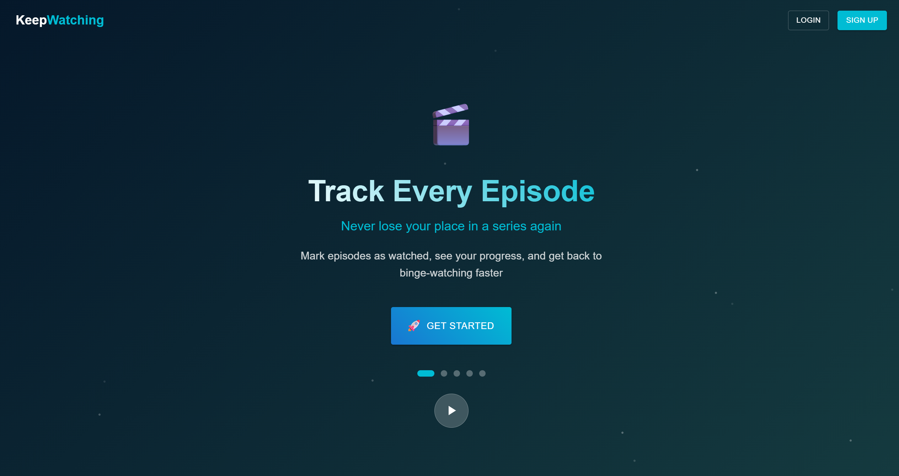

# KeepWatching
A modern React-based web application for tracking your favorite TV shows and movies. Never lose track of what you're watching or what episode you're on again!

## Features

### 🎬 Content Management
- **TV Show Tracking**: Mark episodes as watched, track your progress through seasons
- **Movie Management**: Build your movie watchlist and track what you've seen
- **Watch Status**: Track shows as "Not Watched", "Watching", "Up to Date", or "Watched"
- **Episode Progress**: See exactly which episodes you've watched and which are next

### 👨‍👩‍👧‍👦 Multi-Profile Support
- **Family Profiles**: Create separate profiles for each family member
- **Individual Progress**: Each profile maintains its own watch history and preferences
- **Profile Statistics**: Detailed viewing statistics for each profile

### 🔍 Discovery & Search
- **Content Discovery**: Find trending shows and movies by streaming service
- **Advanced Content Search**: Search for shows and movies with filters for year, genre, and more
- **Person Search**: Find actors, directors, and cast members, then explore their complete filmography
- **Similar Content**: Get recommendations based on what you're already watching
- **Streaming Integration**: See which services have your content

### 📊 Statistics & Insights
- **Viewing Analytics**: Track your watching habits with detailed statistics
- **Progress Charts**: Visual representation of your viewing progress
- **Genre Analysis**: See your favorite genres and viewing patterns
- **Account Overview**: Account-wide statistics across all profiles

### 🎯 Smart Features
- **Keep Watching**: Quick access to your next episodes to watch
- **Upcoming Episodes**: See when new episodes of your shows are airing
- **Recent Releases**: Stay up to date with newly released content
- **Firebase Authentication**: Secure login with email/password or Google

### 🔔 Notifications
- **Real-Time Alerts**: Stay informed about new episodes and movie releases
- **System Updates**: Get notified about new features and important announcements
- **Notification Center**: Manage notifications with search, filtering, and bulk actions
- **Quick Access Dropdown**: View recent notifications directly from the navigation bar

## Key Features Breakdown

### Authentication Flow
- Firebase Authentication with email/password and Google OAuth
- Automatic account creation and profile setup
- Email verification support
- Secure token-based API communication

### Content Management
- Integration with TMDB for comprehensive movie/TV data
- Real-time watch status updates via WebSocket
- Hierarchical tracking (Show → Season → Episode)
- Bulk operations for marking seasons/shows as watched

### Profile System
- Multiple profiles per account with isolated watch data
- Profile-specific statistics and recommendations
- Image upload for profile customization
- Default profile settings

### Search & Discovery
- Multi-criteria search with sorting options
- Person search with filmography exploration
- Trending content discovery
- Service-specific filtering (Netflix, Disney+, etc.)
- Content type filtering (movies vs. TV shows)

### Statistics Dashboard
- Watch progress visualization
- Genre and streaming service distribution
- Account-wide and profile-specific analytics
- Interactive charts and progress bars

### Notification System
- Real-time notifications via WebSocket for instant updates
- Multiple notification types: TV shows, movies, system updates, features, and issues
- Quick-access dropdown in navigation bar showing recent notifications
- Full-page notification center with advanced management
- Search and filter capabilities for finding specific notifications
- Bulk actions for marking all as read/unread or dismissing all
- Individual notification actions (mark as read/unread, dismiss)
- Unread badge counter for at-a-glance notification status

## Workflows

### [Authentication](./pages/authentication.md)
Secure user authentication system allowing account creation with email/password or Google OAuth, plus logout functionality. Includes email verification and password reset capabilities through Firebase Authentication.

### [Home](./pages/home.md)
Personalized dashboard displaying your current profile's viewing progress, upcoming episodes, recent releases, and quick access to continue watching shows. Provides an at-a-glance overview of your entertainment status with clickable statistics cards.

### [Shows](./pages/shows.md)
Complete TV show management interface where you can view all your favorited shows, filter by genre/streaming service/watch status, and track episode-by-episode progress. Includes bulk actions for marking entire seasons or shows as watched.

### [Movies](./pages/movies.md)
Movie collection manager for browsing your favorited films, filtering by various criteria, and updating watch status from "Not Watched" to "Watched". Features detailed movie information including runtime, ratings, and streaming availability.

### [Discover](./pages/discover.md)
Content discovery hub for finding trending shows and movies or browsing by specific streaming services like Netflix, Disney+, and HBO Max. Offers filtering by content type, release timing (new, upcoming, expiring), and top-rated selections.

### [Search](./pages/search.md)
Advanced search functionality for finding specific shows, movies, or people (actors, directors, cast members) with filters for premiere year, content type, and sorting options. Features tabs for shows, movies and person search, with the ability to add content directly to your favorites and explore complete filmographies.

### [Manage Account](./pages/manageAccount.md)
Account settings page for managing user profile, uploading profile images, creating/editing/deleting family profiles, and viewing detailed viewing statistics. Includes email verification status and the ability to set default profiles for quick access.

### [Notifications](./pages/notifications.md)
Comprehensive notification system keeping you informed about new episodes, movie releases, system updates, and feature announcements. Provides both a quick-access dropdown in the navigation bar and a full-page notification center with search, filtering, and management capabilities.
