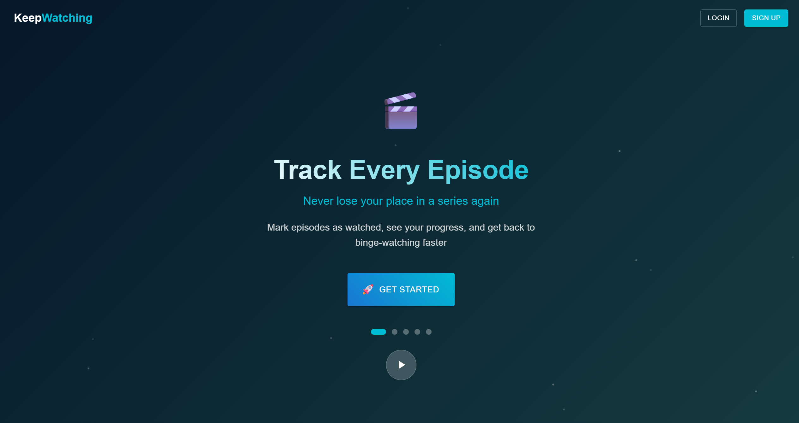

# KeepWatching

A modern React-based web application for tracking your favorite TV shows and movies. Never lose track of what you're watching or what episode you're on again!

## Features

### 🎬 Content Management

- **TV Show Tracking**: Mark episodes as watched, track your progress through seasons
- **Movie Management**: Build your movie watchlist and track what you've seen
- **Watch Status**: Track shows as "Not Watched", "Watching", "Up to Date", or "Watched"
- **Episode Progress**: See exactly which episodes you've watched and which are next
- **Rewatch Support**: Start a rewatch of any completed show, season, or movie and track it separately
- **Watchlist**: Build a prioritized queue of what to watch next, with a decision wizard to help you pick something when you can't decide

### 👨‍👩‍👧‍👦 Multi-Profile Support

- **Family Profiles**: Create separate profiles for each family member
- **Individual Progress**: Each profile maintains its own watch history and preferences
- **Profile Statistics**: Detailed viewing statistics for each profile

### 🔍 Discovery & Search

- **Content Discovery**: Find trending shows and movies by streaming service
- **Advanced Content Search**: Search for shows and movies with filters for year, genre, and more
- **Person Search**: Find actors, directors, and cast members, then explore their complete filmography
- **Similar Content**: Get recommendations based on what you're already watching
- **Streaming Integration**: See which services have your content

### ⭐ Ratings & Community

- **Personal Ratings**: Rate any show or movie 1–5 stars and add private notes from the detail page
- **Community Recommendations**: Recommend content to other users with an optional message and rating
- **Community Feed**: Browse community recommendations on the Home page to discover what others are watching
- **Recommendation Details**: See all community reviews and ratings for a specific title

### 📅 Calendar & History

- **Content Calendar**: View upcoming and recently aired episodes and movies in an agenda list or month grid view, with selectable date range presets (or a custom range) and `.ics` export for your calendar app
- **Watch History**: Full paginated history of every episode and movie you've watched, with rich filtering
- **Prior Watch Tracking**: Record watch history for shows you watched before joining KeepWatching, using original air dates
- **Rewatch History**: Prior watches and rewatches are clearly labelled and filterable in your history

### 📊 Statistics & Insights

- **Viewing Analytics**: Track your watching habits with detailed statistics
- **Progress Charts**: Visual representation of your viewing progress
- **Genre Analysis**: See your favorite genres and viewing patterns
- **Account Overview**: Account-wide statistics across all profiles
- **Recap**: Shareable, Spotify-Wrapped-style monthly and yearly recap cards with viewing hours, top genres, an activity heatmap, and streaks — surfaced automatically on Home or browsed anytime from Manage Account

### 🎯 Smart Features

- **Keep Watching**: Quick access to your next episodes to watch
- **Catch-Up Mode**: See episodes and estimated runtime remaining for a show, plus a projected "caught up by" date based on your recent watch pace
- **Season Skipping**: Mark a season as Skipped to bypass it without counting it as watched or leaving a gap in your progress
- **Upcoming Episodes**: See when new episodes of your shows are airing
- **Recent Releases**: Stay up to date with newly released content
- **Firebase Authentication**: Secure login with email/password or Google
- **Dark/Light Theme**: Toggle between dark and light themes to match your preference
- **PWA / Installable App**: Install KeepWatching on any device for a native app experience with offline support

### 🔔 Notifications

- **Real-Time Alerts**: Stay informed about new episodes and movie releases
- **System Updates**: Get notified about new features and important announcements
- **Notification Center**: Manage notifications with search, filtering, and bulk actions
- **Quick Access Dropdown**: View recent notifications directly from the navigation bar

## Key Features Breakdown

### Authentication Flow

- Firebase Authentication with email/password and Google OAuth
- Automatic account creation and profile setup
- Email verification support
- Secure token-based API communication

### Content Management

- Integration with TMDB for comprehensive movie/TV data
- Real-time watch status updates via WebSocket
- Hierarchical tracking (Show → Season → Episode)
- Bulk operations for marking seasons/shows as watched

### Profile System

- Multiple profiles per account with isolated watch data
- Profile-specific statistics and recommendations
- Image upload for profile customization
- Default profile settings

### User Preferences

- Dark/light theme switching with persistent settings
- Theme preference saved per user account
- Seamless theme transitions across all pages

### Ratings & Community Recommendations

- 1–5 star ratings with optional private notes on every show and movie detail page
- Recommend content to the community with an optional personal message
- Community tab on the Home page surfaces recommendations from all users
- Recommendation detail dialog shows ratings and messages from other community members

### Prior Watch & Rewatch

- Prior Watch Prompt when opening a show you've never marked — record episodes watched before joining with original air dates
- Season-level prior watch dialog when marking a full season watched for the first time
- Out-of-order watch prompts, including the option to mark earlier seasons as Skipped, to help keep your history accurate when you mark content out of order
- Bulk-mark detection banner warns when many episodes were marked on the same day and offers to fix dates using original air dates
- Rewatch buttons on completed shows, seasons, and movies to start a new tracked viewing pass

### Content Calendar

- Agenda (list) and grid (month) views showing episodes and movies by air/release date
- Defaults to 30 days past and 60 days future; grid view automatically expands when navigating to new months
- Agenda view adds a Date Range selector with presets (Next 7/30 Days, This Month, Last 30 Days) and a Custom Range picker (up to a 1-year span)
- Export the currently loaded range to an `.ics` file for import into Google Calendar, Apple Calendar, Outlook, etc.
- View preference (agenda vs. grid) and selected date range persisted across sessions, and reset on logout
- Compact calendar embedded in the Home page TV Shows and Movies tabs for quick glance

### Watch History

- Full paginated history with filters for content type, date range, prior watch status, and title search
- Each entry shows watch count, prior watch badge, runtime, and exact watch date
- Sort ascending or descending by watch date

### Installable PWA

- Install from the browser or app store on any device for a standalone app experience
- Offline fallback page when the network is unavailable
- Service worker caches static assets and images for faster loads
- In-app update prompt notifies you when a new version is available

### Search & Discovery

- Multi-criteria search with sorting options
- Person search with filmography exploration
- Trending content discovery
- Service-specific filtering (Netflix, Disney+, etc.)
- Content type filtering (movies vs. TV shows)

### Statistics Dashboard

- Watch progress visualization
- Genre and streaming service distribution
- Account-wide and profile-specific analytics
- Interactive charts and progress bars

### Notification System

- Real-time notifications via WebSocket for instant updates
- Multiple notification types: TV shows, movies, system updates, features, and issues
- Quick-access dropdown in navigation bar showing recent notifications
- Full-page notification center with advanced management
- Search and filter capabilities for finding specific notifications
- Bulk actions for marking all as read/unread or dismissing all
- Individual notification actions (mark as read/unread, dismiss)
- Unread badge counter for at-a-glance notification status

## Workflows

### [Authentication](./pages/authentication.md)

Secure user authentication system allowing account creation with email/password or Google OAuth, plus logout functionality. Includes email verification and password reset capabilities through Firebase Authentication.

### [Home](./pages/home.md)

Personalized dashboard displaying your current profile's viewing progress, upcoming episodes, recent releases, and quick access to continue watching shows. Provides an at-a-glance overview of your entertainment status with clickable statistics cards.

### [Shows](./pages/shows.md)

Complete TV show management interface where you can view all your favorited shows, filter by genre/streaming service/watch status, and track episode-by-episode progress. Includes bulk actions for marking entire seasons or shows as watched, a Catch-Up Mode summary for shows with a backlog, and the ability to skip seasons you don't plan to watch.

### [Movies](./pages/movies.md)

Movie collection manager for browsing your favorited films, filtering by various criteria, and updating watch status from "Not Watched" to "Watched". Features detailed movie information including runtime, ratings, and streaming availability.

### [Person Details](./pages/personDetails.md)

Comprehensive profile pages for actors, directors, and crew members accessible from show/movie cast tabs. Displays biographical information including birthdate, birthplace, and full biography, along with filmography showing movie and TV credits from your favorited content in KeepWatching with character roles and episode counts.

### [Discover](./pages/discover.md)

Content discovery hub for finding trending shows and movies or browsing by specific streaming services like Netflix, Disney+, and HBO Max. Offers filtering by content type, release timing (new, upcoming, expiring), and top-rated selections.

### [Search](./pages/search.md)

Advanced search functionality for finding specific shows, movies, or people (actors, directors, cast members) with filters for premiere year, content type, and sorting options. Features tabs for shows, movies and person search, with the ability to add content directly to your favorites and explore complete filmographies.

### [Manage Account](./pages/manageAccount.md)

Account settings page for managing user profile, uploading profile images, creating/editing/deleting family profiles, and viewing detailed viewing statistics. Includes email verification status, the ability to set default profiles for quick access, and tools to review and correct bulk-marked watch history.

### [Notifications](./pages/notifications.md)

Comprehensive notification system keeping you informed about new episodes, movie releases, system updates, and feature announcements. Provides both a quick-access dropdown in the navigation bar and a full-page notification center with search, filtering, and management capabilities.

### [Calendar](./pages/calendar.md)

Visual content calendar showing upcoming and recently aired episodes and movies. Toggle between an agenda list view and a month grid view, choose a date range preset or custom range, and export to `.ics` for your own calendar app. Accessible from the TV Shows and Movies tabs on the Home page, or directly via the navigation menu.

### [Watch History](./pages/watchHistory.md)

Complete paginated record of every episode and movie you have watched, including rewatches and prior-watch entries. Filter by content type, date range, prior watch status, and title search. Also provides tools to start rewatches of completed shows, seasons, and movies.

### [Watchlist](./pages/watchlist.md)

Prioritized queue of shows and movies you plan to watch next. Add items from show and movie detail pages, reorder them by priority, and filter by type. Includes a decision wizard that filters your queue by content type, genre, and available time to suggest up to three picks when you can't decide what to watch.

### [Recap](./pages/recap.md)

Shareable, poster-style monthly and yearly viewing recaps, in the spirit of Spotify Wrapped. Surfaces automatically on the Home page when a new recap is ready, or browse any past period on demand from Manage Account. Each card shows hours watched, an activity heatmap, top genres, your most-watched show, and your longest streak, with cards themed to your profile's accent color.
