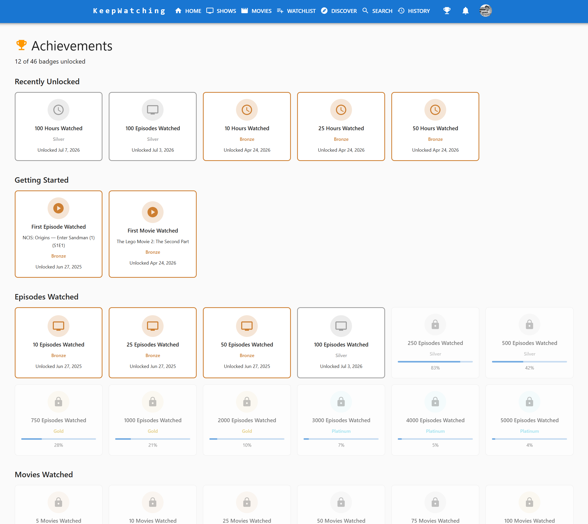
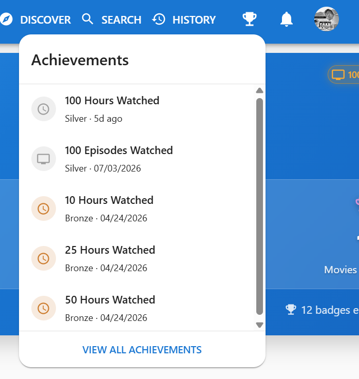
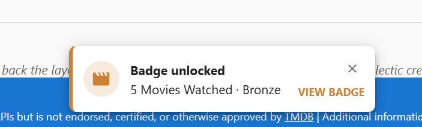
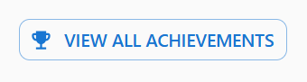
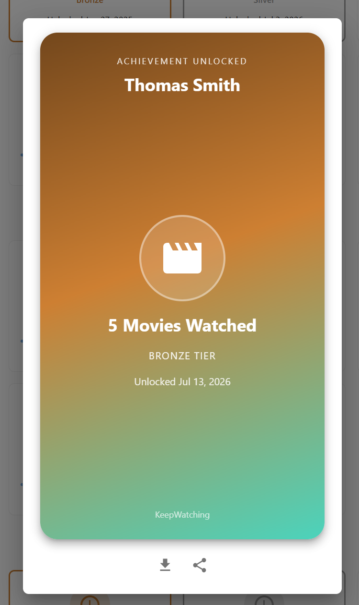

[< Back](../README.md)

# Achievements - User Guide

Achievements turns the milestone data that's always been tracked behind the scenes into a dedicated, game-ified badges page. Earn tiered badges for episodes, movies, and hours watched, for completing shows, and for sticking around — then share any unlocked badge as a poster-style image.

## Overview

A dedicated **Achievements** page shows every badge you can earn, grouped by category, with locked badges dimmed and showing your progress toward unlocking them.

## Where to Find It

- **Trophy icon**: a trophy sits in the top navigation bar next to the notification bell, on every page. Clicking it opens a preview dropdown of your most recently unlocked badges with a **View All Achievements** link — the same pattern as the notification bell's dropdown. A gold count badge marks badges you haven't seen yet and clears once you open the dropdown or the full page. Unlike the entry points below, this one works even if you haven't unlocked a badge yet, so new profiles can still discover the page.

- **Unlock toast**: the moment a watch-status change crosses a milestone threshold — marking an episode, season, or show watched — a toast appears with the badge's tier, title, and a **View Badge** action that jumps straight to that badge on the full page. If a single action crosses more than one threshold at once (e.g. finishing a whole season), the toast shows the highest tier and a "+N more" line for the rest.

- **Quick Stats teaser**: once you've unlocked at least one badge, a small "N badges earned — View Achievements" link appears below the profile header's stats cards on [Home](home.md).

- **Statistics tab**: a **View All Achievements** button sits above the Enhanced Analytics section, right where milestone data has always lived.

## Badge Categories

Badges are organized into six categories, each tiered **Bronze → Silver → Gold → Platinum** based on how far up that category's threshold ladder a badge sits:

| Category | What it tracks |
| --- | --- |
| **Getting Started** | Your first-ever episode and first-ever movie watched |
| **Episodes Watched** | Total episodes watched, from 10 up to 5,000 |
| **Movies Watched** | Total movies watched, from 5 up to 500 |
| **Hours Watched** | Total estimated viewing hours, from 10 up to 5,000 |
| **Shows Completed** | Number of shows you've fully finished |
| **Member Anniversary** | Years since you joined KeepWatching |

## Using the Page

- **Unlocked count**: the page header shows how many of the total badges you've unlocked.
- **Recently Unlocked**: a strip at the top highlights your most recently earned badges, newest first.
- **Locked badges**: shown dimmed with a progress bar toward the next tier — click one to see exactly how close you are.
- **Unlocked badges**: click one to open a shareable poster card with **Download** and **Share** buttons, the same pattern used by [Recap](recap.md) — Share opens your device's native share sheet where supported, falling back to Download otherwise.

## Notes

- **Unlock toast timing**: badge-unlock checks run after watch-status changes complete, so the toast typically appears within a second of marking something watched — not instantly, and not on page load.
- Achievements are tracked per profile, consistent with the rest of KeepWatching's profile-based tracking.
- "Shows Completed" counts a show the moment its status becomes **Watched** — whether that's from explicitly marking the whole show watched, or naturally as the result of marking its last episode or season watched.
- Streak- and binge-watching-based badges aren't available yet.

---

_Achievements is designed to make your KeepWatching milestones more visible and more fun to look back on — check the trophy icon any time, or just keep watching and let the unlock toast tell you when you're there._
