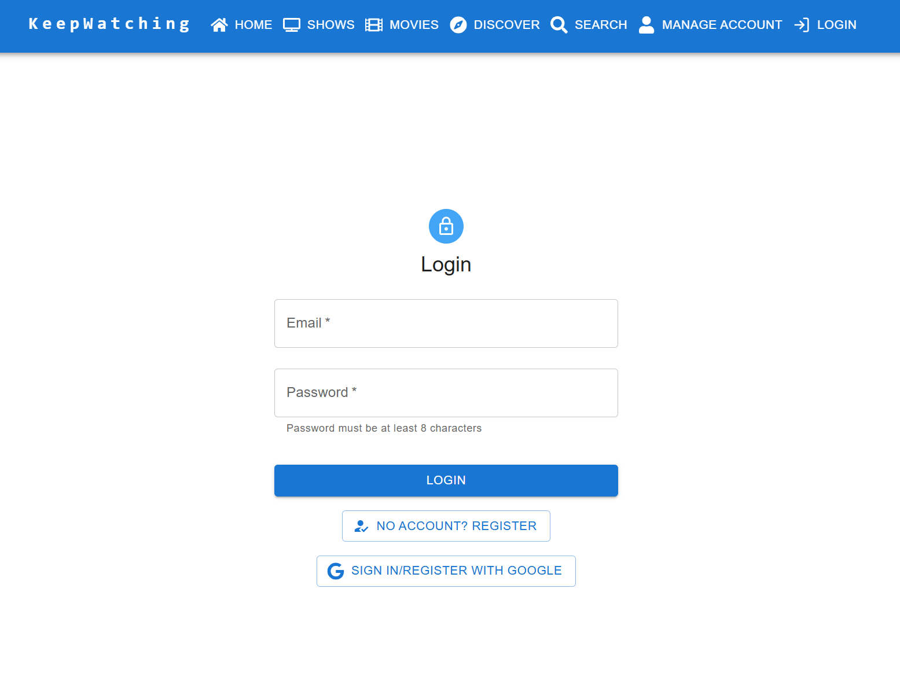
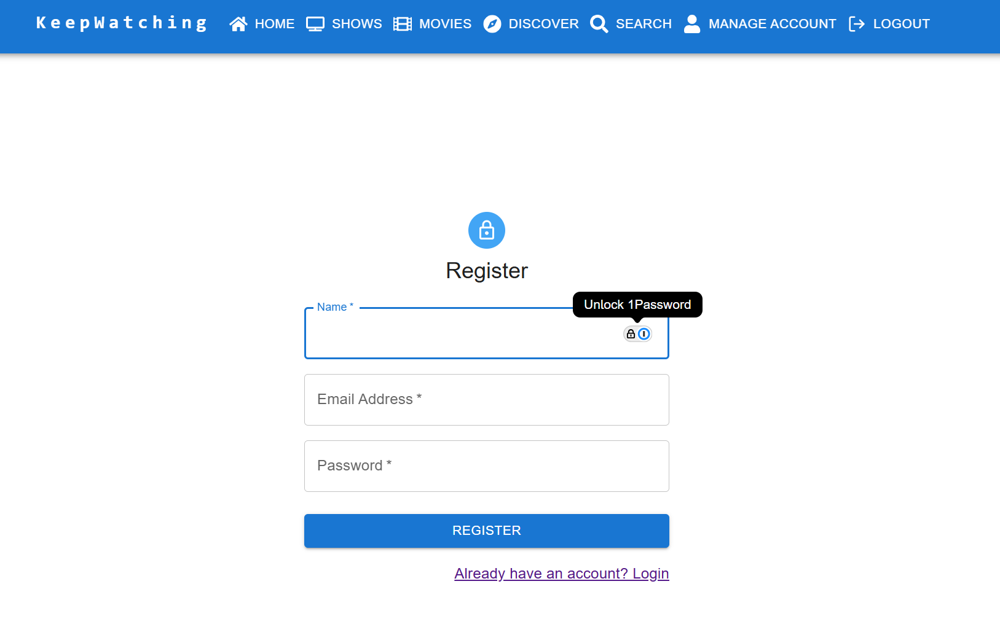

[Home](../README.md)
# Authentication

All the routes are protected except the login and register pages. Once a user is successfully logged in, the application becomes available. 

#### Login
Users can login with the email & password they used during their registration process or by using a linked Google account. 

#### Register
Users register by entering in their account name, email and password. Authentication is managed by the Google Firebase Auth SDK and KeepWatching has no access to a user's password. As part of the registration process a default profile is created for the account using the same name as the account. 
