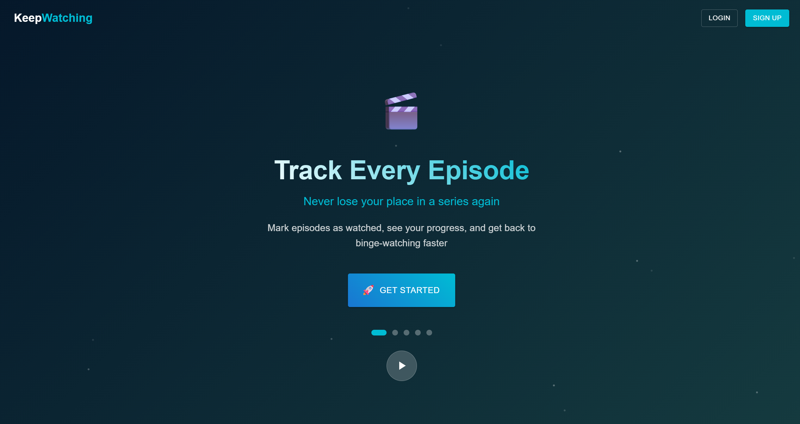
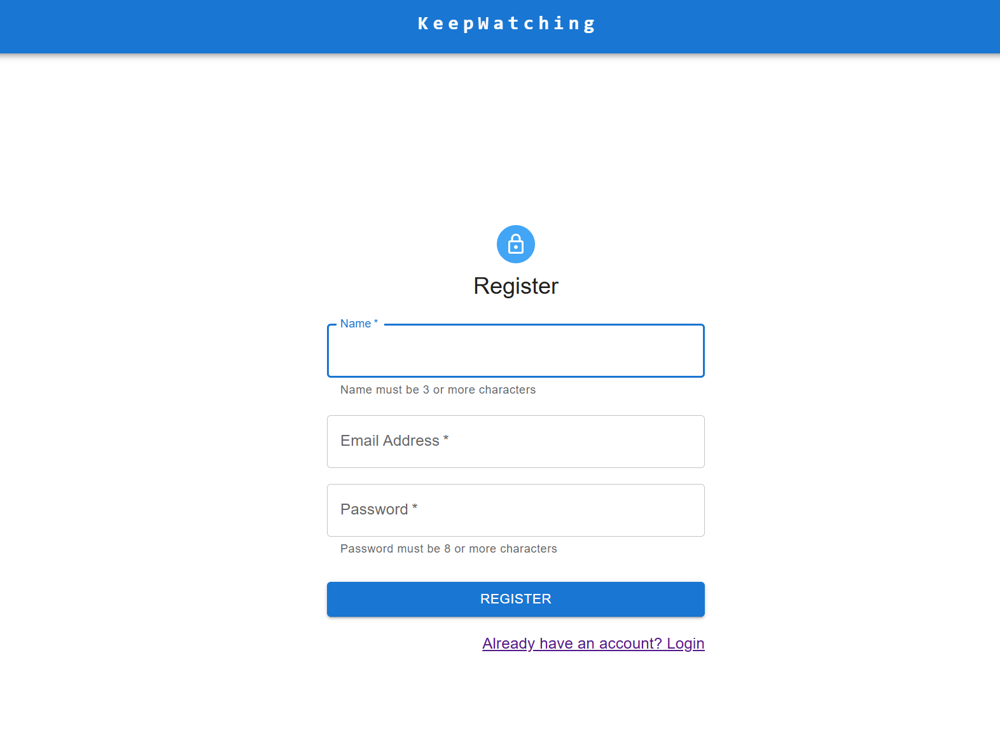
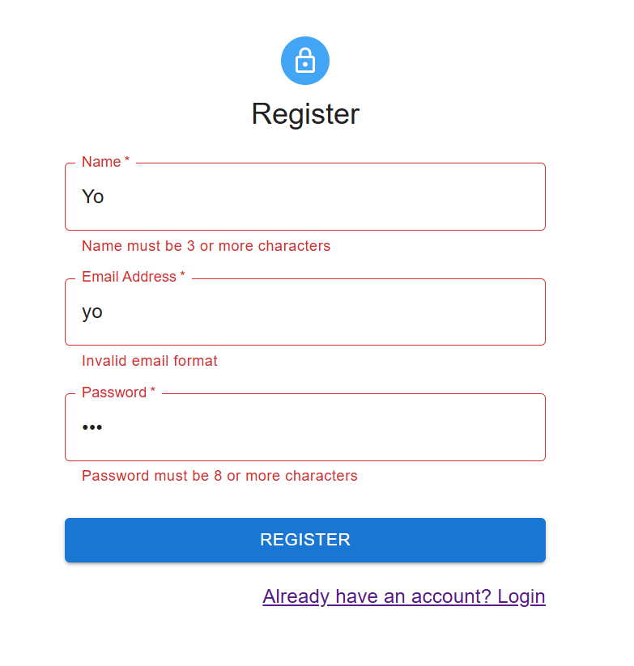
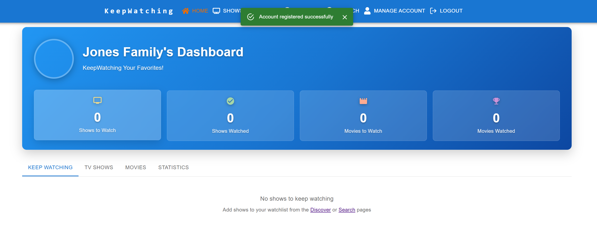
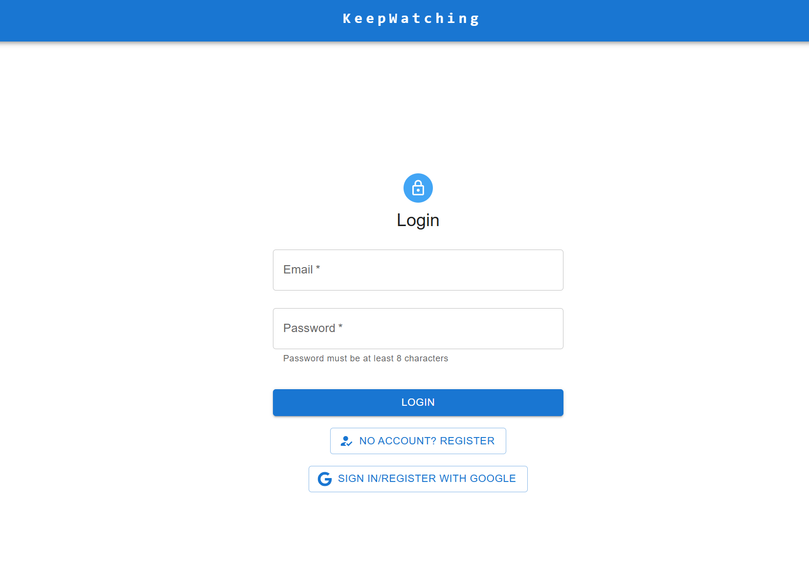
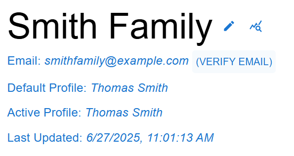
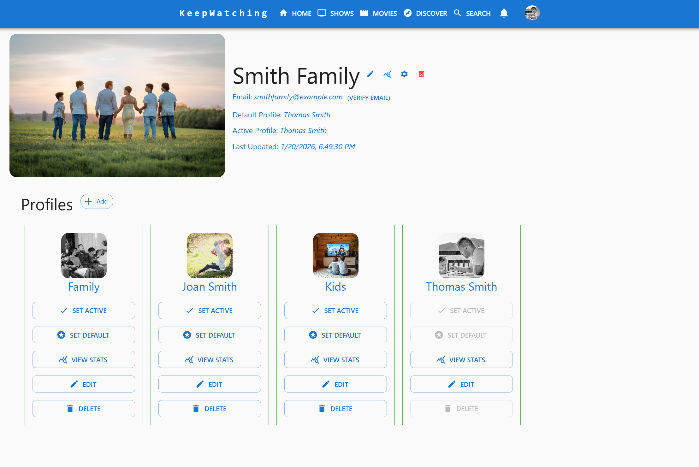
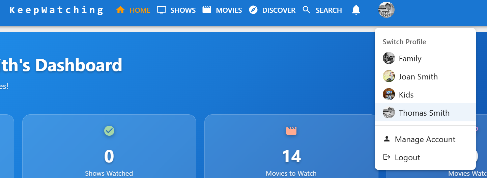

[< Back](../README.md)

# Authentication - User Guide

KeepWatching provides a secure and user-friendly authentication system powered by Firebase Authentication. This guide covers all authentication features from an end-user perspective, including account creation, login options, email verification, and account management.

## Table of Contents

- [Getting Started](#getting-started)
- [Registration](#registration)
- [Login Methods](#login-methods)
- [Email Verification](#email-verification)
- [Account Management](#account-management)
- [Security Features](#security-features)
- [Troubleshooting](#troubleshooting)

## Getting Started

When you first visit KeepWatching, you'll be greeted with a beautiful landing page that showcases the app's features. The authentication system automatically detects whether you're logged in and redirects you appropriately.

### Authentication Flow Overview

1. **Unauthenticated users** see the landing page with options to Login or Sign Up
2. **Authenticated users** are automatically redirected to their personalized dashboard
3. **Session management** keeps you logged in across browser sessions
4. **Automatic logout** occurs when sessions expire or you manually log out

## Registration

### Creating a New Account

To create a new KeepWatching account:

1. Click the **"Sign Up"** button on the landing page or navigation
2. You'll be taken to the registration form

### Registration Form Fields

The registration form requires three pieces of information:

- **Name** (minimum 3 characters)
  - This will be your display name throughout the app
  - Used for initial profile creation and personalization
  
- **Email Address**
  - Must be a valid email format
  - Used for login and account communications
  - Cannot be changed after registration
  
- **Password** (minimum 8 characters)
  - Should be strong and unique
  - Used for secure login authentication

### Registration Validation

The form provides real-time validation:

- **Name validation**: Shows error if less than 3 characters
- **Email validation**: Checks for proper email format
- **Password validation**: Ensures minimum 8 character length

### Account Creation Process

After submitting valid information:

1. **Firebase account creation**: Your account is securely created
2. **Email verification**: A verification email is automatically sent
3. **Profile setup**: A default profile is created for you
4. **Automatic login**: You're immediately logged into your new account
5. **Dashboard redirect**: You're taken to your personalized dashboard

## Login Methods

KeepWatching offers two convenient login methods to access your account.

### Email and Password Login

The traditional login method using your registered credentials:

1. Click **"Login"** from the landing page or navigation
2. Enter your registered email address
3. Enter your password
4. Click **"Login"** to authenticate

#### Login Form Features

- **Email validation**: Real-time validation ensures proper email format
- **Password requirements**: Minimum 8 characters required
- **Error handling**: Clear error messages for invalid credentials
- **Remember me**: Session persists across browser restarts
- **Keyboard shortcuts**: Press Enter to submit the form

### Google Sign-In

For quick and secure access using your Google account:

1. On the login page, click **"Sign In/Register with Google"**
2. Choose your Google account from the popup
3. Grant necessary permissions
4. Automatic account creation or login

#### Google Sign-In Benefits

- **No password management**: Use your existing Google credentials
- **Faster registration**: Automatically populates name and email
- **Enhanced security**: Leverages Google's security infrastructure
- **Profile picture**: Automatically imports your Google profile image

#### Google Sign-In Process

For **new users**:
- Account is automatically created using Google profile information
- Email verification is handled by Google
- Default profile is set up immediately

For **existing users**:
- Instant authentication using Google credentials
- Access to your existing shows, movies, and profiles

## Email Verification

Email verification enhances account security and enables important communications.

### Automatic Verification Email

When you register with email/password:
1. Verification email is sent immediately to your registered address
2. Check your inbox (and spam folder) for the verification email
3. Click the verification link in the email
4. Your email will be marked as verified

### Manual Verification

If you haven't received the verification email or need to resend it:

1. Go to **Manage Account** page
2. Look for your email address in the account information
3. Click **"Verify Email"** if your email is unverified
4. A new verification email will be sent

### Verification Status

Your verification status is displayed in the account management section:
- **"(Email Verified)"** - Your email has been successfully verified
- **"(Verify Email)"** - Click to send verification email

### Benefits of Email Verification

- **Enhanced security**: Confirms you own the email address
- **Account recovery**: Enables password reset functionality
- **Important notifications**: Receive updates about your account
- **Feature access**: Some features may require verified email

## Account Management

Once logged in, you can manage your account settings and information.

### Accessing Account Settings

1. Navigate to **"Manage Account"** from the main navigation
2. View and edit your account information
3. Manage profiles and preferences

## Security Features

KeepWatching implements multiple security measures to protect your account.

### Firebase Authentication

- **Industry-standard security**: Powered by Google's Firebase platform
- **Encrypted storage**: Passwords are securely hashed and stored
- **Session management**: Automatic session expiration and renewal
- **Secure transmission**: All authentication data sent over HTTPS

### Password Security

- **Minimum requirements**: 8 character minimum length
- **Firebase validation**: Additional security checks performed server-side
- **No plain text storage**: Passwords are never stored in readable format

### Account Protection

- **Email verification**: Confirms account ownership
- **Session tokens**: Secure, temporary authentication tokens
- **Automatic logout**: Sessions expire for security
- **Error handling**: No sensitive information revealed in error messages

### Network Security

- **HTTPS encryption**: All data transmission is encrypted
- **CORS protection**: Cross-origin request security
- **Token authentication**: Secure API communication
- **Request validation**: Server-side authentication validation

## Logout Process

Securely ending your KeepWatching session:

### Manual Logout

1. Click **"Logout"** in the main navigation
2. Your session is immediately terminated
3. All authentication tokens are cleared
4. You're redirected to the landing page

### Automatic Logout

Sessions may automatically expire:
- **Token expiration**: Authentication tokens have limited lifetime
- **Inactivity timeout**: Extended periods of inactivity

### Post-Logout Behavior

After logging out:
- **Local storage cleared**: No personal data remains on device
- **Session invalidated**: Cannot access protected content
- **Landing page redirect**: Returned to public welcome page
- **Clean state**: Fresh start for next login

## Troubleshooting

Common authentication issues and their solutions.

### Login Problems

**"Invalid credentials" Error**
- Verify email address is correct
- Check password (remember it's case-sensitive)
- Ensure email is verified

**Google Sign-In Issues**
- Check popup blockers in your browser
- Ensure third-party cookies are enabled
- Try clearing browser cache and cookies
- Verify Google account is accessible

### Registration Issues

**"Email already in use" Error**
- Account with this email already exists
- Try logging in instead of registering
- Use the Google Sign-In option if you registered with Google
- Contact support if you believe this is an error

**Verification Email Not Received**
- Check spam/junk folder
- Verify email address was entered correctly
- Wait a few minutes for email delivery
- Use "Verify Email" button to resend

### Account Access Problems

**Forgotten Password**
- Currently, password reset must be handled by support
- Contact support for assistance with password recovery
- Consider using Google Sign-In for easier access

**Account Locked or Disabled**
- May occur after multiple failed login attempts
- Wait 15-30 minutes before trying again
- Contact support if problem persists

### Browser-Related Issues

**Session Not Persisting**
- Check browser settings for third-party cookies
- Ensure JavaScript is enabled
- Try disabling browser extensions temporarily
- Clear browser cache and try again

**Page Loading Issues**
- Verify internet connection stability
- Try refreshing the page
- Disable ad blockers temporarily

### Getting Help

If you continue experiencing authentication issues:

1. **Try different browser**: Test with Chrome, Firefox, or Safari
2. **Clear browser data**: Remove cookies and cache
3. **Contact support**: Reach out with specific error messages and steps taken

---

## Summary

KeepWatching's authentication system provides secure, user-friendly access to your entertainment tracking data. With multiple login options, robust security features, and comprehensive account management tools, you can confidently manage your viewing preferences and progress across all your devices.

The combination of Firebase Authentication and thoughtful user experience design ensures that accessing your KeepWatching account is both secure and convenient, whether you're signing up for the first time or returning to continue tracking your favorite shows and movies.