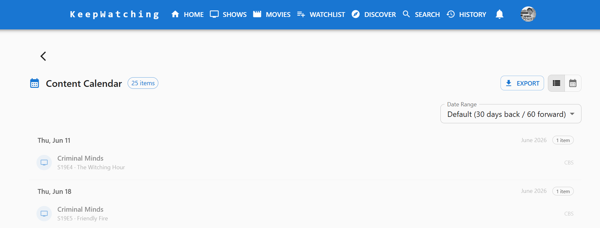
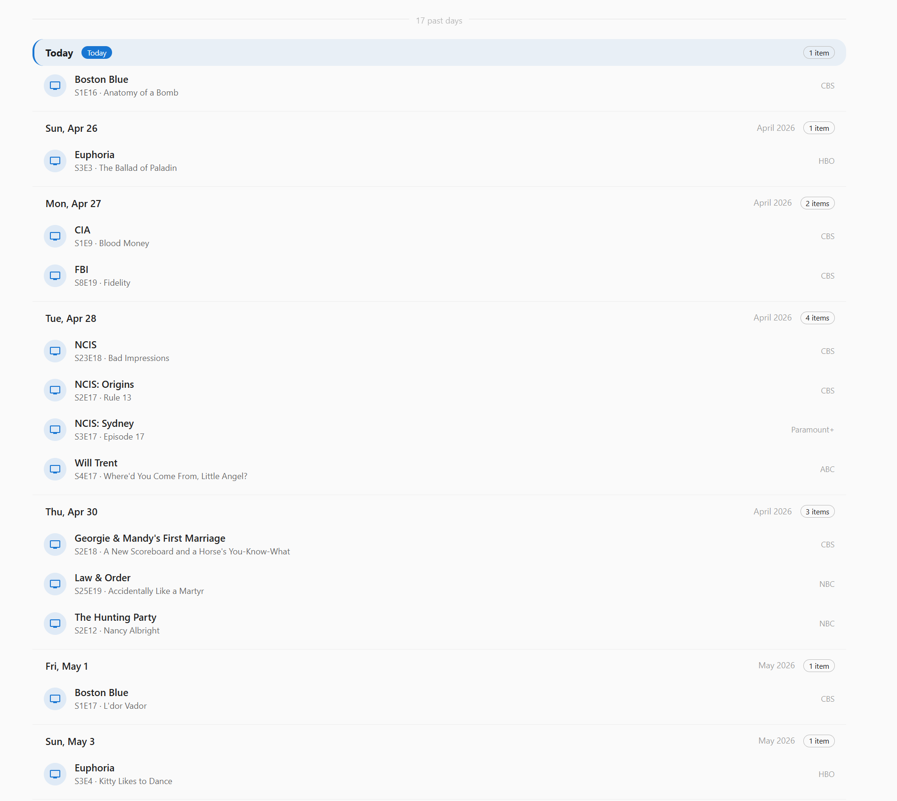
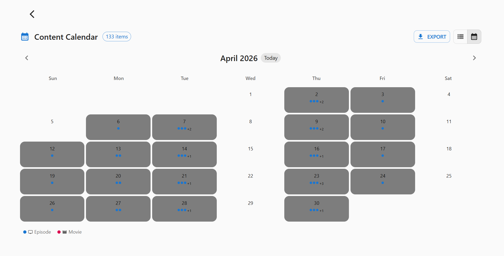
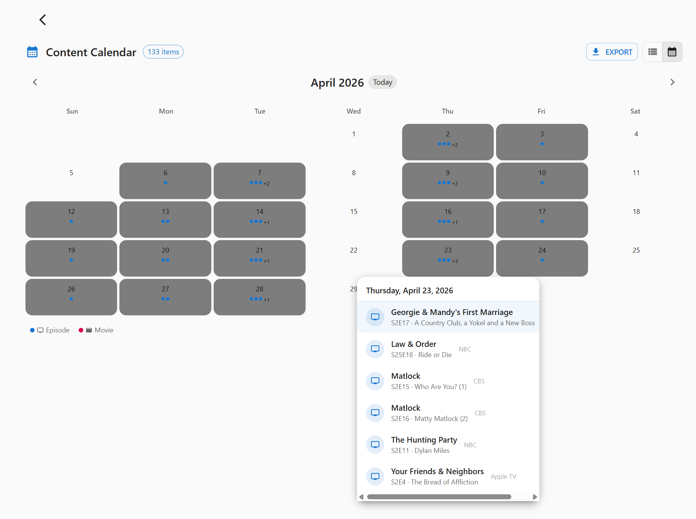

[< Back](../README.md)

# Calendar - User Guide

The Calendar feature in KeepWatching gives you a visual overview of when your shows air new episodes and when movies are released. You can see upcoming and recently aired content at a glance without leaving the app.

## Accessing the Calendar

The Calendar is available in two ways:

- **Home page shortcut**: A **View Calendar** button appears in both the TV Shows tab and the Movies tab on your Home dashboard, linking directly to the full Calendar page.
- **Direct navigation**: Navigate to `/calendar` from the main navigation menu.

## Views

The Calendar offers two display modes that you can toggle between at any time. Your preferred view is saved automatically and restored on your next visit.

### Agenda View (List)

The agenda view shows a scrollable, day-by-day list of content. Each day section lists the episodes and movies airing or releasing on that date, including the show or movie title, episode name (for TV), and a link to the relevant detail page.

This view is ideal for seeing everything in order at a glance, particularly on mobile devices. It's also the only view with the **Date Range** selector (see below), since the grid view always shows a full month at a time.

### Grid View (Month Calendar)

The grid view displays a traditional month calendar layout. Each day cell shows a count of episodes and movies airing that day. Clicking a day opens a detail panel listing each item for that date.

Use the **previous** and **next** arrow buttons to navigate between months. When you navigate to a month outside the already-fetched date range, the calendar automatically fetches new data for that period.

## Choosing a Date Range

While in Agenda view, a **Date Range** dropdown lets you control exactly which window of content is loaded:

- **Default** — 30 days in the past to 60 days in the future (the standard view)
- **Next 7 Days** / **Next 30 Days** — upcoming content only
- **This Month** — everything airing or releasing in the current calendar month
- **Last 30 Days** — recently aired/released content only
- **Custom Range…** — pick your own **Start** and **End** dates, up to a maximum span of 1 year

Your selected range (and preset choice) is remembered between visits, so the calendar reopens exactly how you left it. Signing out resets it back to the Default range.

## Exporting to Your Calendar App

Use the **Export** button in the header to download an `.ics` file containing every episode and movie currently loaded in the calendar (based on your selected date range). Import the file into Google Calendar, Apple Calendar, Outlook, or any other calendar app that supports the standard iCalendar format to see your KeepWatching schedule alongside your other events. Each event links back to the show or movie's detail page in KeepWatching.

## Date Range & Caching

By default the calendar loads content spanning 30 days in the past and 60 days into the future from today — or whichever preset/custom range you've selected, as described above. In Grid view, navigating to a month outside the already-fetched range automatically fetches the additional data for that month. Already-fetched data is cached for 5 minutes before being considered stale and refreshed.

## Content Shown

The calendar includes:

- **Episodes**: Upcoming and recently aired episodes from shows in your profile, grouped by air date
- **Movies**: Upcoming releases and recent releases from movies in your watchlist, grouped by release date

Each item links to its show or movie detail page so you can mark it watched or view more information.

## Tips

- Use the **Agenda** view as your day-to-day check on what aired recently
- Use the **Grid** view for planning ahead across a full month
- Switch to a **Custom Range** and export to `.ics` when you want a specific window (e.g. a season's premiere week) in your personal calendar app
- Combine the Calendar with the **Upcoming Episodes** and **Upcoming Releases** sections on the Home page for a complete picture of your content schedule
