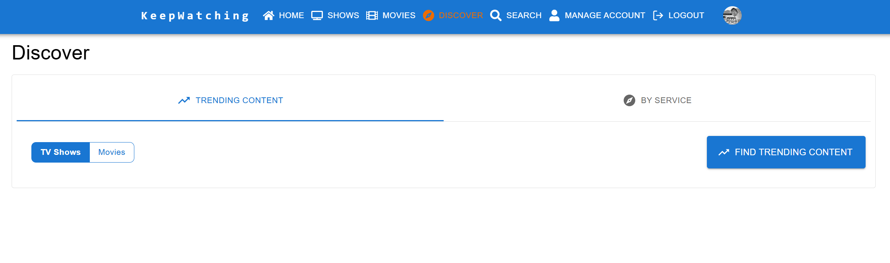
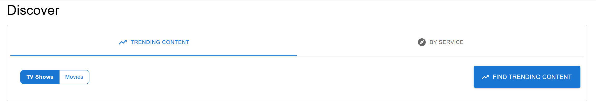
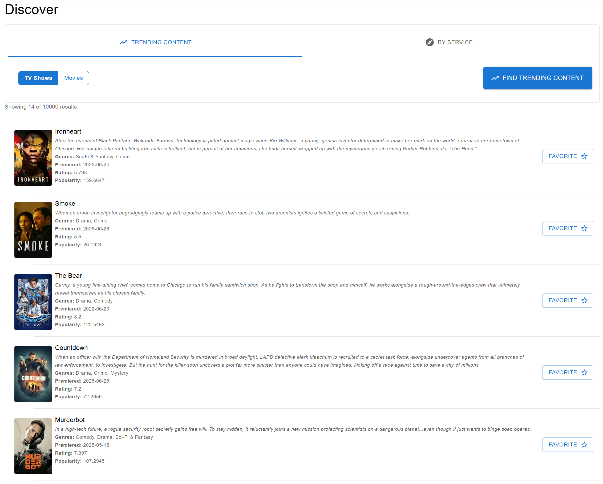
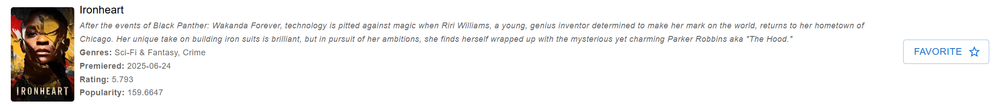
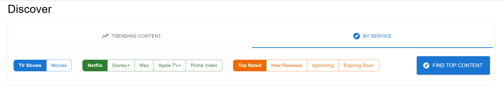
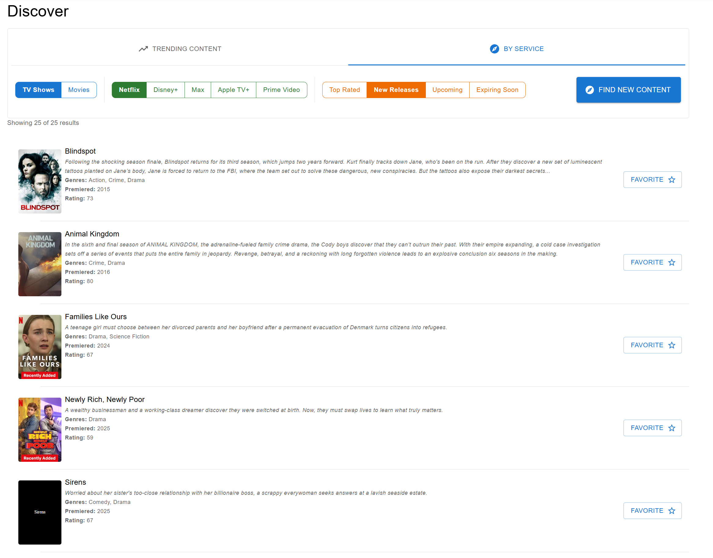
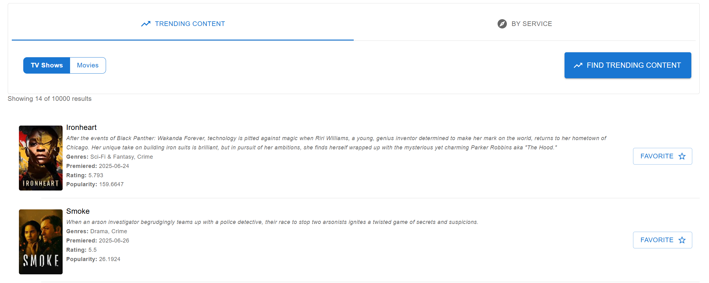
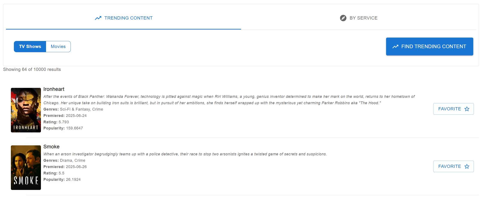

[< Back](../README.md)

# Discover - User Guide

The Discover page is your gateway to finding new and trending content across all major streaming platforms. Whether you're looking for the hottest shows everyone's talking about or want to explore what's new on your favorite streaming service, the Discover page has you covered.

## Overview

The Discover page offers two main discovery modes:
- **Trending Content** - Find what's popular right now across all platforms
- **By Service** - Browse content from specific streaming services with advanced filtering

## Getting Started

When you first visit the Discover page, you'll see two tabs at the top:
1. **Trending Content** - For finding popular shows and movies
2. **By Service** - For browsing specific streaming platforms

## Trending Content Discovery

### How to Use Trending Content

The Trending Content tab helps you discover what's currently popular across all streaming platforms.

1. **Select Content Type**
   - Choose between "TV Shows" or "Movies" from the selector
   - This determines what type of content you'll see in your results

2. **Find Trending Content**
   - Click the "Find Trending Content" button to see what's popular
   - Results will show the most trending content based on your selected type

### Understanding Trending Results

Each result shows:
- **Title and poster image**
- **Brief description** of the show or movie
- **Genres** to help you understand the content type
- **Premiere date** to see how new or established the content is
- **Rating** to gauge quality
- **Favorite button** to add content to your personal collection

## Service-Specific Discovery

### Available Streaming Services

The "By Service" tab lets you explore content from these major platforms:
- Netflix
- Disney+
- HBO Max
- Apple TV+
- Prime Video

### How to Browse by Service

1. **Choose Content Type**
   - Select either "Movies" or "TV Shows" 
   - You can browse both types of content on any service

2. **Select a Streaming Service**
   - Choose your preferred service from the "Streaming Service" selector
   - This will filter results to only show content available on that platform

3. **Apply Content Filters**
   - **Top Rated** - Shows the highest-rated content on the service
   - **New Releases** - Displays recently added content
   - **Upcoming** - Shows content coming soon to the platform
   - **Expiring Soon** - Highlights content leaving the service soon

4. **Search for Content**
   - Click the "Find [Filter Type] Content" button
   - The button text changes based on your selected filter (e.g., "Find Top Content", "Find New Content")

## Working with Search Results

### Viewing Results

Search results are displayed in a scrollable list format with detailed information for each item:

- **Poster image** on the left
- **Title and description** in the center
- **Key details** like genres, premiere date, and ratings
- **Favorite button** on the right to add to your collection

### Adding Content to Your Collection

To save interesting content for later:

1. **Click the Favorite Button** (star icon) on any content card
2. The content will be added to your personal collection
3. You can then track your viewing progress from the Shows or Movies pages

### Loading More Results

The Discover page automatically loads more content as you scroll down:

- **Scroll down** to see additional results
- A **loading indicator** appears while new content is being fetched
- The page shows how many results you're viewing out of the total available

## Tips for Better Discovery

### Finding the Right Content

1. **Use Multiple Filters** - Try different combinations of service, content type, and filters to discover varied content
2. **Check Expiring Soon** - Don't miss content that's leaving your favorite services
3. **Explore New Releases** - Stay current with the latest additions to streaming platforms
4. **Browse Top Rated** - Find critically acclaimed content you might have missed

### Managing Your Discoveries

1. **Favorite Early and Often** - Add interesting content to your favorites immediately so you don't forget
2. **Mix Content Types** - Explore both movies and TV shows for a varied entertainment experience
3. **Try Different Services** - Each platform has unique content worth exploring

### Staying Updated

- **Visit Regularly** - Trending content changes frequently, so check back often
- **Use Multiple Filters** - Different filter types reveal different aspects of a service's catalog
- **Follow Upcoming Content** - Use the "Upcoming" filter to plan your future viewing

## Troubleshooting Common Issues

### No Results Found
If you don't see any results:
- Try selecting a different streaming service
- Change your content type (Movies vs TV Shows)
- Check that you've selected all required filters

### Content Not Loading
If results aren't appearing:
- Check your internet connection
- Try refreshing the page
- Ensure you've clicked the search button after selecting your filters

## Next Steps

After discovering content you like:

1. **Visit Your Shows/Movies Pages** - View and manage your favorited content
2. **Set Watch Status** - Mark items as "Watching", "Watched", or "Not Watched"
3. **Track Progress** - For TV shows, mark individual episodes as you watch them
4. **Get Recommendations** - The system will suggest similar content based on your favorites

The Discover page is designed to make finding your next favorite show or movie effortless. Whether you're looking for something trending or want to dive deep into a specific streaming service's catalog, you'll always have something new and exciting to watch.