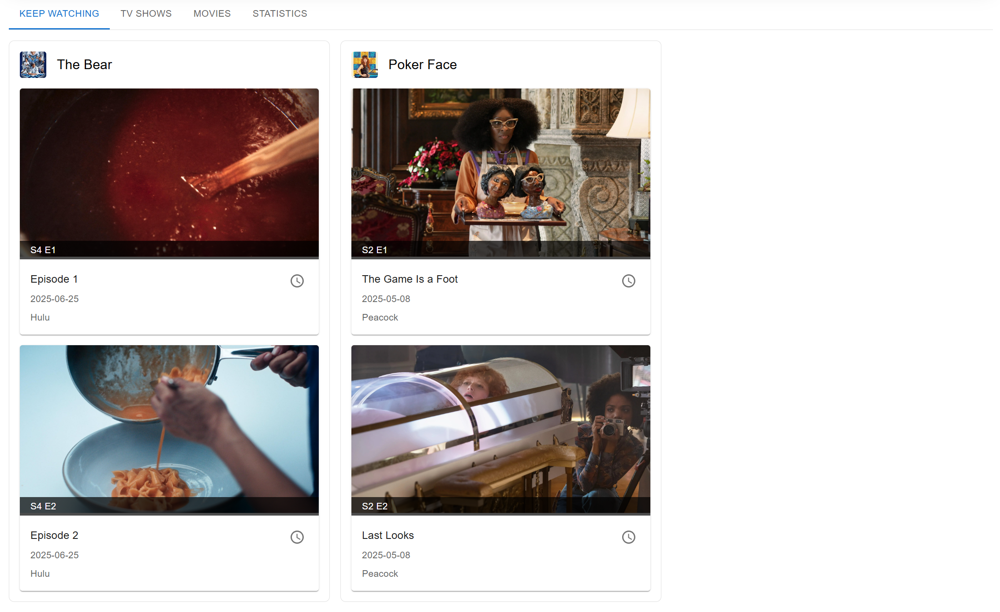
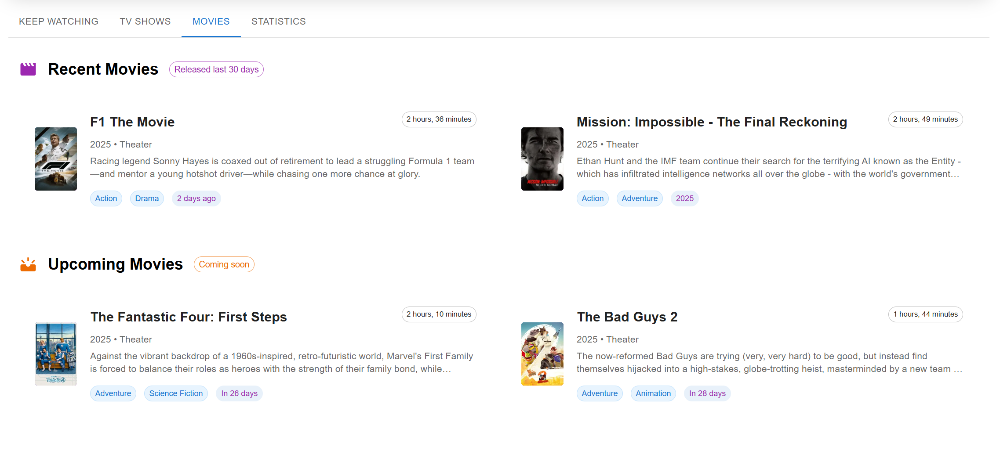
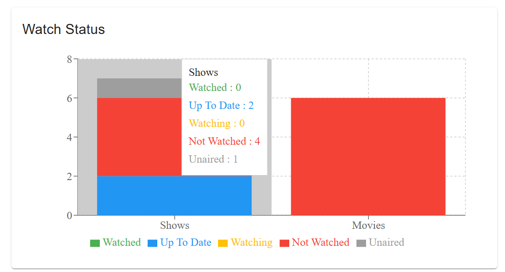

[< Back](../README.md)

# Home/Profile Dashboard User Guide

The Home/Profile Dashboard is your central hub for managing and tracking your entertainment content. This comprehensive guide will walk you through all the features and functionality available on your personal dashboard.

## Overview

The Home/Profile Dashboard provides a personalized view of your watching activity, organized into intuitive tabs that help you quickly find what you're looking for. From here, you can continue watching shows, discover new content, and track your viewing statistics.

## Profile Header

### Profile Information Display
At the top of your dashboard, you'll see your profile information including:
- **Profile Image**: Your custom profile picture (click to upload a new one)
- **Profile Name**: The name of the currently active profile
- **Quick Stats Cards**: At-a-glance viewing statistics

### Quick Statistics Cards
Four summary cards provide instant insights into your viewing habits:

- **Shows to Watch**: Total number of shows marked as "Not Watched" or "Watching"
- **Shows Watched/Up to Date**: Shows you've completed or are current with
- **Movies to Watch**: Movies in your watchlist that haven't been watched
- **Movies Watched**: Movies you've marked as completed

## Navigation Tabs

The dashboard is organized into four main tabs, each serving a specific purpose:

### 1. Keep Watching Tab

This tab is your starting point for continuing your viewing journey. It displays:

#### What You'll See:
- **Next Episodes**: Up to 2 episodes from your actively watched shows (up to 6 of them)
- **Episode Cards**: Each card shows:
  - Show poster image
  - Episode still/thumbnail
  - Season and episode numbers (e.g., "S1 E5")
  - Episode title
  - Air date
  - Network or streaming service

#### How to Use:
1. **Mark Episodes as Watched**: Click the watch status icon on any episode card to mark it as watched
2. **Navigate to Show Details**: Click on the show title to view full show details
3. **Automatic Updates**: Episodes are automatically sorted by season and episode number
4. **Progress Tracking**: As you mark episodes watched, new episodes appear automatically

#### Smart Features:
- Only shows aired episodes (no future episodes)
- Prioritizes shows you're actively watching
- Balances content across different shows to avoid overwhelming you with episodes from a single series

### 2. TV Shows Tab

This tab focuses entirely on your television content and provides:

#### Content Sections:

##### Recent Episodes
*[Screenshot: Recent episodes section]*
- Recently aired episodes from shows you're watching
- Perfect for catching up on missed episodes
- Organized by air date to show newest content first

##### Upcoming Episodes
*[Screenshot: Upcoming episodes section]*
- Episodes from your watched shows that will air soon
- Helps you stay current with ongoing series
- Shows air dates and network information
- Click any episode to go to the show's detail page

#### Navigation Features:
- Episode tiles link directly to show detail pages
- Section headers provide quick navigation to your shows page

### 3. Movies Tab

Your movie management center includes:

#### Content Sections:

##### Recent Releases
- Movies from your watchlist that have recently been released
- Helps you stay current with new movies you want to watch
- Shows release dates and streaming availability

##### Upcoming Releases
- Movies in your watchlist that haven't been released yet
- Plan your future movie watching
- Track anticipated releases

#### Movie Management:
- Each movie tile shows poster, title, release date, and streaming services

#### Navigation Features:
- Movie tiles link directly to movie detail pages
- Section headers provide quick navigation to your movies page

### 4. Statistics Tab

A comprehensive analytics view of your viewing habits:

#### Overview Statistics:
- **Overall Progress**: Visual progress bar showing your total episode watch completion
- **Content Counts**: Total shows, movies, and episodes in your profile
- **Watch Status Distribution**: Charts showing the breakdown of your content by watch status

#### Detailed Analytics:

##### Watch Status Charts

- Visual representation of your content by status (Watched, Watching, Not Watched, Up to Date)
- Separate tracking for shows and movies
- Helps identify your viewing patterns

##### Genre Distribution

- Pie chart showing your top genres by content count
- Discover your favorite types of entertainment
- Based on all shows and movies in your profile

##### Streaming Services

- Bar chart of content by streaming platform
- See which services provide most of your content
- Useful for subscription management decisions

##### Active Shows Progress

- Detailed progress bars for shows you're actively watching
- See completion percentage for each show
- Track how close you are to finishing series

## Smart Features & Automation

### Real-Time Updates
- Episode watch status updates instantly across all tabs
- New episodes automatically appear when they air
- Statistics update immediately when you change watch status

### Intelligent Content Sorting
- Episodes sorted by season and episode number
- Shows balanced across "Keep Watching" to avoid overwhelming single-show dominance
- Recent/upcoming content sorted by air date

### Visual Progress Tracking
- Color-coded statistics cards for easy recognition
- Progress bars show completion percentages
- Watch status icons provide instant visual feedback

## Getting Started Workflow

### For New Users:
1. **Add Content**: Start by adding shows and movies from the Discover or Search pages
2. **Set Watch Status**: Mark content as "Watching" for shows you want to follow
3. **Track Progress**: Use the Keep Watching tab to mark episodes as watched
4. **Monitor Stats**: Check the Statistics tab to see your viewing patterns develop

### Daily Usage:
1. **Start Here**: Open the Keep Watching tab to see what's next
2. **Mark Progress**: Click episode watch buttons as you finish watching
3. **Check Updates**: Review Recent Episodes for newly aired content
4. **Discover More**: Use Upcoming sections to plan future viewing

## Tips for Maximum Efficiency

### Content Management:
- **Be Selective**: Only mark shows as "Watching" if you're actively following them
- **Regular Cleanup**: Periodically review and update watch status for stalled shows
- **Use Statistics**: Monitor your completion rates to avoid overwhelming your watchlist

### Navigation Shortcuts:
- **Episode Links**: Click episode titles to jump directly to show details
- **Movie Links**: Click movie titles to jump directly to movie details
- **Section Headers**: Use section headers as navigation shortcuts

### Profile Optimization:
- **Upload Photos**: Add profile images for easy identification
- **Monitor Progress**: Check statistics regularly to balance your watching habits
- **Update Status**: Keep watch status current for accurate recommendations

## Troubleshooting

### Common Issues:

**Episodes Not Appearing in Keep Watching:**
- Verify shows are marked as "Watching" 
- Check that episodes have aired (future episodes won't appear)
- Ensure you haven't already marked recent episodes as watched

**Statistics Not Updating:**
- Statistics update in real-time - try refreshing if data seems stale
- Verify content is properly added to your profile
- Check that watch status changes are being saved

**Missing Recent/Upcoming Content:**
- Content depends on air date data from external sources
- Some shows may have delayed or missing air date information
- Try adding content directly from Search or Discover pages

### Getting Help:
- Check the full User's Guide for additional information
- Verify your internet connection for real-time updates
- Contact support if data isn't syncing properly

---

*This dashboard is designed to make managing your entertainment effortless. Take some time to explore each tab and discover how the features work together to enhance your viewing experience.*