[< Back](../README.md)

# Manage Account - User Guide

The Manage Account page is your central hub for managing your KeepWatching account settings and profiles. This comprehensive guide will walk you through all the features available on this page.

## Table of Contents

- [Overview](#overview)
- [Account Information Section](#account-information-section)
- [Preferences](#preferences)
- [Review Watch History](#review-watch-history)
- [Account Statistics](#account-statistics)
- [Deleting Your Account](#deleting-your-account)
- [Profile Management](#profile-management)
- [Profile Switching via Navigation](#profile-switching-via-navigation)
- [Profile Switching Workflow](#profile-switching-workflow)
- [Tips and Best Practices](#tips-and-best-practices)
- [Troubleshooting](#troubleshooting)
- [Security and Privacy](#security-and-privacy)

## Overview

The Manage Account page allows you to:

- Edit your account information and profile picture
- Manage multiple viewing profiles for your family
- View detailed statistics for your account and individual profiles
- Set default profiles and switch between active profiles
- Configure your preferences and application settings
- Download a copy of a profile's data
- Hand a profile off as its own independent account
- Delete your account

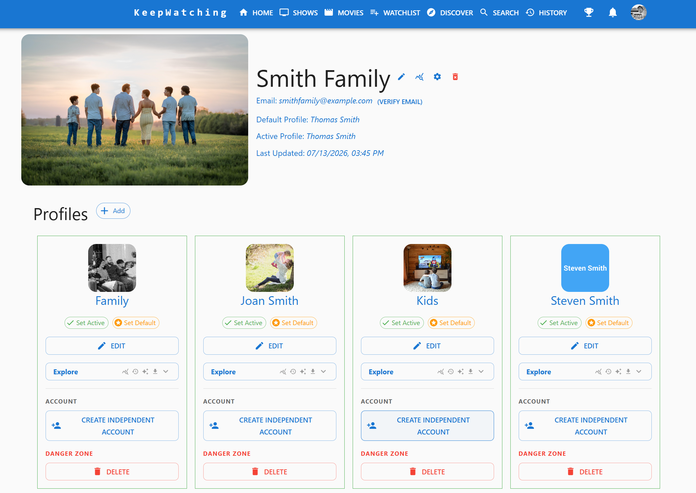

## Account Information Section

### Account Profile Picture

Your account profile picture is displayed prominently at the top of the page.

**To update your account picture:**

1. Hover over your current account image
2. Click when you see the "Manage Image" overlay
3. Select the 'Upload image' option (if you already have an image this option will be 'Change image')
4. Select a new image file from your device
5. The image will be automatically uploaded and updated

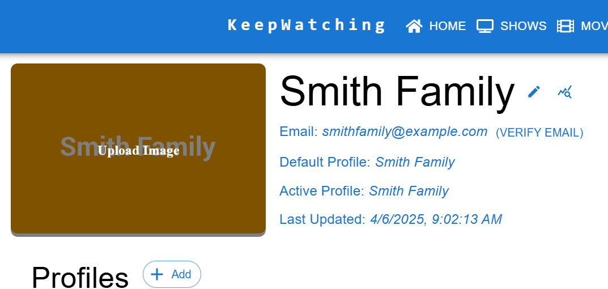

**To remove your account picture:**

1. Hover over your current account image
2. Click when you see the "Manage Image" overlay
3. Select the 'Remove image' option
4. The image will be automatically removed

### Account Details

Your account information is displayed next to your profile picture:

- **Account Name**: Your display name with an edit button
- **Email**: Your registered email address with verification status
- **Default Profile**: Shows which profile is set as your default
- **Active Profile**: Shows which profile is currently active
- **Last Updated**: Timestamp of when your profile data was last refreshed

The account name section also includes action buttons for:

- **Edit** (pencil icon) - Edit your account name
- **Statistics** (chart icon) - View account-wide statistics
- **Review Watch History** (history icon) - Review and fix bulk-imported watch history
- **Preferences** (gear icon) - Configure application preferences
- **Install** (device icon) - Install KeepWatching as an app on this device; only appears when your browser supports installation
- **Delete Account** (trash icon) - Permanently delete your account

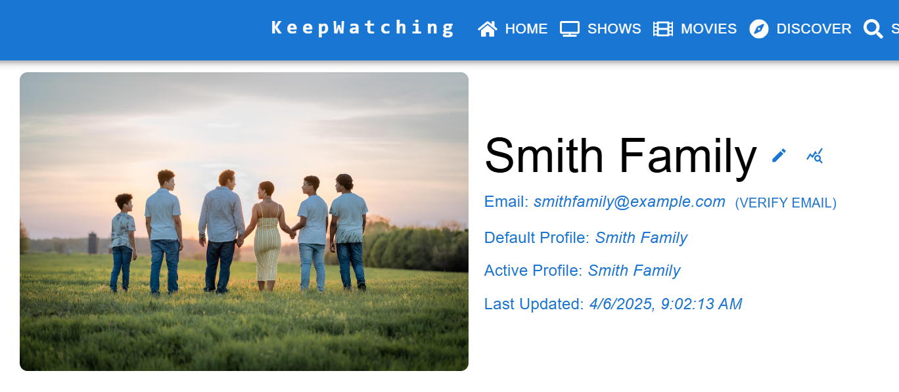

### Editing Your Account Name

1. Click the edit icon (pencil) next to your account name
2. Enter your new name in the dialog box
3. Click "Save" to confirm your changes

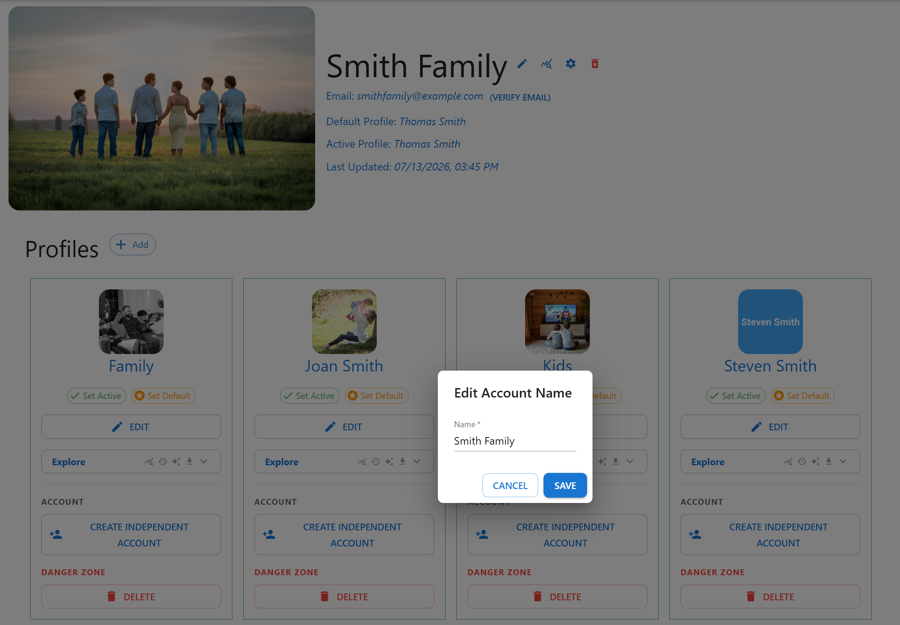

### Email Verification

If your email isn't verified, you'll see a "Verify Email" button next to your email address:

1. Click "Verify Email" to send a verification email
2. Check your email inbox for the verification message
3. Follow the link in the email to complete verification
4. Return to the page to see the updated verification status

## Preferences

Click the preferences icon (gear) next to your account name to configure application settings.

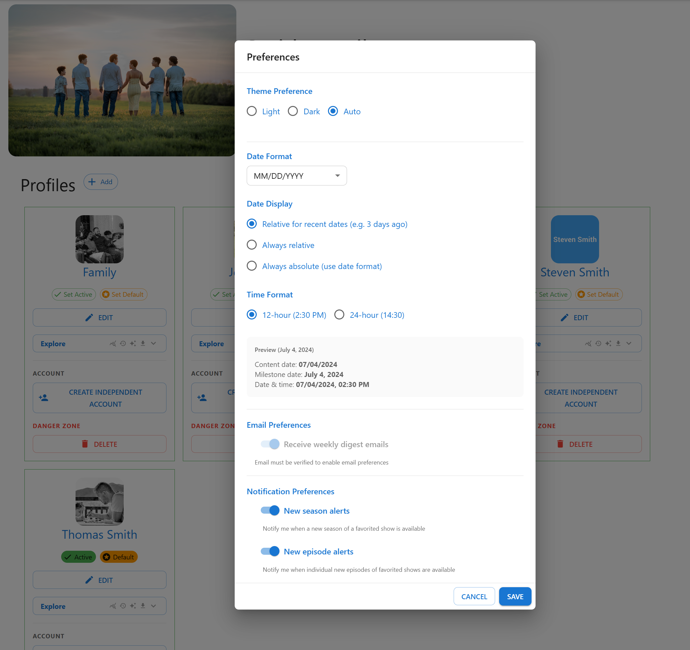

**Preferences include:**

- **Theme Selection**: Choose between Light, Dark, or Auto theme
  - Light: Always use light theme
  - Dark: Always use dark theme
  - Auto: Automatically match your system theme preference
- **Date Format**: Choose how dates are displayed — MM/DD/YYYY, DD/MM/YYYY, or YYYY-MM-DD
- **Date Display**: Choose how dates are worded
  - Relative for recent dates: shows things like "3 days ago" for recent activity, falling back to the date format for older dates
  - Always relative: always shows a relative phrase, regardless of age
  - Always absolute: always shows the date using your chosen Date Format
- **Time Format**: Choose 12-hour (2:30 PM) or 24-hour (14:30) time
- **Live Preview**: A preview box shows a sample content date, milestone date, and date & time formatted using your current selections, so you can see the effect before saving
- **Email Preferences**: Configure email notifications
  - Weekly Digest: Receive weekly summary emails (requires verified email)
- **Notification Preferences**: Control which automatic notifications you receive
  - New season alerts: notify when a new season of a favorited show is available
  - New episode alerts: notify when individual new episodes of favorited shows are available

The preferences dialog allows you to customize your viewing experience across all devices. Changes are saved when you click the "Save" button.

**Note**: Email preferences require a verified email address to enable.

## Review Watch History

Click the **Review Watch History** icon (history/clock icon) next to your account name to open the watch history review tool. This feature helps you identify and fix shows where all episodes were marked as watched on the same day — a common pattern when manually recording a large backlog at once.

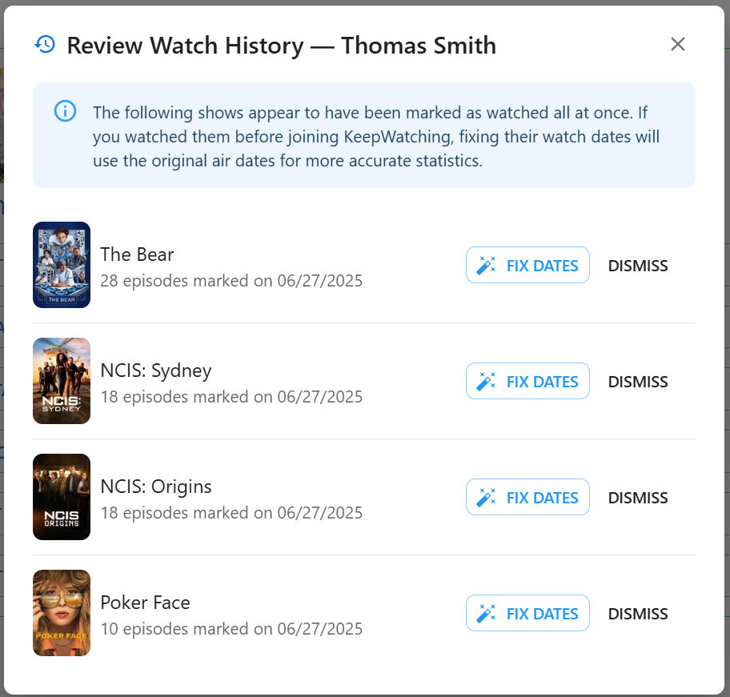

### What It Shows

The review panel lists shows where many episodes share the same watch date. For each show it displays:

- Show poster and title
- The number of episodes that share the same watch date
- The date on which they were all marked

### Actions

For each show you have two options:

- **Fix dates** — retroactively updates the watch dates for all those episodes to use their original air dates, so your history accurately reflects when each episode actually aired
- **Dismiss** — marks the show as reviewed and removes it from the list without changing any dates (useful if you genuinely watched everything in one sitting)

You can also fix bulk-marked shows directly from the Show Details page, where a banner appears automatically if a bulk-mark pattern is detected.

## Account Statistics

Click the statistics icon next to your account name to view comprehensive account-wide analytics.

**Account Statistics include:**

- **Base Statistics**: Core metrics including:
  - Overall episode watch progress across all profiles
  - Total number of profiles, unique shows, and movies
  - Watch status breakdowns for shows and movies
  - Genre and streaming service distributions
  - Content breakdown charts

- **Enhanced Statistics**: Advanced analytics including:
  - **Velocity Metrics**: Watch rate and episode velocity over time
  - **Timeline Analysis**: Watch history and activity patterns over time
  - **Binge Patterns**: Consecutive watch sessions and binge-watching behavior
  - **Streaks**: Longest watch streaks and consistency tracking
  - **Time-to-Watch Analysis**: How quickly you watch content after adding it
  - **Seasonal Trends**: Viewing patterns by season and time of year
  - **Milestones**: Achievements and viewing milestones reached
  - **Content Depth**: Genre preferences and streaming service distribution
  - **Content Discovery**: How you discover and add new content
  - **Abandonment Risk**: Shows at risk of being abandoned
  - **Unaired Content**: Tracking of upcoming and unaired episodes
  - **Profile Comparisons**: Compare viewing patterns across profiles
  - **Rewatches**: Totals and most-rewatched shows/movies/episodes/seasons (in one card) plus a dedicated card showing the shows with the most rewatched episode volume across all profiles, each with its own top rewatched episodes nested underneath
  - **Skip Rate**: How many seasons have been marked Skipped, and which shows have the most skipped seasons
  - **Watchlist Usage**: Currently-queued items, average time in queue, add/remove churn, and completion rate (watched vs. abandoned) for the watchlist

- **Time Window Selector**: A **Time window** control (30D / 90D / 6M / 1Y / All) above the Enhanced Statistics scopes them to a specific period. It applies to Velocity, Timeline, Binge Patterns, Streaks, Seasonal Trends, Time-to-Watch, Content Depth, and Content Discovery — Milestones, Abandonment Risk, Unaired Content, Rewatches, Skip Rate, and Watchlist Usage always reflect lifetime data regardless of the selected window

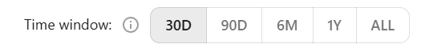

The statistics are fetched in parallel and displayed in an interactive dashboard with charts and visualizations powered by the KeepWatching UI library.

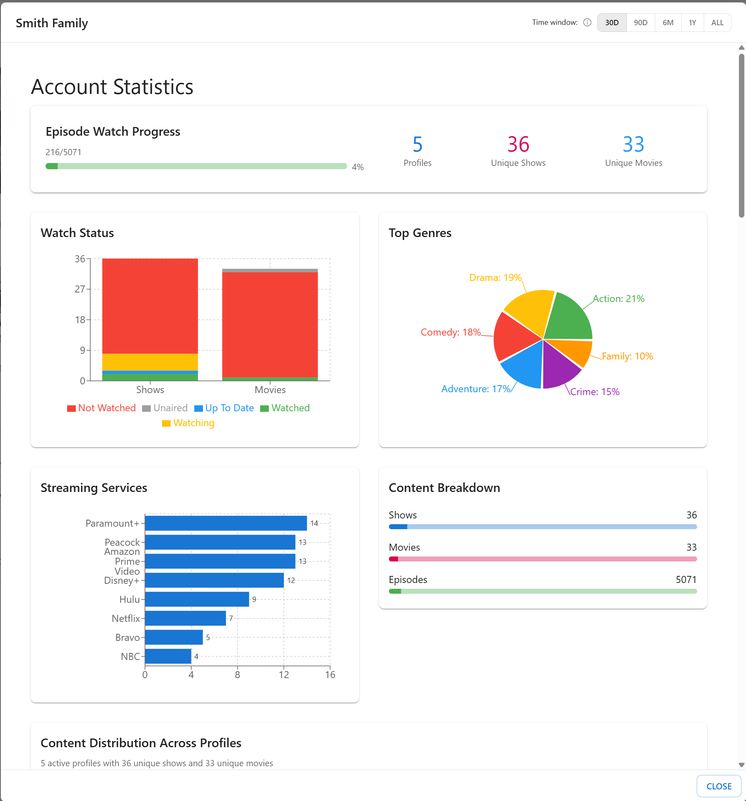

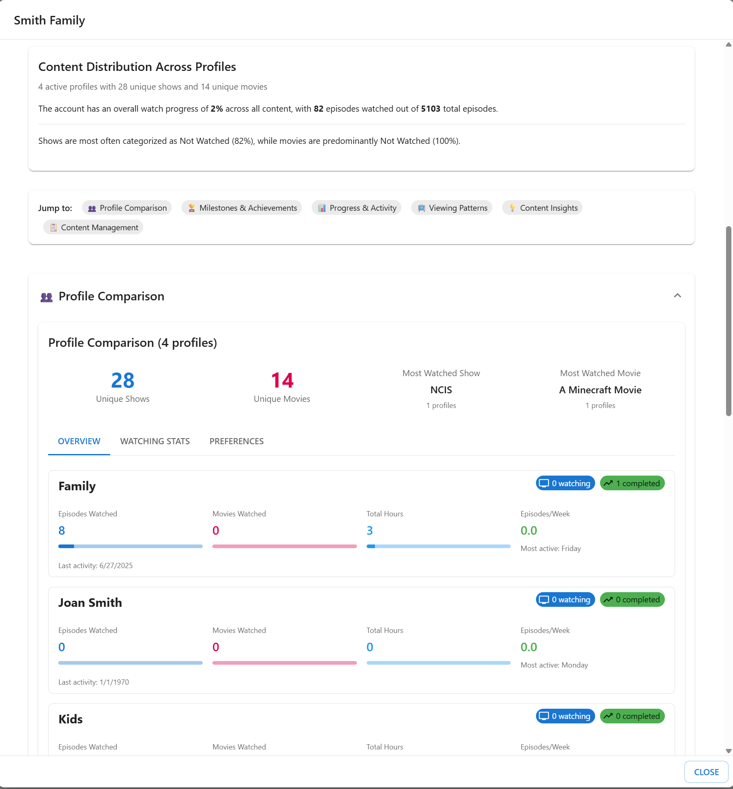
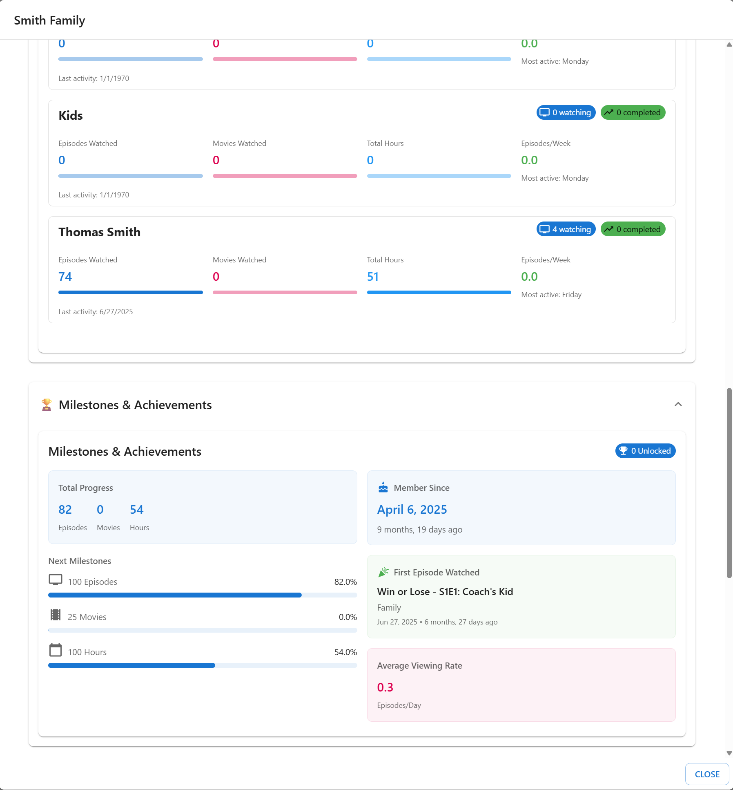
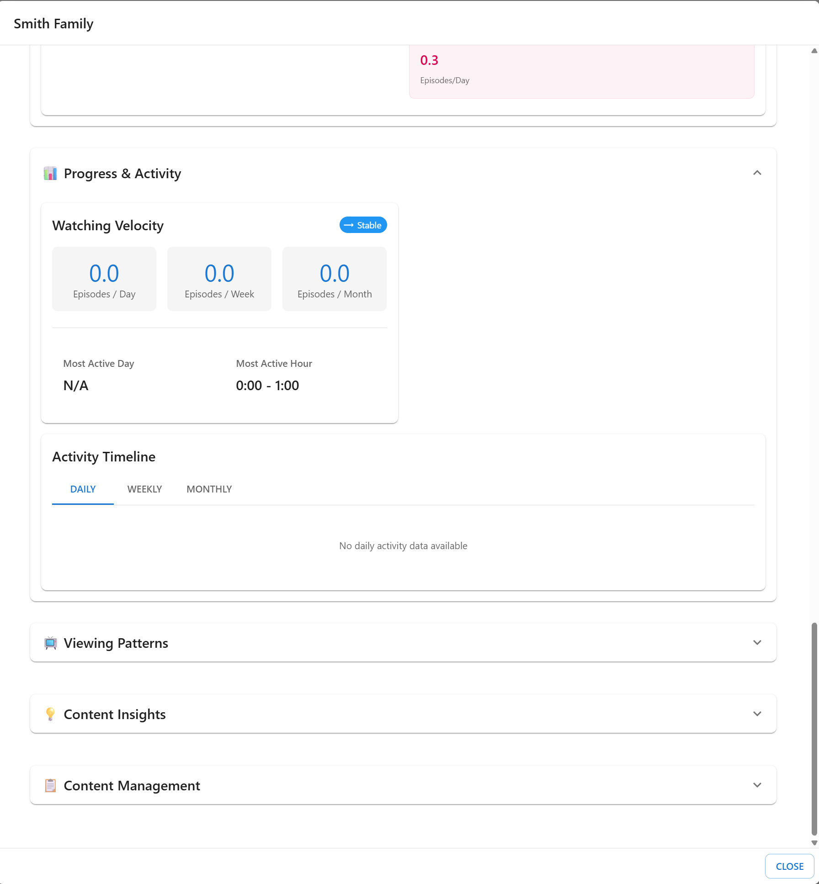

## Deleting Your Account

The delete account feature allows you to permanently remove your account and all associated data.

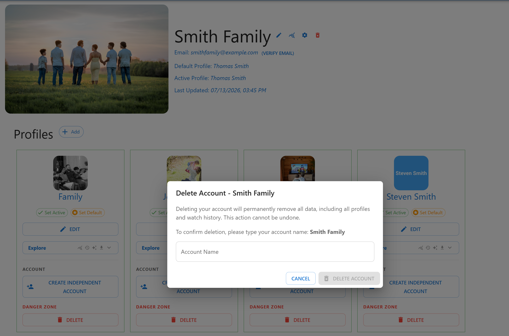

**To delete your account:**

1. Click the delete icon (trash) next to your account name
2. A confirmation dialog will appear
3. Type your exact account name to confirm deletion
4. Click "Delete Account" to proceed

**Important Warnings:**

- Deleting your account removes ALL data including all profiles and watch history
- This action is PERMANENT and cannot be undone
- The delete button is only enabled when you correctly type your account name
- You will be logged out immediately after deletion

## Profile Management

### Profiles Section

The profiles section displays all profiles associated with your account as individual cards.

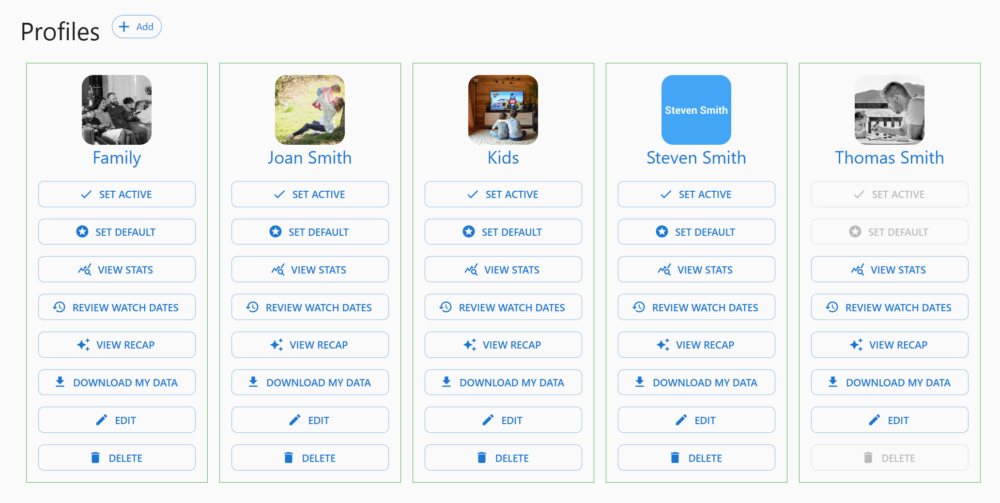

### Adding a New Profile

1. Click the "Add" chip button in the Profiles section header
2. Enter a name for the new profile
3. Click "Save" to create the profile
4. The new profile will appear as a card in the profiles section

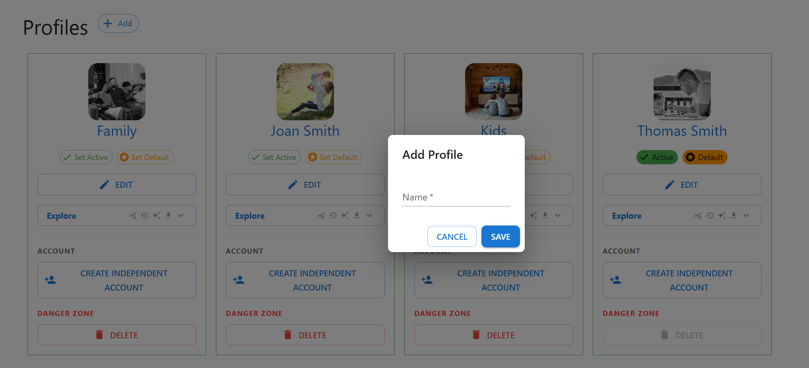
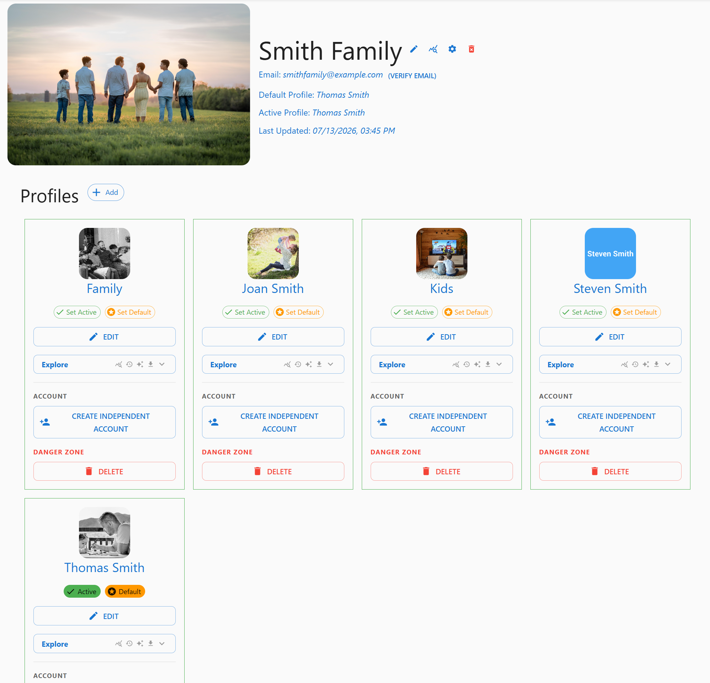

### Profile Cards

Each profile card shows:

- Profile picture (clickable to upload new image)
- Profile name
- Status chips showing whether the profile is currently **Active** and/or the account's **Default**
- An **Edit** button
- An **Explore** menu with that profile's stats, watch-date review, recap, and data export
- An **Account** section for handing the profile off as its own account
- A **Danger Zone** with the profile's **Delete** control

### Profile Actions

#### Set Active Profile

A profile that isn't currently active shows a clickable **Set Active** chip:

1. Click the **Set Active** chip on the desired profile card
2. The chip's label changes to "Setting Active…" with a spinner during the process
3. Once complete, all your viewing data will reflect that profile's progress
4. The currently active profile shows a filled, non-clickable **Active** chip instead

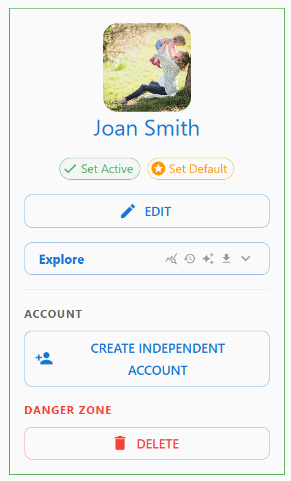

#### Set Default Profile

A profile that isn't your account's default shows a clickable **Set Default** chip:

1. Click the **Set Default** chip on the desired profile card
2. This profile will be automatically selected when you log in
3. The account's current default profile shows a filled, non-clickable **Default** chip instead

#### Explore Menu

Click **Explore** on a profile card to open a menu grouping that profile's "look, don't just switch" actions:

- **View Stats** — detailed analytics for that profile (see below)
- **Review Watch Dates** — opens the same watch-date review tool described in [Review Watch History](#review-watch-history) above, scoped to this profile
- **View Recap** — that profile's shareable Recap (see below)
- **Download My Data** — exports that profile's data as JSON (see below)

#### View Profile Statistics

Select **View Stats** from a profile card's Explore menu to see detailed analytics for that specific profile:

- **Base Statistics**: Core metrics including:
  - Individual viewing progress and statistics
  - Show completion rates and progress bars
  - Genre preferences and streaming service usage
  - Episode watch progress charts

- **Enhanced Statistics**: Advanced analytics including:
  - **Velocity Metrics**: Personal watch rate and viewing pace
  - **Timeline Analysis**: Personal watch history and patterns
  - **Binge Patterns**: Individual viewing sessions and habits
  - **Streaks**: Personal consistency tracking
  - **Time-to-Watch Analysis**: How quickly content is watched after adding
  - **Seasonal Trends**: Personal viewing patterns by season
  - **Milestones**: Personal achievements and milestones reached
  - **Content Depth**: Genre preferences and streaming service usage
  - **Content Discovery**: How the profile discovers new content
  - **Abandonment Risk**: Shows at risk of being abandoned
  - **Unaired Content**: Tracking of upcoming episodes for this profile
  - **Rewatches**: Totals and most-rewatched shows/movies/episodes/seasons (in one card) plus a dedicated card showing the shows with the most rewatched episode volume for this profile, each with its own top rewatched episodes nested underneath
  - **Skip Rate**: How many seasons this profile has marked Skipped, and which shows have the most skipped seasons
  - **Watchlist Usage**: Currently-queued items, average time in queue, add/remove churn, and completion rate (watched vs. abandoned) for this profile's watchlist

- **Time Window Selector**: The same **Time window** control (30D / 90D / 6M / 1Y / All) described in [Account Statistics](#account-statistics) above scopes the Enhanced Statistics to a specific period — Milestones, Abandonment Risk, Unaired Content, Rewatches, Skip Rate, and Watchlist Usage are unaffected and always show lifetime data

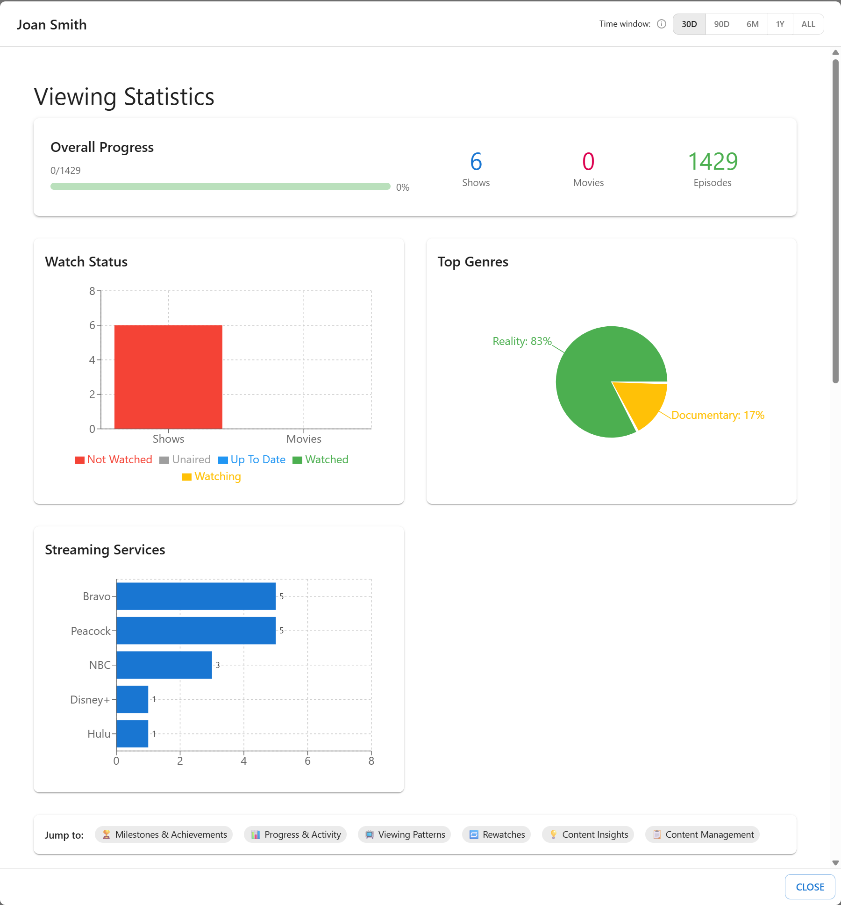

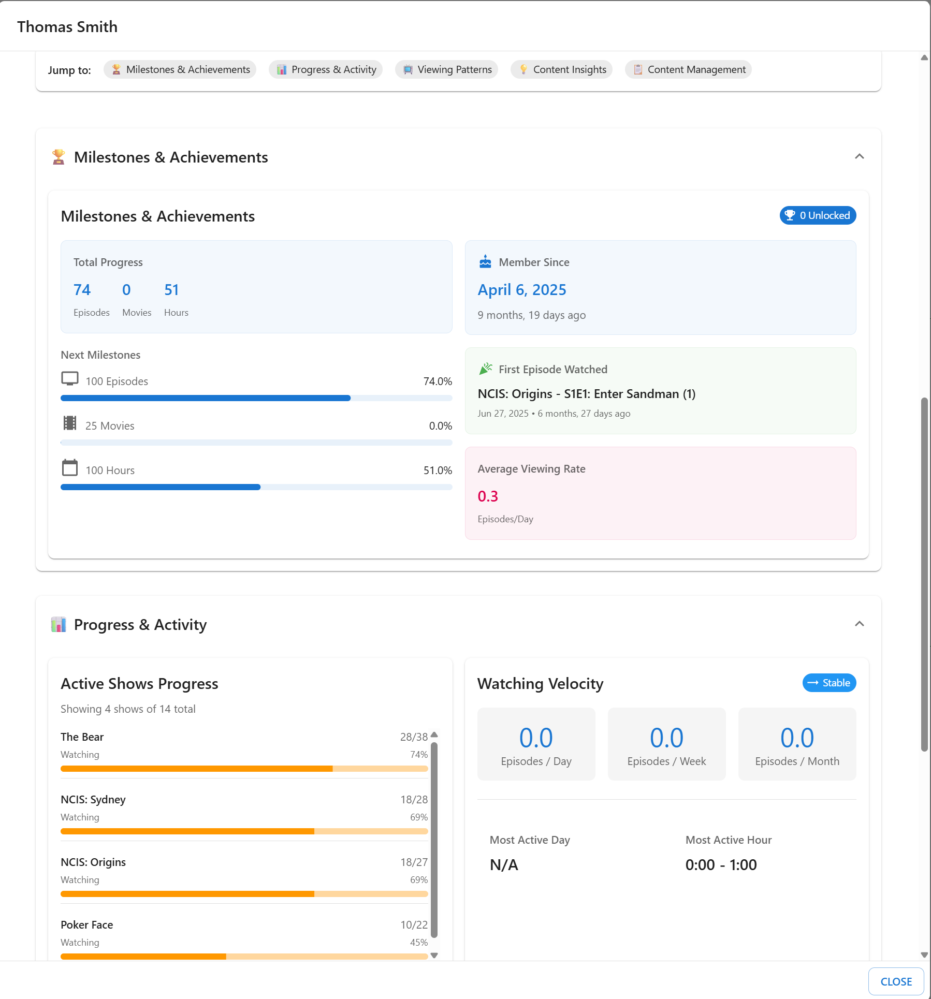

#### View Recap

Select **View Recap** from a profile card's Explore menu to open that profile's shareable [Recap](recap.md) — a poster-style monthly and yearly summary of viewing activity including hours watched, an activity heatmap, top genres, most-watched show, and longest streak. Unlike the Home page banner, this is available anytime for any period the profile has activity for.

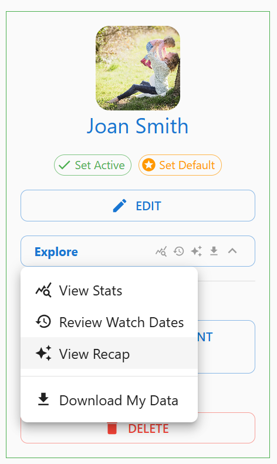

#### Download My Data

Select **Download My Data** from a profile card's Explore menu to download a JSON file of that profile's data:

- **Favorites**: All shows and movies added to the profile
- **Ratings**: Star ratings and notes left on shows and movies
- **Watchlist**: The profile's prioritized watch queue
- **Watch History**: The full watch history, including rewatches

The menu item shows an "Exporting…" state with a spinner while the data is gathered, then triggers a browser download of a `keepwatching-data-<profile>-<date>.json` file — no data leaves your browser except the normal API requests used to gather it. This works for any profile on the account, not just the currently active one. If the export fails (for example, due to a network issue), an error message appears in the Explore menu and you can try again.

#### Create Independent Account

In the **Account** section of a profile card, click "Create Independent Account" to invite that profile's owner to take it out of your account and set it up as their own, fully independent KeepWatching account — useful when a family member (e.g. a teenager moving out, a roommate) wants their own login. The button is disabled if the profile is the only one on your account, since the account must always keep at least one profile.

**To send an invitation:**

1. Click "Create Independent Account" in the profile card's Account section
2. Enter the new owner's email address (required) and optionally their name
3. If the profile is currently your account's **default profile**, you'll also be asked to choose which of your remaining profiles becomes the new default — this step is skipped for any non-default profile
4. Click "Send Invitation"

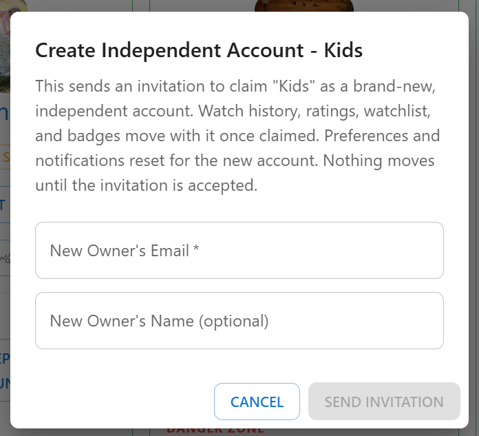

The Account section then shows "Invite sent to `<email>`" with a **Cancel Invite** option in place of the button, so you always know an invitation is pending. **Nothing moves until the invitation is accepted** — the profile, and everything in it, stays fully usable on your account in the meantime.

**What happens when the invitation is accepted:**

The invited person receives an email with a link to claim the profile. They set up their new account by creating a password or continuing with Google — on their own device, using their own credentials. Once claimed:

- The profile, along with its **watch history, ratings, notes, watchlist, and badges**, moves to the new account
- The profile disappears from your account's Profiles section
- **Preferences and notification settings do not transfer** — the new account starts with fresh defaults
- If you'd set a replacement default profile in step 3 above, your account's default switches to it automatically

**Notes:**

- Invitations expire after 7 days if not claimed
- The invited person must sign in with the exact email address the invitation was sent to
- Only one pending invitation is allowed per profile at a time — cancel the existing one before sending another

#### Edit Profile

1. Click "Edit" on a profile card
2. Enter the new name in the dialog box
3. Optionally pick an **accent color** from the swatches (or "None" to clear it) — this color carries through to that profile's [Recap](recap.md) cards
4. Click "Save" to update the profile

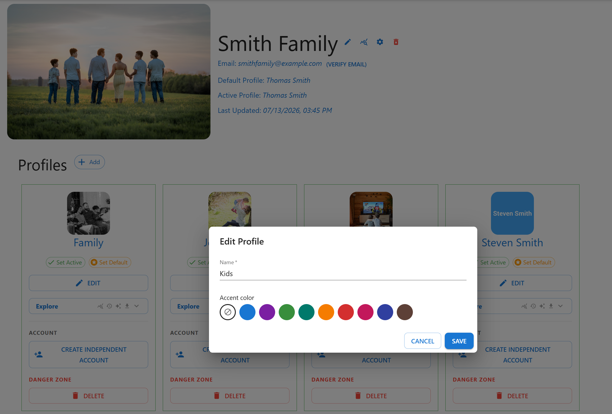

#### Upload Profile Picture

1. Hover over the profile picture on any profile card
2. Click when you see the "Manage Image" overlay
3. Select the 'Upload image' option
4. Select an image file from your device
5. The profile picture will be updated automatically

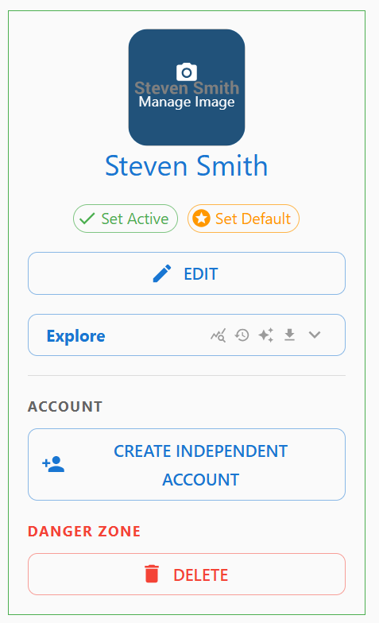

#### Delete Profile

1. In the **Danger Zone** section of the profile card you want to remove, click "Delete"
2. A confirmation dialog will appear warning about data loss
3. Click "Delete" to confirm (this action cannot be undone)
4. The profile and all its watch history will be permanently removed

**Important Notes:**

- You cannot delete your default profile
- Deleting a profile removes ALL watch data associated with it
- This action is permanent and cannot be undone

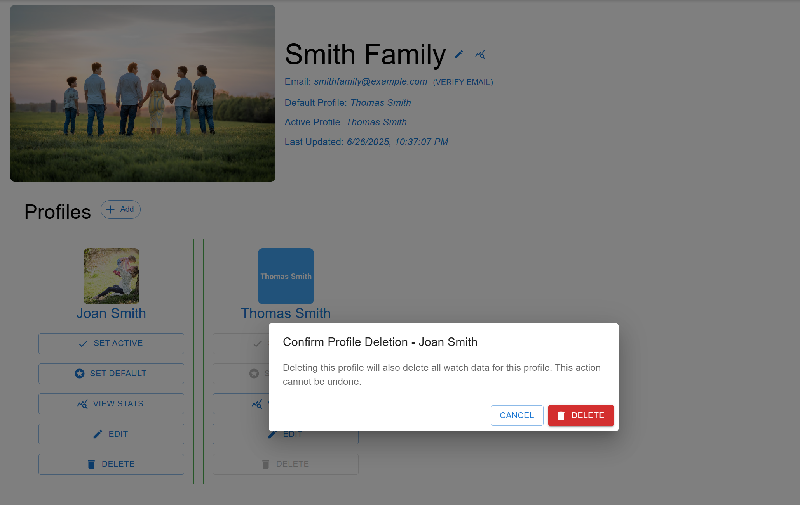

## Profile Switching via Navigation

In addition to the Manage Account page, you can quickly switch profiles from the navigation bar:

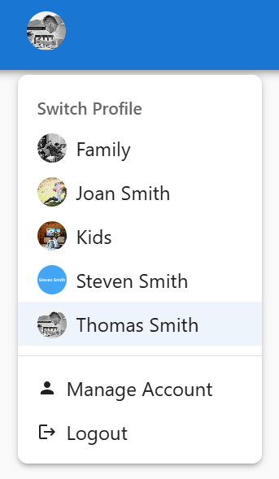

1. Click on your profile avatar in the top-right corner of the navigation bar
2. A menu will appear showing all available profiles
3. Select the profile you want to switch to
4. You'll be automatically redirected to the home page with the new profile active

**Navigation Menu Features:**

- **Switch Profile Section**: Lists all profiles with their avatars
- **Active Profile Indicator**: The currently active profile is highlighted
- **Manage Account**: Quick link to the Manage Account page
- **Logout**: Sign out of your account

This provides a convenient way to switch between profiles without navigating to the Manage Account page.

## Profile Switching Workflow

### Understanding Active vs Default Profiles

- **Active Profile**: The profile currently being used for viewing and tracking
- **Default Profile**: The profile automatically selected when you log in

### Best Practices for Multiple Profiles

1. **Family Setup**: Create separate profiles for each family member
2. **Content Separation**: Use different profiles for different types of content (e.g., "Kids Shows", "Adult Content")
3. **Progress Tracking**: Each profile maintains independent watch history and progress

### Switching Profiles

When you set a new active profile:

1. All content lists (shows, movies) update to reflect that profile's data
2. Statistics and progress tracking switch to the new profile
3. Recommendations become personalized to that profile's viewing history
4. The navigation and home page update to show the active profile's information

## Tips and Best Practices

### Profile Organization

- Use descriptive names for profiles (e.g., "Mom", "Kids", "Family Movies")
- Upload profile pictures to make profiles easily identifiable
- Set appropriate default profiles for your primary viewing

### Account Management

- Review account statistics periodically to understand viewing patterns
- Explore enhanced statistics for deeper insights into viewing habits
- Configure preferences to customize your experience
- Verify your email to enable email preferences

### Data Management

- Be cautious when deleting profiles as this removes all watch history
- Use the "Set Active" feature or navigation menu to quickly switch between family members
- Consider creating separate profiles for different viewing contexts

## Troubleshooting

### Common Issues

**Profile not updating after switching:**

- Refresh the page after switching active profiles
- Check that the profile change was successful by verifying the "Active Profile" field
- Try switching profiles via the navigation menu instead

**Upload issues with profile pictures:**

- Ensure image files are in supported formats (JPG, PNG, GIF)
- Check that image file size is reasonable (under 2MB)
- Try refreshing the page if uploads seem stuck

**Email verification not working:**

- Check your spam/junk folder for verification emails
- Ensure your email address is correct in your account settings
- Try requesting verification again if the first email doesn't arrive

**Profile deletion restrictions:**

- You cannot delete your default profile - set a different default first
- Ensure you really want to delete the profile as this action is permanent

**Statistics not loading:**

- Check your internet connection
- Refresh the page and try again
- Some enhanced statistics may take longer to load
- If issues persist, contact support

**Preferences not saving:**

- Ensure you click the "Save" button in the preferences dialog
- Check your internet connection
- Email preferences require a verified email address

### Getting Help

If you encounter issues not covered in this guide:

1. Check the main application help documentation
2. Verify your internet connection is stable
3. Try logging out and logging back in
4. Contact support if problems persist

## Security and Privacy

### Account Security

- Your account information is securely stored and encrypted
- Profile pictures are stored safely and only visible to your account
- Email verification helps protect your account from unauthorized access
- Account deletion is protected by name confirmation to prevent accidental deletion

### Data Privacy

- Each profile's viewing data is isolated and private
- Only account holders can view profile statistics and information
- Use [Download My Data](#profile-actions) on any profile card to get a copy of that profile's favorites, ratings, watchlist, and watch history at any time
- All data is permanently removed when you delete your account
