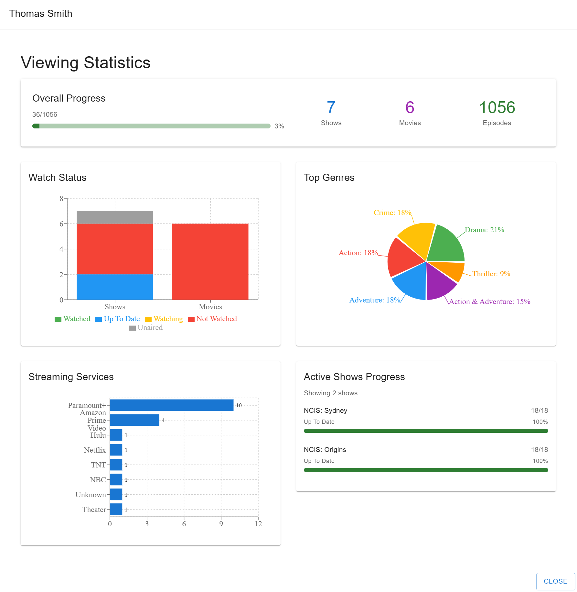

[< Back](../README.md)

# Manage Account - User Guide

The Manage Account page is your central hub for managing your KeepWatching account settings and profiles. This comprehensive guide will walk you through all the features available on this page.

## Overview

The Manage Account page allows you to:
- Edit your account information and profile picture
- Manage multiple viewing profiles for your family
- View detailed statistics for your account and individual profiles
- Set default profiles and switch between active profiles
- Configure your preferences and application settings
- Delete your account

## Account Information Section

### Account Profile Picture
Your account profile picture is displayed prominently at the top of the page.

**To update your account picture:**
1. Hover over your current account image
2. Click when you see the "Manage Image" overlay
3. Select the 'Upload image' option (if you already have an image this option will be 'Change image')
4. Select a new image file from your device
5. The image will be automatically uploaded and updated

**To remove your account picture:**
1. Hover over your current account image
2. Click when you see the "Manage Image" overlay
3. Select the 'Remove image' option
4. The image will be automatically removed

### Account Details
Your account information is displayed next to your profile picture:

- **Account Name**: Your display name with an edit button
- **Email**: Your registered email address with verification status
- **Default Profile**: Shows which profile is set as your default
- **Active Profile**: Shows which profile is currently active
- **Last Updated**: Timestamp of when your profile data was last refreshed

The account name section also includes action buttons for:
- **Edit** (pencil icon) - Edit your account name
- **Statistics** (chart icon) - View account-wide statistics
- **Preferences** (gear icon) - Configure application preferences
- **Delete Account** (trash icon) - Permanently delete your account

### Editing Your Account Name
1. Click the edit icon (pencil) next to your account name
2. Enter your new name in the dialog box
3. Click "Save" to confirm your changes

### Email Verification
If your email isn't verified, you'll see a "Verify Email" button next to your email address:
1. Click "Verify Email" to send a verification email
2. Check your email inbox for the verification message
3. Follow the link in the email to complete verification
4. Return to the page to see the updated verification status

## Preferences

Click the preferences icon (gear) next to your account name to configure application settings.

**Preferences include:**
- **Theme Selection**: Choose between Light, Dark, or Auto theme
  - Light: Always use light theme
  - Dark: Always use dark theme
  - Auto: Automatically match your system theme preference
- **Email Preferences**: Configure email notifications
  - Weekly Digest: Receive weekly summary emails (requires verified email)

The preferences dialog allows you to customize your viewing experience across all devices. Changes are saved when you click the "Save" button.

**Note**: Email preferences require a verified email address to enable.

## Account Statistics
Click the statistics icon next to your account name to view comprehensive account-wide analytics.

**Account Statistics include:**
- **Base Statistics**: Core metrics including:
  - Overall episode watch progress across all profiles
  - Total number of profiles, unique shows, and movies
  - Watch status breakdowns for shows and movies
  - Genre and streaming service distributions
  - Content breakdown charts

- **Enhanced Statistics**: Advanced analytics including:
  - **Velocity Metrics**: Watch rate and episode velocity over time
  - **Timeline Analysis**: Watch history and activity patterns over time
  - **Binge Patterns**: Consecutive watch sessions and binge-watching behavior
  - **Streaks**: Longest watch streaks and consistency tracking
  - **Time-to-Watch Analysis**: How quickly you watch content after adding it
  - **Seasonal Trends**: Viewing patterns by season and time of year
  - **Milestones**: Achievements and viewing milestones reached
  - **Content Depth**: Genre preferences and streaming service distribution
  - **Content Discovery**: How you discover and add new content
  - **Abandonment Risk**: Shows at risk of being abandoned
  - **Unaired Content**: Tracking of upcoming and unaired episodes
  - **Profile Comparisons**: Compare viewing patterns across profiles

The statistics are fetched in parallel and displayed in an interactive dashboard with charts and visualizations powered by the KeepWatching UI library.

## Deleting Your Account

The delete account feature allows you to permanently remove your account and all associated data.

**To delete your account:**
1. Click the delete icon (trash) next to your account name
2. A confirmation dialog will appear
3. Type your exact account name to confirm deletion
4. Click "Delete Account" to proceed

**Important Warnings:**
- Deleting your account removes ALL data including all profiles and watch history
- This action is PERMANENT and cannot be undone
- The delete button is only enabled when you correctly type your account name
- You will be logged out immediately after deletion

## Profile Management

### Profiles Section
The profiles section displays all profiles associated with your account as individual cards.

### Adding a New Profile
1. Click the "Add" chip button in the Profiles section header
2. Enter a name for the new profile
3. Click "Save" to create the profile
4. The new profile will appear as a card in the profiles section

### Profile Cards
Each profile card shows:
- Profile picture (clickable to upload new image)
- Profile name
- Action buttons for profile management

### Profile Actions

#### Set Active Profile
The "Set Active" button switches your current viewing context to that profile:
1. Click "Set Active" on the desired profile card
2. The button will show "Setting Active..." during the process
3. Once complete, all your viewing data will reflect that profile's progress
4. The button will be disabled and grayed out for the currently active profile

#### Set Default Profile
The "Set Default" button makes a profile your account's default:
1. Click "Set Default" on the desired profile card
2. This profile will be automatically selected when you log in
3. The button will be disabled for the currently set default profile

#### View Profile Statistics
Click "View Stats" to see detailed analytics for that specific profile:

- **Base Statistics**: Core metrics including:
  - Individual viewing progress and statistics
  - Show completion rates and progress bars
  - Genre preferences and streaming service usage
  - Episode watch progress charts

- **Enhanced Statistics**: Advanced analytics including:
  - **Velocity Metrics**: Personal watch rate and viewing pace
  - **Timeline Analysis**: Personal watch history and patterns
  - **Binge Patterns**: Individual viewing sessions and habits
  - **Streaks**: Personal consistency tracking
  - **Time-to-Watch Analysis**: How quickly content is watched after adding
  - **Seasonal Trends**: Personal viewing patterns by season
  - **Milestones**: Personal achievements and milestones reached
  - **Content Depth**: Genre preferences and streaming service usage
  - **Content Discovery**: How the profile discovers new content
  - **Abandonment Risk**: Shows at risk of being abandoned
  - **Unaired Content**: Tracking of upcoming episodes for this profile

#### Edit Profile
1. Click "Edit" on a profile card
2. Enter the new name in the dialog box
3. Click "Save" to update the profile name

#### Upload Profile Picture
1. Hover over the profile picture on any profile card
2. Click when you see the "Manage Image" overlay
3. Select the 'Upload image' option
4. Select an image file from your device
5. The profile picture will be updated automatically

#### Delete Profile
1. Click "Delete" on the profile card you want to remove
2. A confirmation dialog will appear warning about data loss
3. Click "Delete" to confirm (this action cannot be undone)
4. The profile and all its watch history will be permanently removed

**Important Notes:**
- You cannot delete your default profile
- Deleting a profile removes ALL watch data associated with it
- This action is permanent and cannot be undone

## Profile Switching via Navigation

In addition to the Manage Account page, you can quickly switch profiles from the navigation bar:

1. Click on your profile avatar in the top-right corner of the navigation bar
2. A menu will appear showing all available profiles
3. Select the profile you want to switch to
4. You'll be automatically redirected to the home page with the new profile active

**Navigation Menu Features:**
- **Switch Profile Section**: Lists all profiles with their avatars
- **Active Profile Indicator**: The currently active profile is highlighted
- **Manage Account**: Quick link to the Manage Account page
- **Logout**: Sign out of your account

This provides a convenient way to switch between profiles without navigating to the Manage Account page.

## Profile Switching Workflow

### Understanding Active vs Default Profiles
- **Active Profile**: The profile currently being used for viewing and tracking
- **Default Profile**: The profile automatically selected when you log in

### Best Practices for Multiple Profiles
1. **Family Setup**: Create separate profiles for each family member
2. **Content Separation**: Use different profiles for different types of content (e.g., "Kids Shows", "Adult Content")
3. **Progress Tracking**: Each profile maintains independent watch history and progress

### Switching Profiles
When you set a new active profile:
1. All content lists (shows, movies) update to reflect that profile's data
2. Statistics and progress tracking switch to the new profile
3. Recommendations become personalized to that profile's viewing history
4. The navigation and home page update to show the active profile's information

## Tips and Best Practices

### Profile Organization
- Use descriptive names for profiles (e.g., "Mom", "Kids", "Family Movies")
- Upload profile pictures to make profiles easily identifiable
- Set appropriate default profiles for your primary viewing

### Account Management
- Review account statistics periodically to understand viewing patterns
- Explore enhanced statistics for deeper insights into viewing habits
- Configure preferences to customize your experience
- Verify your email to enable email preferences

### Data Management
- Be cautious when deleting profiles as this removes all watch history
- Use the "Set Active" feature or navigation menu to quickly switch between family members
- Consider creating separate profiles for different viewing contexts

## Troubleshooting

### Common Issues

**Profile not updating after switching:**
- Refresh the page after switching active profiles
- Check that the profile change was successful by verifying the "Active Profile" field
- Try switching profiles via the navigation menu instead

**Upload issues with profile pictures:**
- Ensure image files are in supported formats (JPG, PNG, GIF)
- Check that image file size is reasonable (under 2MB)
- Try refreshing the page if uploads seem stuck

**Email verification not working:**
- Check your spam/junk folder for verification emails
- Ensure your email address is correct in your account settings
- Try requesting verification again if the first email doesn't arrive

**Profile deletion restrictions:**
- You cannot delete your default profile - set a different default first
- Ensure you really want to delete the profile as this action is permanent

**Statistics not loading:**
- Check your internet connection
- Refresh the page and try again
- Some enhanced statistics may take longer to load
- If issues persist, contact support

**Preferences not saving:**
- Ensure you click the "Save" button in the preferences dialog
- Check your internet connection
- Email preferences require a verified email address

### Getting Help
If you encounter issues not covered in this guide:
1. Check the main application help documentation
2. Verify your internet connection is stable
3. Try logging out and logging back in
4. Contact support if problems persist

## Security and Privacy

### Account Security
- Your account information is securely stored and encrypted
- Profile pictures are stored safely and only visible to your account
- Email verification helps protect your account from unauthorized access
- Account deletion is protected by name confirmation to prevent accidental deletion

### Data Privacy
- Each profile's viewing data is isolated and private
- Only account holders can view profile statistics and information
- All data is permanently removed when you delete your account
