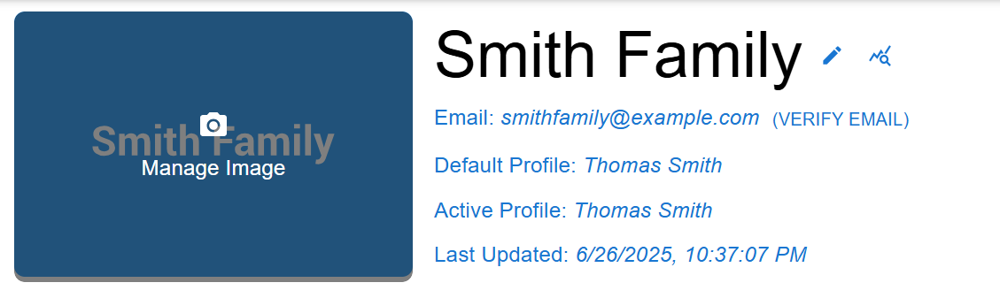
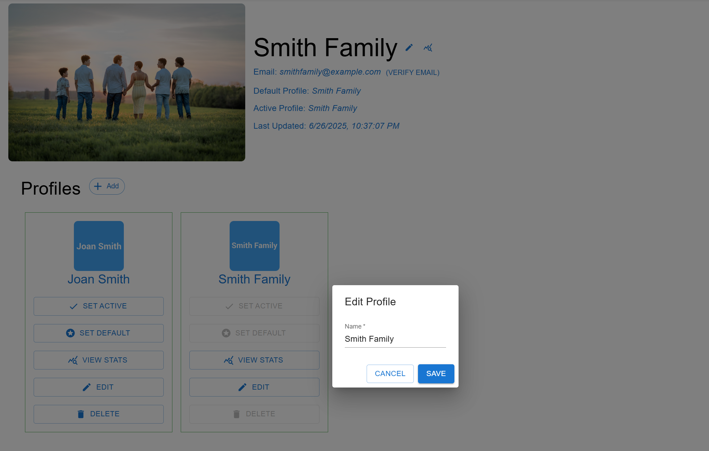

[< Back](../README.md)

# Manage Account
The Manage Account page is where users will go to manage their account, including creating/editing profiles, uploading account and profile pictures and viewing statistics about their account and profiles. 

## Manage Account
When managing an account, the user sees their email (and whether it's been verified), their default profile, their active profile and the last time the active profile was updated. They will also see the profiles that exist for the account. They have the ability to upload an image for the account or profiles. Change the name of the account or any profiles. Set the active or default profile or delete a profile. And to view statistics for the account or any profile. 

## Manage Account - Upload Account Image

## Manage Account - Add Profile

## Manage Account - Edit Profile

## Manage Account - Delete Profile
Users can delete accounts, as long as it's not set to be the account's default profile. 

## Manage Account - Set Active Profile
A single profile is active at a time, users select the 'Set Active' button on any profile to make it the active one. 

## Manage Account - Set Default Profile
A single profile is set as the default profile for an account and is the one loaded when a user logins, users select the 'Set Default' button on any profile to make it the default profile. 
## Manage Account - Account Statistics
Users can view statistics about their accounts, including number of profiles, total shows & movies being watched across all profiles. The most popular genre of shows/movies, the most popular streaming services and how much of their favorited content they've watched. 

## Manage Account - Profile Statistics
Users can view statistics about a specific profile, including the number of shows & movies being watched. The most popular genre of shows/movies, the most popular streaming services and how much of their favorited content they've watched. 