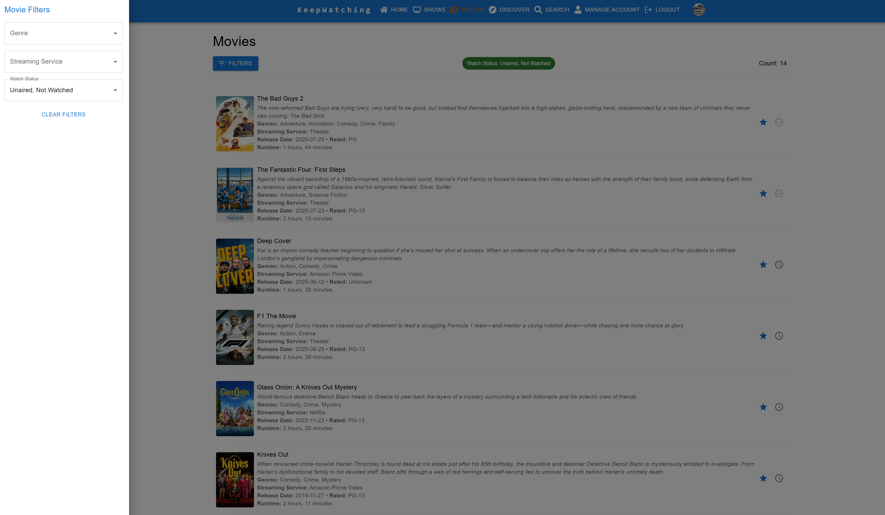
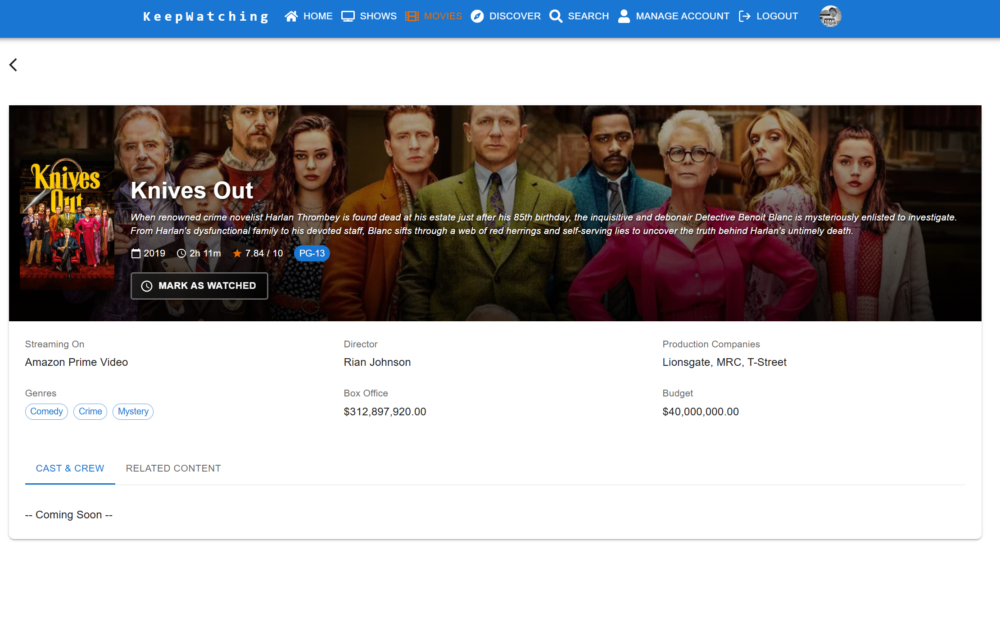
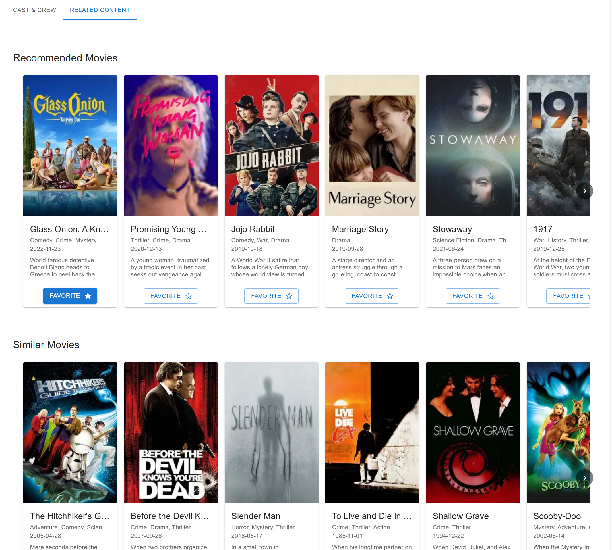

[< Back](../README.md)

# Movies - User Guide

The Movies feature in KeepWatching allows you to manage your favorite movies, track what you've watched, and discover new films. This guide covers how to use the Movies page and Movie Details page to build and manage your personal movie collection.

## Movies Page Overview

The Movies page serves as your personal movie library, displaying all the films you've added to your watchlist. Unlike TV shows, movies have a simpler tracking system focused on whether you've watched them or plan to watch them.

### Key Features:
- **Complete Movie Library**: View all your favorited movies in one organized list
- **Watch Status Tracking**: Simple watched/unwatched status for easy management
- **Smart Organization**: Movies are automatically sorted by watch status and title
- **Quick Actions**: Mark movies as watched or remove them from your favorites
- **Detailed Information**: Rich movie details including ratings, runtime, and streaming availability

## Filtering and Organization

### Filter Options

The Movies page provides targeted filtering options accessible through the **Filters** button in the toolbar.

#### Available Filters:
1. **Genre Filter**: Browse movies by genre (Action, Comedy, Drama, Horror, etc.)
2. **Streaming Service Filter**: Find movies available on specific platforms
3. **Watch Status Filter**: Organize by viewing status:
   - **Unaired**: Movies not yet released
   - **Not Watched**: Movies in your watchlist you haven't seen
   - **Watched**: Movies you've completed

### Using Movie Filters

1. Click the **Filters** button in the top toolbar
2. Select your desired criteria from the filter panel
3. Combine multiple filters to create specific collections (e.g., "Unwatched Action movies on Netflix")
4. Use **Clear Filters** to reset and view your entire collection
5. Filter combinations are saved in the URL for easy bookmarking

### Smart Sorting

Movies are automatically organized in logical order:
1. **Unaired Movies**: Upcoming releases you're anticipating
2. **Not Watched**: Movies ready to watch in your backlog
3. **Watched**: Your completed movie collection

Within each category, movies are sorted alphabetically (ignoring articles like "The" and "A").

## Managing Your Movie Collection

### Movie List Display

Each movie in your collection shows comprehensive information:

#### Movie Information Includes:
- **Poster Image**: Visual movie identification
- **Title and Description**: Movie synopsis and plot summary
- **Release Information**: Release date and year
- **Technical Details**: Runtime, MPA rating (G, PG, PG-13, R, etc.)
- **Genre Tags**: Category classifications
- **Streaming Services**: Where the movie is currently available
- **Quick Action Controls**: Favorite removal and watch status buttons

### Collection Management

#### Adding Movies
Movies are added to your collection from:
- **Search Page**: Find specific titles and add them to favorites
- **Discover Page**: Browse trending and recommended movies
- **Related Content**: Discover movies through recommendations on other movie detail pages

#### Removing Movies
- Click the **star icon** next to any movie to remove it from your favorites
- Movies are immediately removed from your collection
- This action cannot be undone, but you can always re-add movies later

#### Watch Status Management
- Click the **watch status icon** to toggle between watched and unwatched
- Simple binary system: movies are either watched or not watched
- Status changes are instant and sync across all your devices

### Collection Statistics
The top toolbar displays the total count of movies matching your current filters, helping you track the size of your collection and filtered results.

## Movie Details Page

Clicking on any movie opens the comprehensive Movie Details page, providing in-depth information and management controls.

### Movie Information

The Movie Details page features a cinematic layout:

#### Visual Elements
- **Backdrop Image**: Large promotional image creating an immersive header
- **Movie Poster**: Official poster overlaid on the backdrop
- **Title Display**: Prominent movie title with year
- **Watch Status Control**: Large, prominent button for marking watched/unwatched

#### Movie Metadata
Comprehensive details including:
- **Release Information**: Release year
- **Runtime**: Movie length in hours and minutes format
- **Rating**: User rating from TMDB (out of 10)
- **MPA Rating**: Content rating (G, PG, PG-13, R, NC-17)

## Movie Information

### Primary Information Section

The main information area provides:

#### Details Grid
- **Streaming Services**: Current availability across platforms
- **Director**: Key creative personnel
- **Production Companies**: Studios behind the film
- **Genres**: Category tags displayed as interactive chips
- **Financial Information**: Box office performance and production budget

### Watch Status Management
The main watch status button provides:
- **Large, Accessible Design**: Easy-to-use primary action
- **Status Indication**: Clear visual feedback of current watch state
- **Instant Updates**: Immediate status changes with loading feedback
- **Smart Labeling**: Button text changes based on current status ("Mark as Watched" or "Mark Unwatched")

## Movie Details Tabs

The Movie Details page includes tabbed navigation for different aspects of the movie:

### Cast Tab

The Cast tab displays the actors who appear in the movie:
- **Cast List**: All credited actors for the movie
- **Character Information**: Character names played by each actor
- **Profile Photos**: Actor headshots when available
- **Clickable Cards**: Click any cast member to view their [Person Details](personDetails.md) page
- **Additional Credits**: Explore what other shows and movies each actor has appeared in

### Related Content Tab

The Movie Details page includes a dedicated tab for content discovery:

#### Recommendation Types

1. **Recommended Movies**
   - Movies suggested based on your viewing history
   - Personalized recommendations using your movie preferences
   - Algorithm considers genres, directors, and actors you enjoy

2. **Similar Movies**
   - Movies with similar themes, genres, or characteristics
   - Films that share cast members, directors, or production teams
   - Movies with comparable plots or storytelling styles

#### Using Recommendations

- **Browse Suggestions**: Scroll through recommended and similar movies
- **Quick Preview**: View movie posters, titles, and basic information
- **Instant Add**: Click the favorite button to add movies directly to your collection

### Discovery Workflow

1. **Start with Favorites**: Use movies you already love as discovery starting points
2. **Explore Recommendations**: Check both recommended and similar sections
3. **Cross-Reference Streaming**: Verify availability on your preferred platforms
4. **Build Your Queue**: Add interesting movies to your "Not Watched" collection

## Advanced Movie Management

### Viewing Planning

#### Creating Movie Queues
1. **Filter by "Not Watched"**: See your complete backlog
2. **Add Genre Filters**: Narrow down by mood or preference
3. **Check Streaming Availability**: Focus on currently accessible movies
4. **Bookmark Filtered Views**: Save specific combinations for easy access

#### Tracking Progress
- **Immediate Updates**: Mark movies as watched right after viewing
- **Historical Record**: Use "Watched" filter to review your movie history
- **Statistics Tracking**: Monitor your movie consumption through the statistics dashboard

### Platform Integration

#### Streaming Service Awareness
- **Current Availability**: See which services currently offer each movie
- **Platform Planning**: Filter by specific services for subscription optimization
- **Availability Changes**: Information updates as movies move between platforms

#### Multi-Platform Management
- **Service Comparison**: Compare availability across different platforms
- **Subscription Optimization**: See which services offer the most movies from your watchlist
- **Cost Planning**: Make informed decisions about streaming subscriptions

## Tips for Effective Movie Management

### Building Your Collection
1. **Start with Favorites**: Add movies you already love as a foundation
2. **Explore Recommendations**: Use the related content features to discover new films
3. **Genre Variety**: Don't limit yourself to one type of movie
4. **Balance New and Classic**: Mix recent releases with timeless classics

### Organizing Your Watchlist
1. **Regular Curation**: Periodically review and remove movies you're no longer interested in
2. **Priority System**: Keep your "Not Watched" list manageable and focused
3. **Mood Categories**: Use genre filters to match movies to your current preferences
4. **Platform Awareness**: Regularly check what's available on your active subscriptions

### Discovery Best Practices
1. **Follow Connections**: Use similar/recommended movies to explore new genres or directors
2. **Director/Actor Following**: Pay attention to recurring names in movies you enjoy
3. **Cross-Genre Exploration**: Occasionally venture outside your comfort zone
4. **Community Influence**: Consider adding highly-rated movies even if they're outside your usual preferences

The Movies workflow provides a streamlined but comprehensive approach to managing your film viewing experience, focusing on discovery, organization, and simple progress tracking without the complexity of episode management.
