[< Back](../README.md)

# Notifications - User Guide

The Notifications system keeps you informed about new content, system updates, features, and important announcements. KeepWatching provides two ways to access and manage your notifications: a quick dropdown menu in the navigation bar and a full-page notifications center.

## Overview

KeepWatching's notification system delivers timely updates about:
- **New Episodes**: When shows you're watching have new episodes available
- **New Movies**: When movies in your watchlist are released
- **System Updates**: Important system announcements and changes
- **New Features**: Updates about new functionality and improvements
- **Issues & Alerts**: Important notices that may affect your experience

## Notification Icon (Quick Access)

### Location
The notification icon is always visible in the top navigation bar, next to your profile picture.

### Visual Indicators

**Notification Icon States:**
- **Bell Icon (inactive)**: No unread notifications
- **Bell Icon with Badge**: Shows the count of unread notifications

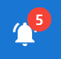

The badge displays the exact number of unread notifications, making it easy to see at a glance when you have new updates.

### Opening the Notification Dropdown

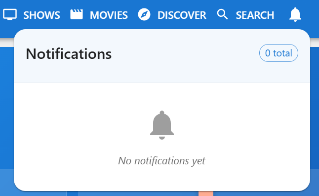
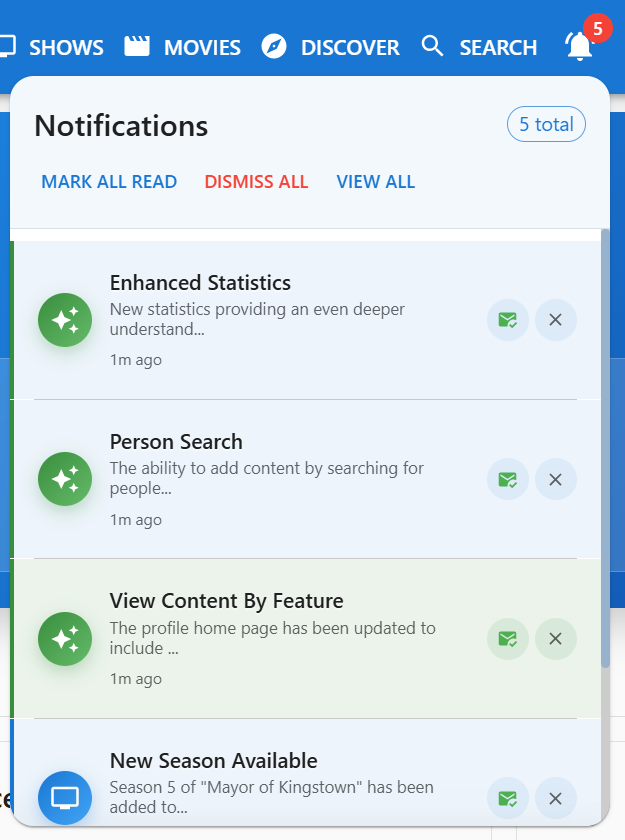
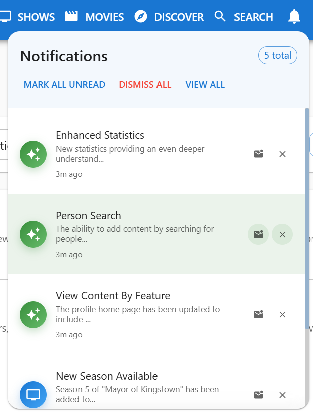

1. **Click the Notification Icon**
   - Located in the top navigation bar
   - Click the bell icon to open the dropdown
   - The dropdown appears below the icon

2. **Dropdown Header**
   - Shows "Notifications" title
   - Displays total notification count
   - Provides quick action buttons

### Quick Actions in Dropdown

The notification dropdown header includes several quick action buttons:

**Mark All Read/Unread:**
- When you have unread notifications, click "Mark All Read" to mark everything as read
- When all notifications are read, click "Mark All Unread" to mark them as unread
- This applies to all notifications in your account

**Dismiss All:**
- Click "Dismiss All" to remove all notifications
- This permanently removes all notifications from your list
- Use with caution - dismissed notifications cannot be recovered

**View All:**
- Click "View All" to navigate to the full Notifications page
- Opens the complete notification center with additional features

### Understanding Notification Items

Each notification in the dropdown shows:

**Visual Elements:**
- **Type Icon**: Colored circular icon indicating notification type:
  - 📺 TV icon (blue) - New episodes or show updates
  - 🎬 Movie icon (purple) - Movie releases or updates
  - ⚠️ Warning icon (orange) - Issues or alerts
  - ✨ Feature icon (green) - New features or enhancements
  - ℹ️ Info icon (blue) - General information

- **Title**: Primary notification headline
- **Message**: Brief description or details
- **Timestamp**: How long ago the notification was received
  - Shows "Xm ago" for recent (under 1 hour)
  - Shows "Xh ago" for today (under 24 hours)
  - Shows "Xd ago" for this week (under 7 days)
  - Shows date for older notifications

**Status Indicators:**
- **Colored left border**: Unread notifications have a colored border matching the notification type
- **Bold text**: Unread notification titles appear in bold
- **Highlighted background**: Unread notifications have a subtle background highlight

### Individual Notification Actions

Each notification in the dropdown has two action buttons:

**Mark as Read/Unread:**
- Click the envelope icon to toggle read status
- ✉️ Open envelope = Mark as read (for unread notifications)
- 📧 Closed envelope = Mark as unread (for read notifications)
- Clicking stops the notification from counting toward your unread badge

**Dismiss Notification:**
- Click the X icon to remove the notification
- This permanently deletes the individual notification
- Cannot be undone

### Dropdown Limitations

The notification dropdown shows:
- **Maximum of 10 notifications** at a time
- Most recent notifications appear first
- If you have more than 10 notifications, you'll see "+X more notifications..." at the bottom
- Click "View All" to see your complete notification history

### Closing the Dropdown

The dropdown automatically closes when you:
- Click anywhere outside the dropdown
- Click the notification icon again
- Navigate to another page
- Click "View All" to go to the full notifications page

## Full Notifications Page

### Accessing the Page

Navigate to the full notifications page by:
1. Clicking "View All" in the notification dropdown
2. Clicking the notification icon and selecting "View All"

The notifications page provides comprehensive notification management with advanced filtering and search capabilities.

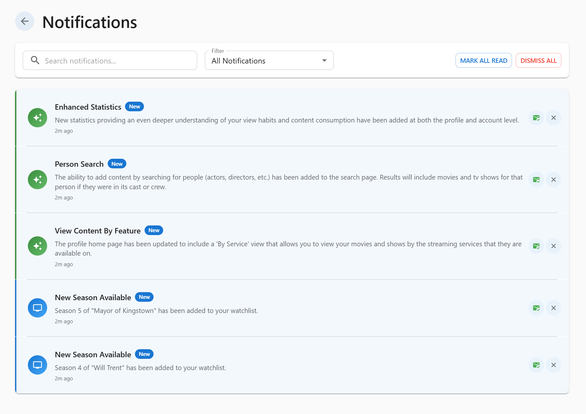

### Page Layout

The notifications page is organized into three main sections:

1. **Header**: Page title and back button
2. **Filters & Search**: Tools for finding specific notifications
3. **Notifications List**: All your notifications with full details

### Back Button

- Located in the top-left corner
- Click to return to your previous page
- Styled with a subtle background for easy visibility

### Search Functionality

**Search Bar:**
- Located in the filters section at the top of the page
- Includes a search icon for easy identification
- Type keywords to filter notifications by message content
- Search is case-insensitive and searches the notification message text
- Results update automatically as you type

**Search Tips:**
- Search by show or movie names
- Search by notification type (e.g., "feature", "update")
- Search by keywords in the message
- Use partial words - the search finds matches within words

### Filter Options

**Filter Dropdown:**
Located next to the search bar, the filter dropdown provides quick sorting:

1. **All Notifications** (default)
   - Shows every notification regardless of status or type
   - Includes both read and unread notifications

2. **Unread (X)**
   - Shows only notifications you haven't marked as read
   - Number in parentheses indicates unread count
   - Perfect for catching up on new notifications

3. **Content Updates**
   - Shows only TV show and movie notifications
   - Filters out system notifications
   - Focus on new episodes and movie releases

4. **System Notifications**
   - Shows only system-related notifications
   - Includes issues, features, and announcements
   - Focus on app updates and important notices

### Bulk Actions

The notifications page provides three bulk action buttons in the filters section:

**Mark All Read/Unread:**
- When unread notifications exist, shows "Mark All Read" button
- When all are read, shows "Mark All Unread" button
- Applies to all notifications (not just filtered/searched results)
- Affects the entire notification list

**Dismiss All:**
- Removes all notifications permanently
- Includes a warning color (red) to indicate caution
- Only enabled when notifications exist
- Cannot be undone - use carefully

### Notification List Display

**List Organization:**
- Notifications appear in a scrollable list
- Most recent notifications appear first
- Each notification is separated by a subtle divider line
- The list shows complete notification details

**Notification Cards:**

Each notification card displays comprehensive information:

**Visual Design:**
- **Type Icon**: Large circular icon with gradient background
  - TV shows: Blue gradient
  - Movies: Purple gradient
  - Issues: Orange gradient
  - Features: Green gradient
  - Info: Blue gradient

- **Status Styling**:
  - Unread: Highlighted background and colored left border
  - Read: Transparent background, no border
  - Unread notifications appear more prominent

**Text Content:**
- **Title**: Bold headline (appears bolder when unread)
- **"New" Badge**: Small chip appears on unread notifications
- **Message**: Full notification message text
  - HTML is automatically stripped for clean display
  - Word wrapping ensures long messages are readable
- **Timestamp**: Shows how long ago the notification was received

**Action Buttons:**

Each notification card has two action buttons on the right:

1. **Toggle Read Status**:
   - Green checkmark icon for unread → click to mark as read
   - Envelope icon for read → click to mark as unread
   - Hover effect shows the action clearly
   - Updates instantly

2. **Dismiss**:
   - X icon in subtle gray
   - Hover turns red to indicate deletion
   - Permanently removes the notification
   - Cannot be undone

### Empty State

When no notifications match your filters or search:

**Empty State Display:**
- Large notification bell icon (gray)
- "No notifications found" headline
- Helpful message:
  - If searching/filtering: "Try adjusting your filters or search terms"
  - If truly empty: "You're all caught up! New notifications will appear here."

## Notification Types Explained

### TV Show Notifications
- **Icon**: Blue TV icon
- **Purpose**: Inform you about new episodes from shows you're tracking
- **Examples**:
  - "New episode of [Show Name] is now available"
  - "[Show Name] Season X Episode Y has aired"
- **What to do**: Navigate to the show to mark episodes as watched

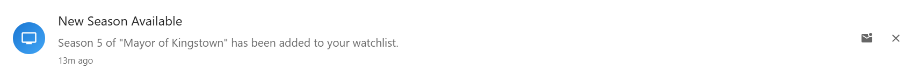

### Movie Notifications
- **Icon**: Purple movie icon
- **Purpose**: Alert you when movies in your watchlist are released
- **Examples**:
  - "[Movie Name] is now available to watch"
  - "[Movie Name] has been released in theaters"
- **What to do**: Navigate to the movie details to update watch status

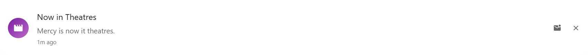

### Issue Notifications
- **Icon**: Orange warning icon
- **Purpose**: Alert you to problems, outages, or important issues
- **Examples**:
  - "Service maintenance scheduled"
  - "Data sync issue detected"
  - "Known issue with [feature]"
- **What to do**: Read carefully and take any suggested actions

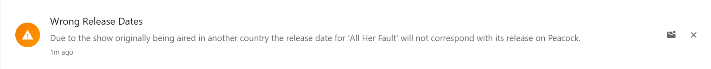

### Feature Notifications
- **Icon**: Green sparkle icon
- **Purpose**: Announce new features and improvements
- **Examples**:
  - "New feature: [Feature Name] is now available"
  - "Enhancement: [Improvement Description]"
  - "Update: [Feature] has been improved"
- **What to do**: Explore the new feature or read about improvements

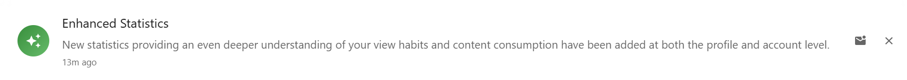

### General Notifications
- **Icon**: Blue info icon
- **Purpose**: Provide general information and announcements
- **Examples**:
  - General app announcements
  - Tips and recommendations
  - Account-related information
- **What to do**: Read for context and information

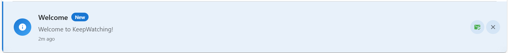
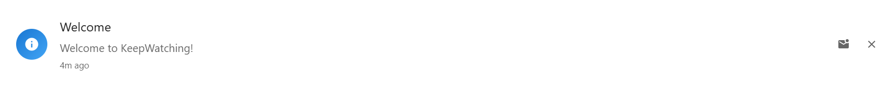

## Notification Workflow

### Daily Notification Management

**Morning Routine:**
1. Check the notification icon badge for unread count
2. Click the notification icon to open the dropdown
3. Quickly scan the most recent notifications
4. Mark important ones as read after reviewing
5. Dismiss irrelevant notifications

**Deep Dive:**
1. Click "View All" to access the full notifications page
2. Use filters to focus on content updates or system notifications
3. Search for specific shows or keywords
4. Read through notifications in detail
5. Take action on content notifications (watch episodes, update status)
6. Dismiss or archive old notifications

## Troubleshooting

### Notifications Not Appearing

**If you don't see expected notifications:**
- Check your internet connection
- Refresh the page
- Verify notifications aren't being dismissed automatically
- Check if you're looking at filtered results

### Notification Actions Not Working

**If buttons don't respond:**
- Ensure you're logged in
- Check your internet connection
- Try refreshing the page
- Clear browser cache if issues persist

### Badge Count Incorrect

**If the badge count seems wrong:**
- Refresh the page to sync notifications
- Check the full notifications page for actual count
- Mark all as read and then refresh

### Dropdown Not Opening

**If the dropdown doesn't open:**
- Click the notification icon again
- Refresh the page
- Ensure no other modals are open

## Integration with Other Features

### Notifications and Content Management

Notifications work seamlessly with other KeepWatching features:

**Profile Activity:**
- Notifications are account-level, not profile-level
- All profiles see the same notifications
- Dismiss actions affect all profiles

**Real-Time Updates:**
- Notifications update in real-time via WebSocket
- New notifications appear without refreshing
- Badge count updates instantly

## Privacy and Data

### Notification Data

- Notifications are stored per account
- Dismissed notifications are permanently deleted
- Read/unread status is tracked per notification
- No notification history after dismissal

### Notification Delivery

- Notifications are delivered through the web app only
- No email or push notifications currently supported
- Check the app regularly to stay updated
- Real-time delivery when app is open

---

*The notification system keeps you informed and in control. Whether you prefer quick checks with the dropdown or comprehensive management with the full page, you have the tools to stay current with all your content and important updates.*
