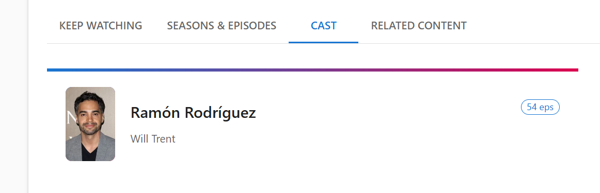
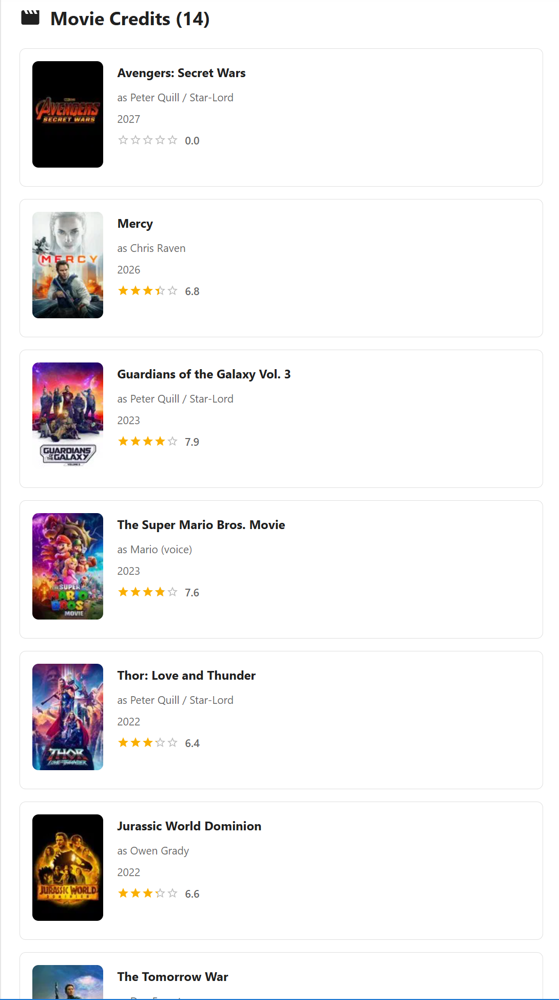
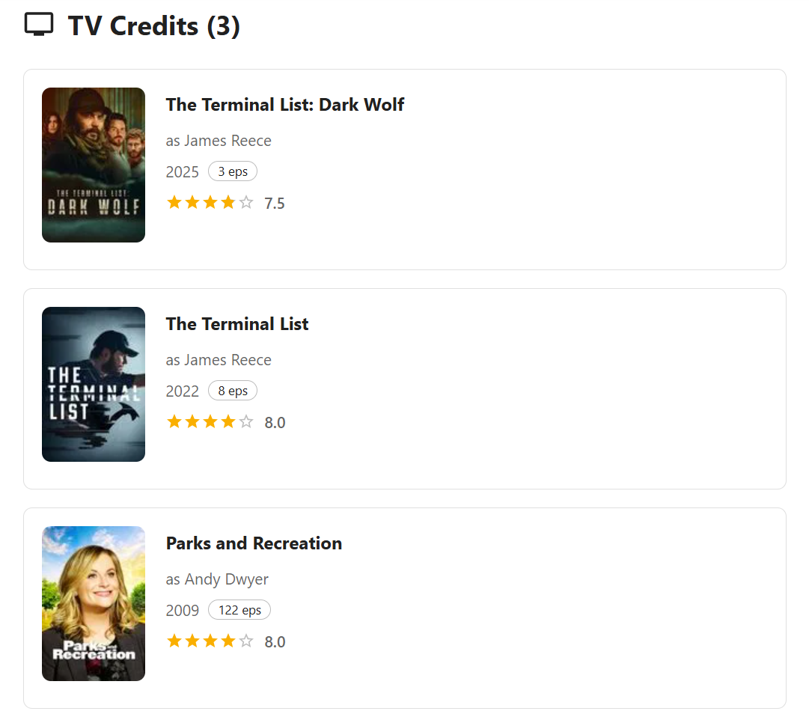

[Home](../README.md) | [Shows](./shows.md) | [Movies](./movies.md)

# Person Details - User Guide

The Person Details feature in KeepWatching allows you to explore detailed information about actors, directors, and other cast and crew members featured in your favorite shows and movies. This comprehensive view provides biographical information, filmography, and helps you discover more content from people you enjoy.

## Accessing Person Details

You can access person details from several locations in the application:

### From Show Details
1. Navigate to any show's details page
2. Click on the **Cast** tab
3. Click on any cast member's card to view their full profile

### From Movie Details
1. Navigate to any movie's details page
2. Click on the **Cast** tab
3. Click on any cast member's card to view their full profile

## Person Details Page Overview

The Person Details page provides a comprehensive view of an individual's career, biographical information, and complete filmography across both movies and TV shows.

### Key Features:
- **Biographical Information**: Complete profile with photo, birthdate, birthplace, and biography
- **Age Calculation**: Automatically calculated current age or age at death
- **Complete Filmography**: Comprehensive list of all movie and TV show credits
- **Organized Credits**: Separate sections for movie and TV credits
- **Quick Navigation**: Easy return to your previous page

## Person Information Section

The top section of the page displays comprehensive biographical information with a cinematic presentation.

### Personal Details

#### Profile Display
- **Profile Photo**: Professional headshot when available
- **Full Name**: Actor, director, or crew member's name
- **Gender Indicator**: Visual icon showing gender
- **Age Information**: Current age or age at time of death
- **Place of Birth**: Geographic origin

#### Information Chips
The header displays quick-reference information chips:
- **Gender**: Visual indicator (Male/Female/Non-binary)
- **Age**: Automatically calculated from birthdate
- **Birthplace**: Location of birth

### Biography Section

The biography section provides detailed information about the person's life and career.

#### Biography Features
- **Expandable Text**: Long biographies are automatically truncated
- **Show More/Less**: Toggle button for reading full biographies
- **Responsive Length**: Different truncation lengths for mobile and desktop
- **Formatted Display**: Italic styling for easy reading

#### Reading Biographies
1. **Short Biographies**: Display in full automatically
2. **Long Biographies**: Initially show first 300-400 characters
3. **Expansion**: Click "Show More" to read the complete biography
4. **Collapse**: Click "Show Less" to return to truncated view

## Filmography Sections

The Person Details page organizes credits into two main categories: Movies and TV Shows. Each section displays complete credit information with visual cards.

### Movie Credits

The movie credits section lists all films the person has appeared in or worked on that have been favorited in the KeepWatching app.

#### Movie Credit Information
Each movie credit card displays:
- **Movie Poster**: Visual identification of the film
- **Movie Title**: Full title of the movie
- **Release Year**: When the movie was released
- **Character/Role**: The character played or role performed

### TV Show Credits

The TV credits section displays all television work, including series, miniseries, and TV movies that have been favorited in the KeepWatching app.

#### TV Credit Information
Each TV credit card displays:
- **Show Poster**: Visual identification of the series
- **Show Title**: Full title of the TV show
- **Year**: When the show premiered
- **Character/Role**: The character played or role performed
- **Episode Count**: Number of episodes appeared in (when available)
- **Show Rating**: User ratings for the show

## Navigation and Return

The Person Details page includes intelligent navigation to help you browse without losing your place.

### Navigation

#### Breadcrumb Navigation
- Use the **back arrow** in the top-left to return to your previous page
- The system remembers your filters and returns you to the exact same view

## Using Person Details for Discovery

The Person Details page is a powerful tool for discovering new content based on people you enjoy.

### Discovery Workflows

#### Following Favorite Actors
1. **Start with Known Content**: Visit a show or movie you love
2. **Explore the Cast**: Check out the cast members
3. **View Filmography**: See what else they've been in

## Advanced Features

### Age Calculation

The system automatically calculates age based on biographical information:

#### Living Persons
- **Current Age**: Calculated from birthdate to today
- **Real-Time**: Updates automatically as time passes
- **Accurate Calculation**: Accounts for months and days, not just years

#### Deceased Persons
- **Age at Death**: Calculated from birthdate to death date
- **Historical Context**: Helps understand the span of their career
- **Respectful Display**: Clear indication without being intrusive

### Gender Representation

Person pages display appropriate gender indicators:
- **Male**: Male symbol icon
- **Female**: Female symbol icon
- **Non-Binary/Unknown**: Neutral person icon

### Biography Handling

The expandable biography feature intelligently manages long text:

#### Truncation Logic
- **Length Detection**: Automatically detects if biography needs truncation
- **Smart Cutoff**: Truncates at character limits (200 mobile, 400 desktop)
- **Clean Breaks**: Adds ellipsis to indicate more content
- **Full Text Available**: Complete biography always accessible via expansion

#### User Control
- **Optional Reading**: Users decide if they want to read full biography
- **Quick Collapse**: Easy return to summary view
- **Smooth Transition**: Animated expansion and collapse

## Integration with Other Features

### Connection to Shows and Movies

Person Details pages serve as connectors between your content:

#### From Shows
- **Cast Discovery**: Explore all cast members from your favorite shows
- **Related Content**: Find other shows featuring the same actors
- **Genre Jumping**: Discover how actors work across different show types

#### From Movies
- **Actor Filmography**: See an actor's complete movie career

The Person Details feature provides a rich, comprehensive view of the talented people behind your favorite shows and movies, making it easy to discover new content and explore the careers of actors you enjoy.
