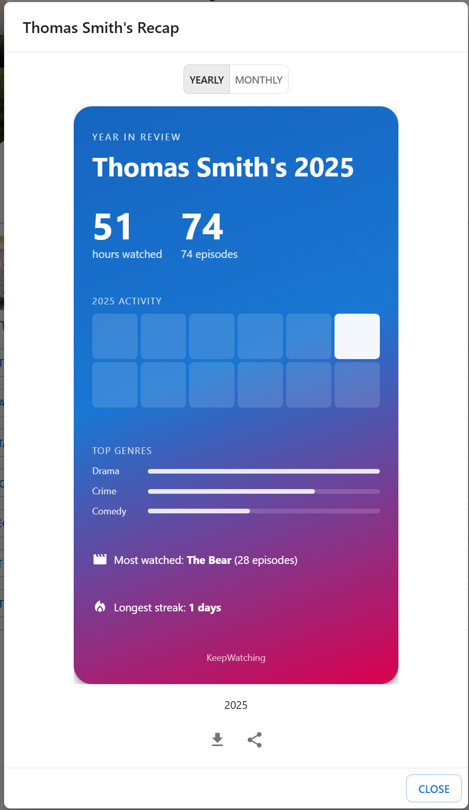
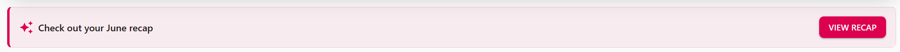
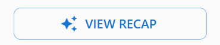
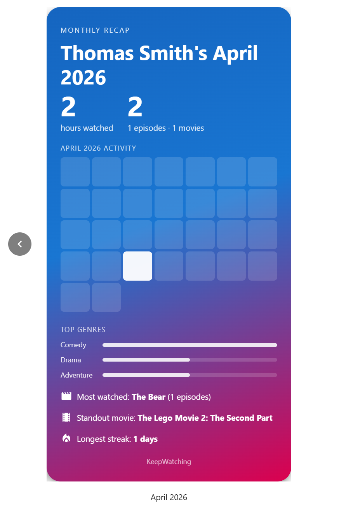
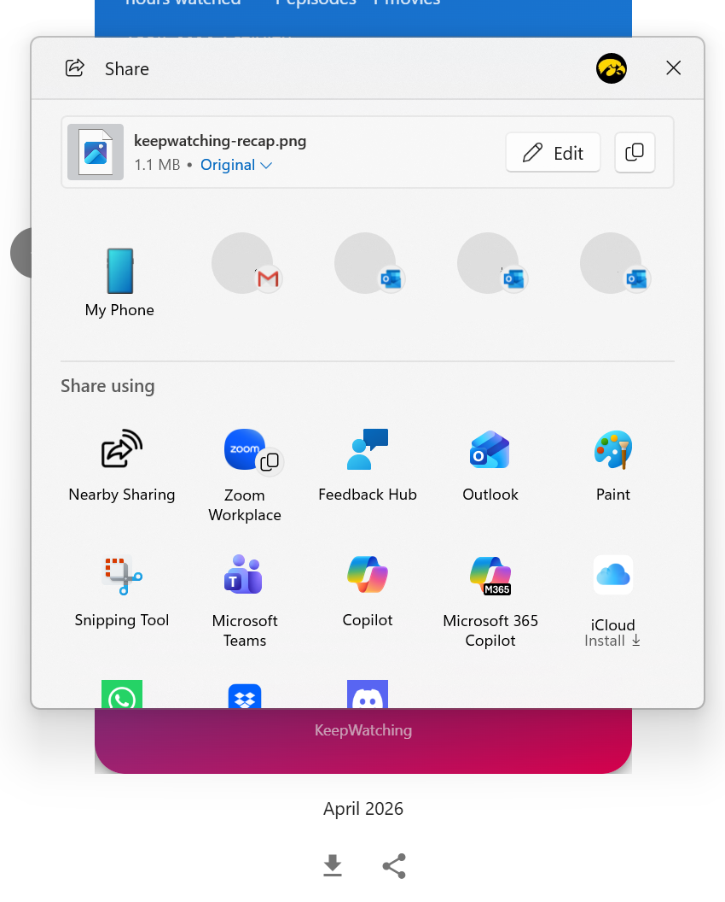

[< Back](../README.md)

# Recap - User Guide

Recap is your personal "year in review" (and month in review) — a shareable, poster-style summary of your viewing activity for a given month or year, in the spirit of Spotify Wrapped. It surfaces automatically on the [Home](home.md) page when a new recap becomes available, and is always reachable on demand from the [Manage Account](manageAccount.md) page.

## Overview

## Where to Find It

### Home Page Banner

A banner appears near the top of the [Home](home.md) page during two windows:

| Window                        | What appears                                                |
| ----------------------------- | ----------------------------------------------------------- |
| The first 5 days of any month | "Check out your `<Month>` recap" — your just-finished month |
| All of December               | "Your `<Year>` Recap is ready" — your year so far           |

The banner only appears if you actually have watch activity for that period — quiet months and years are never promoted. Click **View Recap** on the banner to open it directly to that period.

### Manage Account

Every profile card on the [Manage Account](manageAccount.md) page has a **View Recap** button, letting you browse recaps for that profile at any time — not just during the banner windows.

---

## Browsing Recaps

Once open, the recap view shows one poster-style card at a time. Use the left/right arrow buttons (or swipe on touch devices) to move between periods.

### Yearly / Monthly Toggle

When both are available, a toggle at the top lets you switch between browsing yearly and monthly recaps:

| Toggle      | Shows                                     |
| ----------- | ----------------------------------------- |
| **Yearly**  | One card per calendar year with activity  |
| **Monthly** | One card per calendar month with activity |

When you open a recap from the Home page banner, the toggle is hidden and you're limited to whichever period type the banner was promoting — except during the first 5 days of December, when both are shown, since your November recap and your year-in-progress are both freshly relevant at the same time.

### What's on Each Card

Every card includes:

- **Hours Watched** and **Episodes/Movies Watched** — the two headline numbers, each with a comparison badge showing the percent change versus the previous month or year (hidden if the previous period had no activity, and capped at ">500%" for very large swings)
- **Activity Heatmap** — a day-by-day grid (monthly cards) or month-by-month grid (yearly cards) showing when you watched, with darker cells indicating more episodes watched
- **Top Genres** — your most-watched genres for the period, shown as proportional bars
- **Most Watched Show** — the show with the most episodes watched in the period
- **Standout Movie** — a notable movie watched in the period
- **Longest Streak** — your longest run of consecutive days with watching activity

Cards are colored using your profile's accent color (or the default theme colors, if you haven't set one).

### Availability

Recaps only appear for periods that have actually closed:

- The **current month** is not available until it ends
- The **current year** is not available until December (when the year's recap "goes live" for the reveal, even though the year technically has a few weeks left)

This means a brand-new profile, or one without much recent activity, may not have a recap yet — keep watching, and one will appear at the end of your first tracked month.

---

## Sharing Your Recap

Each card can be downloaded or shared directly from the recap view:

- **Download** — saves the focused card as a PNG image
- **Share** — opens your device's native share sheet (on supported devices/browsers); falls back to download if sharing isn't available

---

## Tips

- **Check Manage Account for a sneak peek**: even outside the banner windows, you can browse any past month's or year's recap on demand from that profile's **View Recap** button.
- **Compare month over month**: the up/down percentage badges make it easy to see whether you're watching more or less than the previous period at a glance.
- **Use the heatmap to spot your patterns**: a run of dark cells is your longest streak; the single darkest cell is your busiest day.
- **Set a profile accent color**: it carries through to your recap cards, making each family member's recap visually distinct.

---

## Troubleshooting

**The Home page banner isn't showing up:**

- It only appears during the first 5 days of a month (for the previous month) or during December (for the year). Outside those windows, use **View Recap** from Manage Account instead.
- The banner is suppressed if the relevant period has no watch activity at all.

**I don't see a recap for the current month or year:**

- The current, still-in-progress month or year is intentionally excluded until it closes (or, for years, until December) — this is by design, not a bug.

**The Yearly/Monthly toggle isn't showing:**

- Recaps opened from the Home page banner are locked to whichever period the banner was promoting, so the toggle is hidden. Open the recap from Manage Account instead for full browsing.

**Download or Share isn't working:**

- Share requires a supported browser/device; unsupported combinations automatically fall back to Download.
- Wait for the card to finish loading before downloading or sharing — the buttons are disabled while data is loading.

---

_Recap turns your everyday watch history into a shareable highlight reel — a fun way to look back at a month or year of viewing, whether you keep it for yourself or share it with friends and family._
