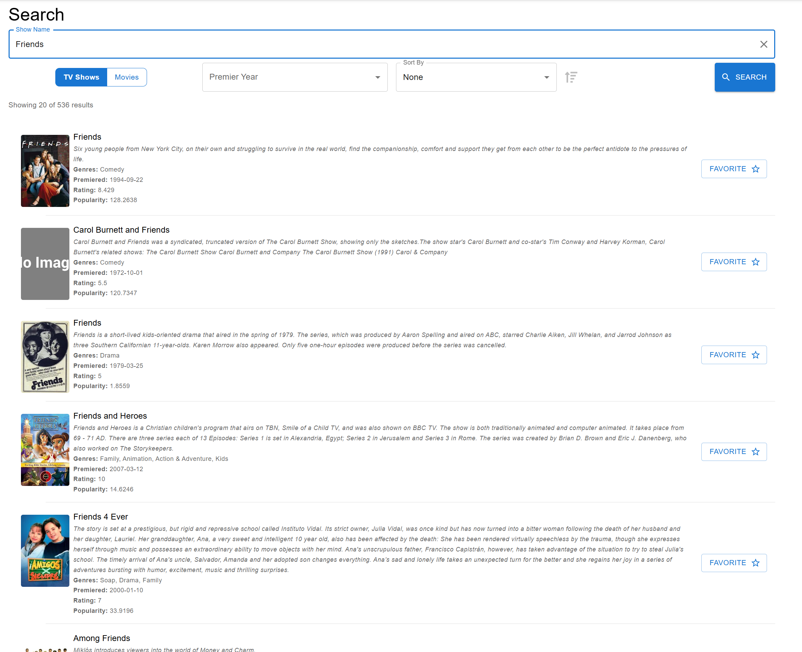
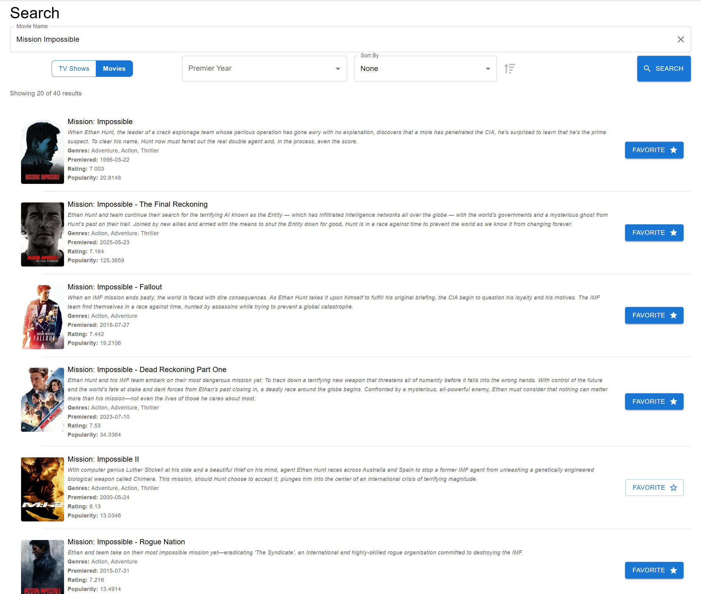
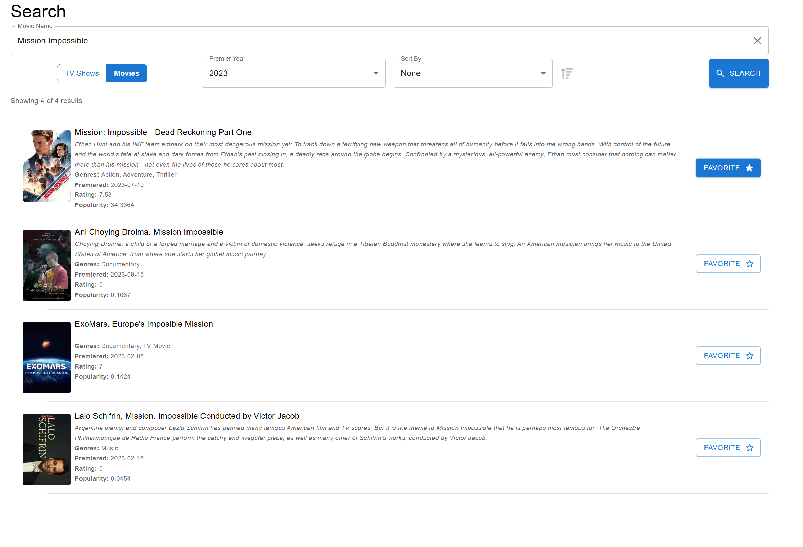

[Home](../README.md)
# Search
Users are able to search TV Shows and Movies and favorite a search result for the active profile to track that show or movie. To further narrow results when searching, users can pick a premier year. After results are returned they're able to sort results by Title, First Air Date, Rating & Popularity. The search functionality utilizes pagination and infinite scroll, where in the first twenty (20) results are returned and when the user scrolls to the bottom, additional results will be loaded automatically. The total number of results (and how many are currently displayed) is shown at the top of the list. Users add a show or movie to the active profile by clicking the favorite button for that content. If a show or movie is already a favorite that will be indicated to the user. 

## Search TV

## Search Movies

