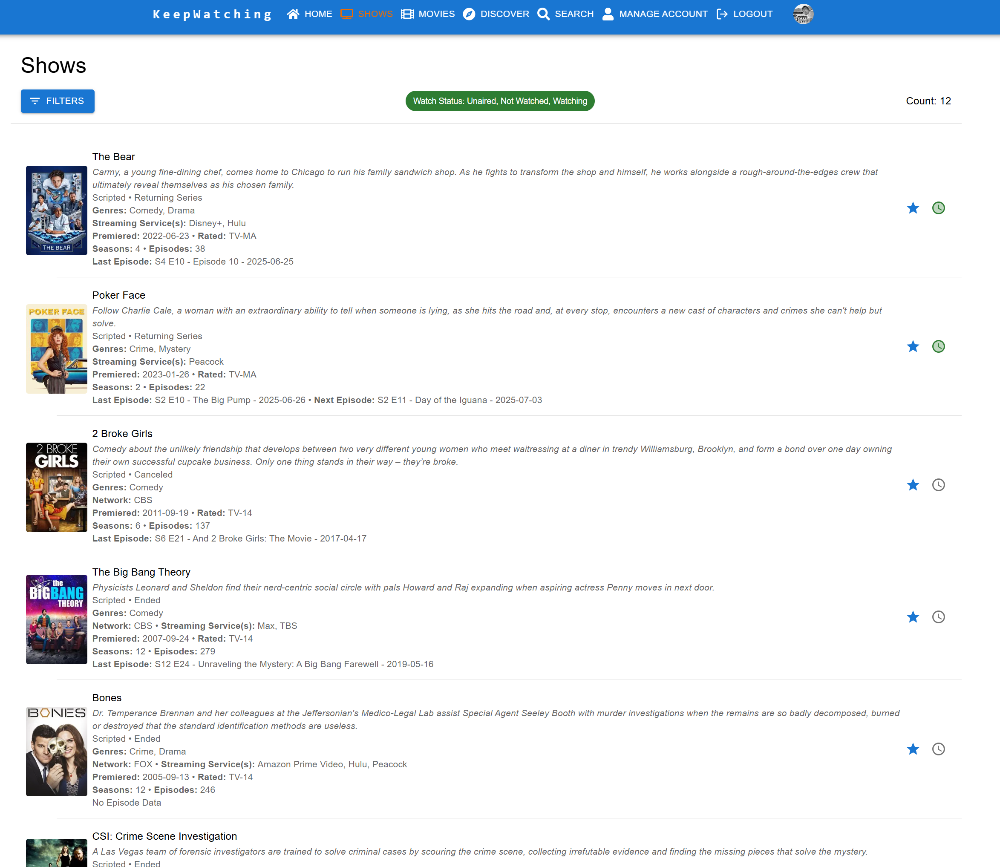
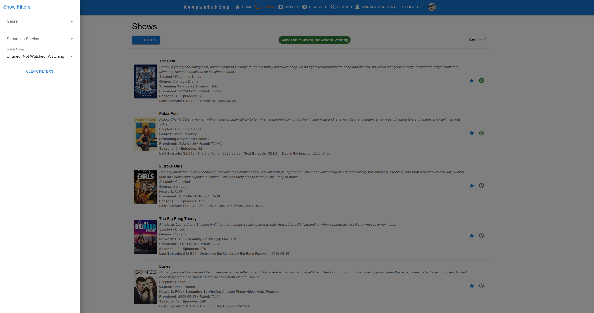
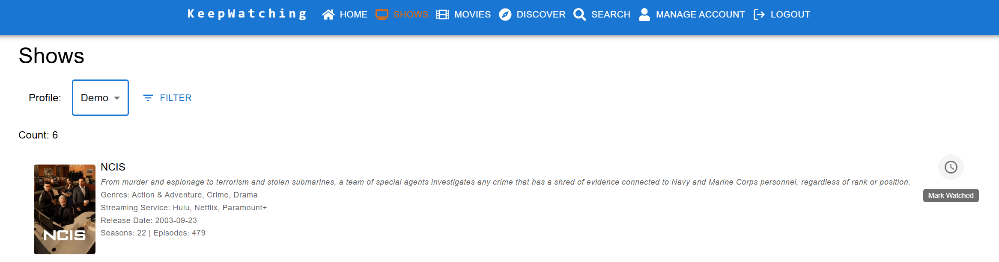
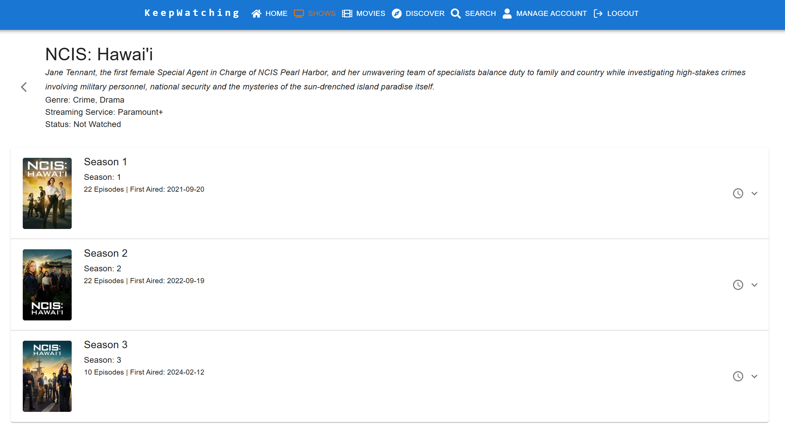
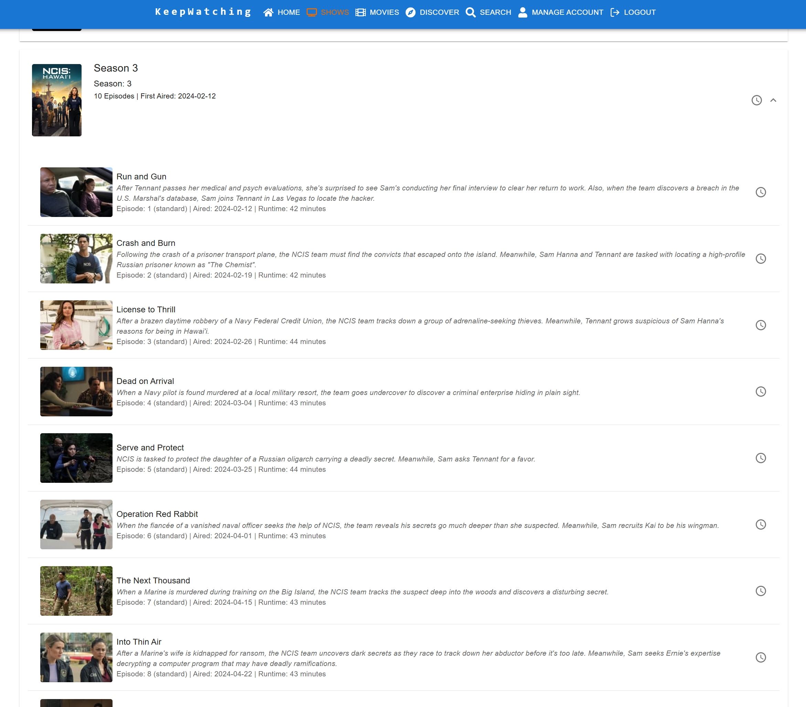

[< Back](../README.md)

# Shows

## Shows List
The shows page displays all of the shows that have been favorited for a profile. When navigating to the page, a default filter of 'Not Watched, Watching' is applied to the list. Shows are sorted first by their watch status and then alphabetically.

The list of shows can further be filtered by Genre, Streaming Service and Watch Status.

### Watch Status
Users can mark a show as Watched (if current status is not watched or watching and there are no future season or episodes), Up To Date (if current status is not watched or watching and there are future season or episodes) or Not Watched (if current status is Watched or Up To Date). Changing the status of show will also change the status of all seasons and episodes for that show.

### Remove Favorite
Users can also choose to remove a show from their favorites by selecting the 'Remove Favorite' action button. Upon completion of the action, the show will be removed from the list and any watch progress cleared for the profile.

## Show Details
Selecting a show will take the user to the details page for that show. This view allows the user to see more information about a particular show, including it's details, the next episodes to watch, a complete listing of seasons and episodes and related content.

### Additional Show Details

### Keep Watching

### Seasons & Episodes
The 'Seasons & Episodes' tab displays a list of the seasons where each season can be expanded to display the episodes for that season. Like shows, the watch status of a season or episode can be updated here.

### Related Content
The 'Related Content' tab displays Recommended and Similar Shows to the current one. From here, the user can choose to favorite any of these shows directly.