[< Back](../README.md)

# Shows - User Guide

The Shows feature in KeepWatching allows you to manage your favorite TV shows, track your viewing progress, and discover new content. This guide covers how to use the Shows page and Show Details page effectively.

## Shows Page Overview

The Shows page is your central hub for managing all your favorite TV shows. It displays a comprehensive list of all shows you've added to your watchlist, with powerful filtering options to help you find exactly what you're looking for.

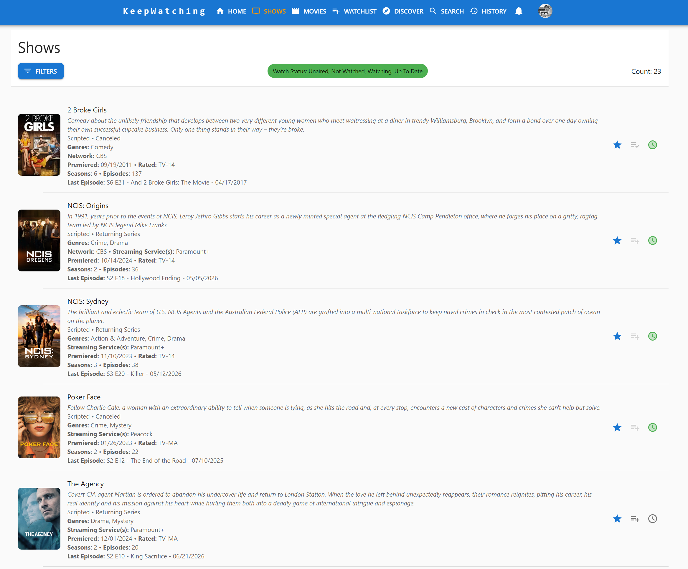

### Key Features:
- **Complete Show List**: View all your favorited shows in one place
- **Watch Status Indicators**: Quickly see which shows you're watching, have completed, or haven't started
- **Smart Sorting**: Shows are automatically sorted by watch status and title for easy navigation
- **Quick Actions**: Mark shows as watched/unwatched or remove favorites directly from the list

## Filtering and Sorting

### Filter Options

The Shows page includes powerful filtering capabilities accessible through the **Filters** button in the top toolbar.

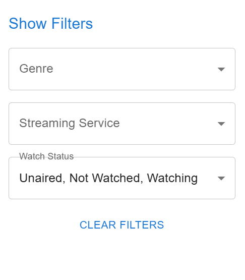
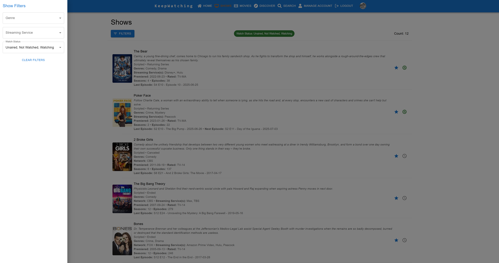

#### Available Filters:
1. **Genre Filter**: Filter shows by specific genres (Action, Comedy, Drama, etc.)
2. **Streaming Service Filter**: Find shows available on specific platforms (Netflix, Disney+, HBO Max, etc.)
3. **Watch Status Filter**: Filter by your viewing progress:
   - **Unaired**: Shows that haven't premiered yet
   - **Not Watched**: Shows you've added but haven't started
   - **Watching**: Shows you're currently following
   - **Up To Date**: Shows where you've watched all available episodes
   - **Watched**: Shows you've completed

### Using Filters

1. Click the **Filters** button in the toolbar
2. Select your desired filters from the drawer that opens
3. Use multiple filters simultaneously to narrow your search
4. Click **Clear Filters** to reset all filters
5. Your filter selections persist in the URL, so you can bookmark filtered views

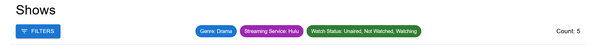

### URL-Based Filtering

Filters are automatically saved in the URL, allowing you to:
- Bookmark specific filtered views
- Navigate back to specific filter combinations

## Managing Shows

### Show List Items

Each show in the list displays comprehensive information:

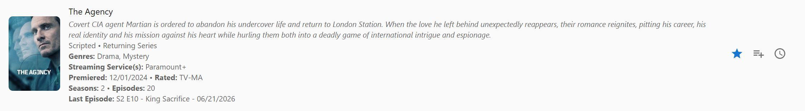

- **Poster Image**: Visual identification of the show
- **Title and Description**: Basic show information
- **Show Details**: Type (Series/Miniseries), status (Continuing/Ended), genres
- **Network and Streaming**: Where the show airs and streams
- **Season/Episode Count**: Total seasons and episodes
- **Episode Information**: Last and next episode details
- **Quick Actions**: Favorite removal and watch status change buttons

### Quick Actions

#### Removing Shows
- Click the **star icon** next to any show to remove it from your favorites
- The show will be immediately removed from your list

#### Changing Watch Status
- Click the **watch status icon** to change a show's status
- Confirm the action in the dialog that appears
- **Warning**: Marking a show as "Watched" or "Not Watched" affects ALL seasons and episodes

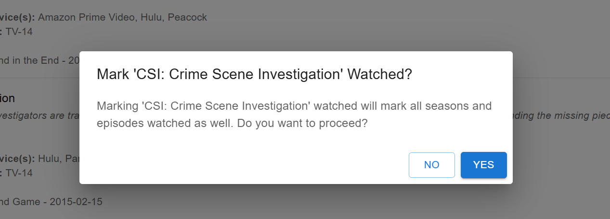

### Show Count
The total number of shows matching your current filters is displayed in the top-right corner of the toolbar.

## Show Details Page

Clicking on any show takes you to the detailed Show Details page, where you can manage individual episodes and seasons.

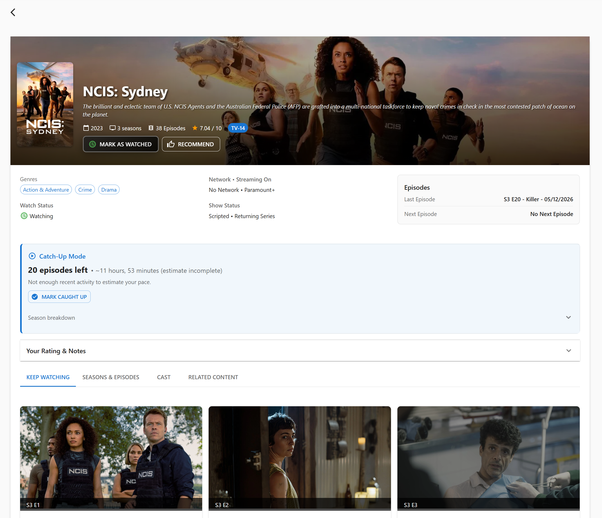

### Show Information Section

The top section displays:
- **Backdrop Image**: Large promotional image
- **Poster**: Show poster overlaid on the backdrop
- **Title and Description**: Complete show synopsis
- **Key Details**: Release year, seasons, episodes, rating
- **Genres**: Tagged genre categories
- **Network and Streaming**: Broadcasting and streaming information
- **Watch Status Control**: Master control for entire show status
- **Recommend Button**: Share this show with the KeepWatching community (see [Ratings & Recommendations](#ratings--recommendations) below)
- **Start Rewatch Button**: Appears once the show is Watched or Up to Date; starts a new tracked viewing pass (see [Rewatch](#rewatch) below)

### Navigation

#### Breadcrumb Navigation
- Use the **back arrow** in the top-left to return to your previous page
- The system remembers your filters and returns you to the exact same view

### Ratings & Recommendations

#### Your Rating & Notes

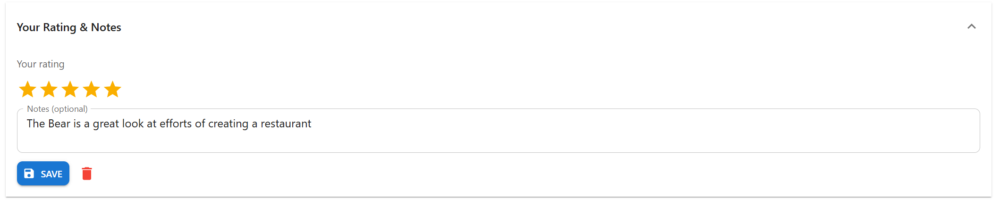

Below the main show information, a collapsible **Your Rating & Notes** section lets you record your personal review:

- **Star Rating**: Rate the show 1–5 stars
- **Notes**: Add optional private notes visible only to you
- **Save / Delete**: Save your rating or remove it entirely

Your rating is stored per profile, so different family members can each have their own rating for the same show.

#### Recommending to the Community

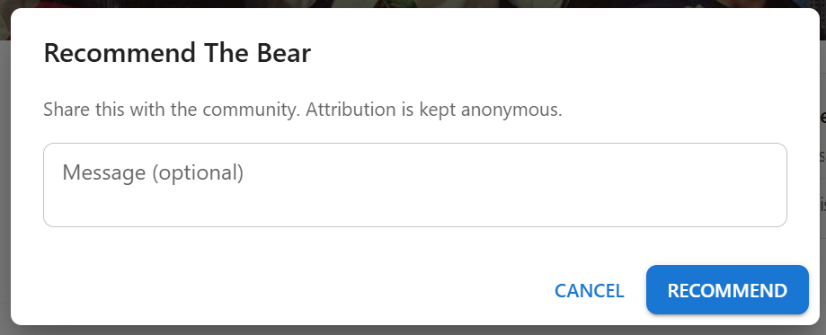

The **Recommend** button (next to the Watch Status control) lets you share the show with other KeepWatching users:

1. Click **Recommend**
2. Optionally add a personal message explaining why you recommend it
3. Optionally include your star rating with the recommendation
4. Click **Submit**

Your recommendation appears in the **Community** tab on the Home page for all users to discover.

### Rewatch

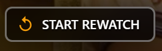

Once a show is fully **Watched** or **Up to Date**, a **Start Rewatch** button appears in the show header. Clicking it:

1. Displays a confirmation dialog
2. Resets the show's episodes so you can track progress through a second (or third!) viewing
3. Records the rewatch in your [Watch History](watchHistory.md) with a watch count greater than 1

Individual seasons also have a rewatch option, and individual episodes can be marked as rewatched directly from the episode list.

### Catch-Up Mode

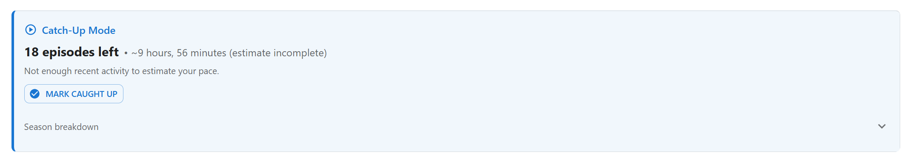

Once a show has a real backlog — three or more aired episodes you haven't watched yet — a **Catch-Up Mode** card appears below the main show information (and above the [Your Rating & Notes](#your-rating--notes) section) summarizing what's left:

- **Episodes & Runtime Remaining**: Total count of aired, unwatched episodes and an estimated total runtime (e.g. "12 episodes left • ~11 hours, 7 minutes")
- **Pace Estimate**: An estimate of your weekly watch pace and a projected date you'll be caught up (e.g. "At your recent pace (2.0 eps/week), caught up by 2026-08-01"), based on episodes you've watched in the last 60 days. Prior-watch entries don't count toward this — only episodes you've actually marked watched recently. If you haven't watched at least two qualifying episodes spanning two or more days in that window, a message lets you know there isn't enough recent activity to estimate a pace
- **Season Breakdown**: An expandable **Season breakdown** section lists episodes and runtime remaining for each season that still has unwatched episodes (seasons you're fully caught up on are omitted)
- **Mark Caught Up**: A button that lets you bulk-clear the entire remaining backlog in one step

Catch-Up Mode only appears once there's a meaningful backlog — with one or two episodes left, the [Keep Watching Tab](#keep-watching-tab) and Next Episode panel already show you what's next. The card disappears automatically once you're caught up, and episodes in [Skipped](#season-skipping) seasons aren't counted toward your remaining total or included when you mark caught up. If runtime data is missing for some episodes, the total (and that season's breakdown row) is labeled "(estimate incomplete)".

#### Mark Caught Up

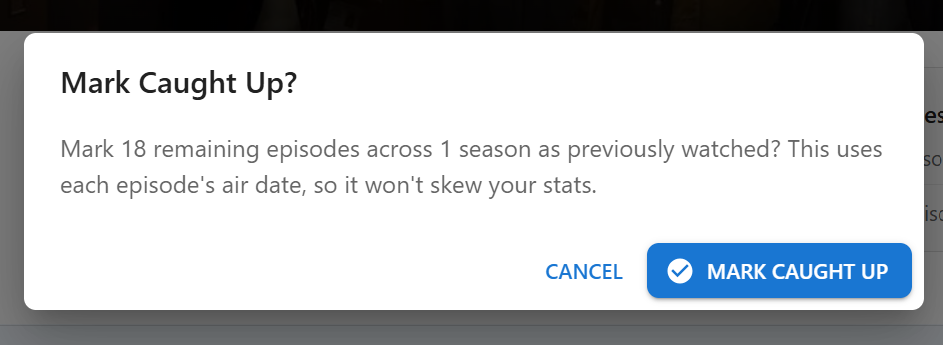

Click **Mark Caught Up** to skip straight to current without marking each episode one by one:

1. A confirmation dialog summarizes what will happen (e.g. "Mark 12 remaining episodes across 3 seasons as previously watched? This uses each episode's air date, so it won't skew your stats.")
2. Click **Mark Caught Up** in the dialog to confirm, or **Cancel** to back out
3. All remaining episodes in every season with a backlog are marked watched, using each episode's original air date rather than today's date — the same prior-watch mechanism used elsewhere, so it won't distort your [Watch History](watchHistory.md), streaks, or pace statistics
4. The button is disabled while the update is in progress; once complete, the Catch-Up Mode card disappears since the show is now current

## Episode Management

The Show Details page includes tabbed navigation for different aspects of show management:

### Keep Watching Tab

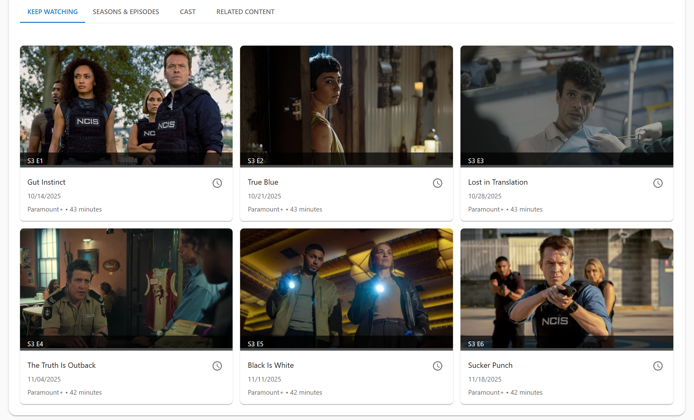

The Keep Watching tab shows:
- **Next Episodes**: Up to 6 upcoming episodes you haven't watched
- **Episode Cards**: Each card shows episode details and watch status controls
- **Smart Sorting**: Episodes are sorted by season and episode number
- **Quick Actions**: Mark episodes as watched directly from the cards

### Seasons & Episodes Tab

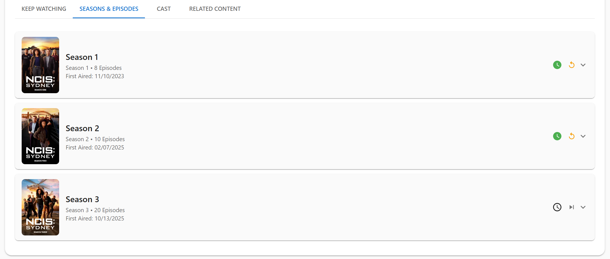

This comprehensive view includes:

#### Season Management
- **Season Accordions**: Each season is displayed in an expandable section
- **Season Overview**: Poster, episode count, air date information
- **Season Watch Status**: Control for marking entire seasons as watched/unwatched
- **Skip Season**: A dedicated skip icon lets you mark an unwatched, aired season as **Skipped** instead — see [Season Skipping](#season-skipping) below
- **Visual Indicators**: Clear watch status icons for quick identification

#### Episode Management
- **Complete Episode List**: All episodes within each season
- **Episode Details**: Title, description, air date, runtime
- **Episode Images**: Still images from each episode when available
- **Individual Controls**: Mark each episode as watched or unwatched
- **Progress Tracking**: Visual indicators show which episodes you've completed

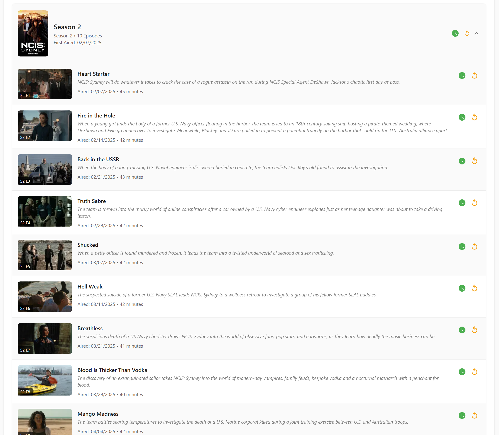

#### Episode Information
Each episode displays:
- **Episode Number**: Season and episode designation (S1 E1)
- **Title**: Episode name
- **Description**: Episode synopsis
- **Air Date**: When the episode aired or will air
- **Runtime**: Episode length
- **Watch Status**: Individual episode completion status

### Cast Tab

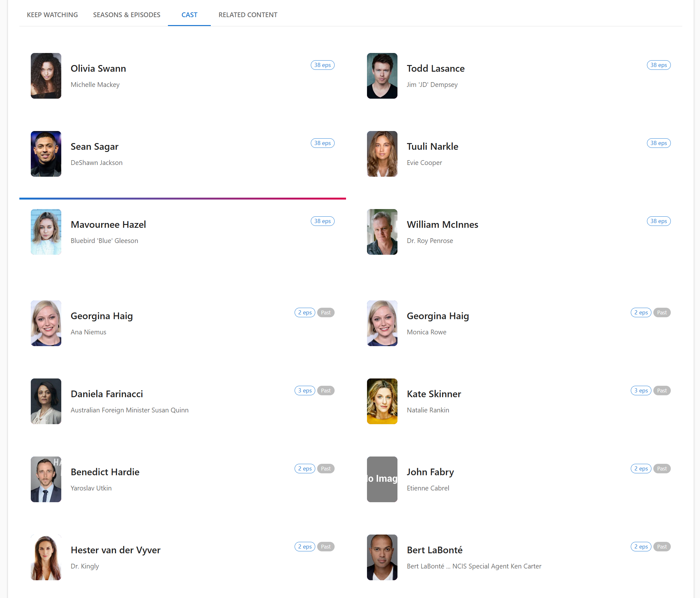

The Cast tab displays the actors who appear in the show:
- **Cast List**: All credited actors for the show
- **Character Information**: Character names played by each actor
- **Profile Photos**: Actor headshots when available
- **Clickable Cards**: Click any cast member to view their [Person Details](personDetails.md) page
- **Additional Credits**: Explore what other shows and movies each actor has appeared in

### Related Content Tab

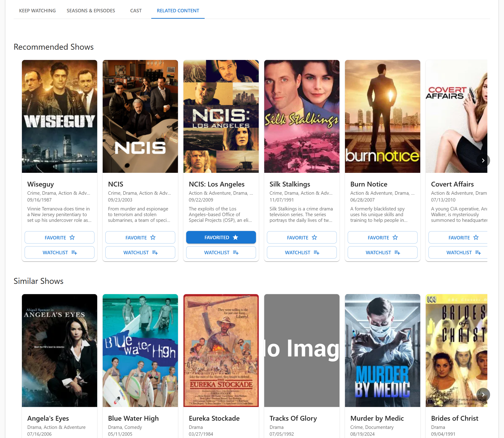

Discover new content with:
- **Recommended Shows**: Shows suggested based on your viewing history
- **Similar Shows**: Shows with similar themes, genres, or characteristics
- **Quick Add**: Add recommended shows directly to your favorites

## Prior Watch & Watch History Features

Several features help you accurately record shows you watched before joining KeepWatching and keep your history clean.

### Prior Watch Prompt

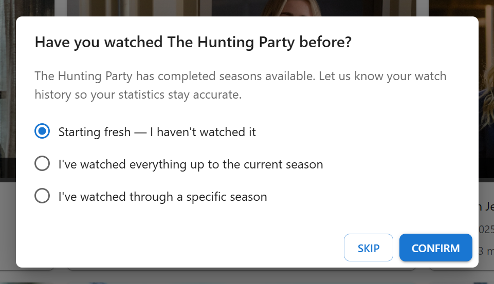

The first time you open a show that has fully aired seasons you have never marked, a **Prior Watch Prompt** dialog appears asking:

- **Starting fresh** — you haven't watched this show before, so no history is recorded
- **Watched everything** — all aired seasons are marked as prior watches using their original air dates
- **Watched through a specific season** — seasons up to your chosen season are marked as prior watches

This prompt only appears once per show per profile.

### Season Prior Watch Dialog

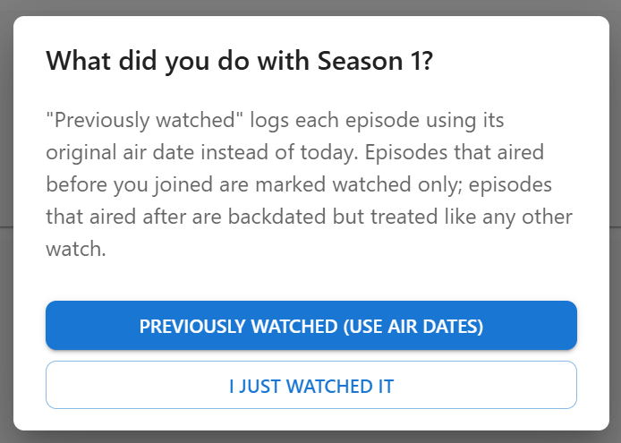

When you mark an entire season as watched for the first time, a dialog asks whether you watched it when it originally aired or more recently. Choosing "when it aired" records the episodes using their original air dates, keeping your history accurate.

### Out-of-Order Watch Prompts

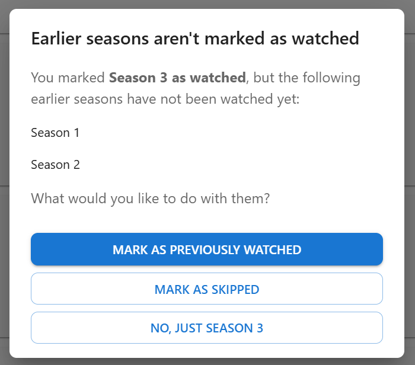

If you mark an episode as watched but earlier episodes in the same season haven't been marked, a prompt asks whether to mark the skipped episodes as prior watches. The same logic applies when you mark a season as watched but earlier seasons are still unwatched — in that case you get three choices:

- **Mark as previously watched** — records the earlier seasons as prior watches using their original air dates
- **Mark as skipped** — marks the earlier seasons as **Skipped** instead of watched (see [Season Skipping](#season-skipping) below)
- **No, just \[this season\]** — leaves the earlier seasons untouched and only updates the season you selected

These prompts prevent accidental gaps in your history.

### Season Skipping

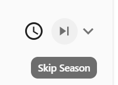

Not every season is one you plan to watch — clip shows, holiday specials, or a bonus season you're not interested in can be marked **Skipped** instead of Watched or Not Watched.

- **Skip Season button**: On the **Seasons & Episodes** tab, an aired season that hasn't been watched or skipped yet shows a skip icon next to its watch status control. Click it to mark the season as **Skipped** immediately, no confirmation needed
- **Skipped status**: Skipped seasons display a distinct "Skipped" badge and icon, count toward the show being complete (so the show can still reach Watched/Up to Date even with skipped seasons), and are excluded from the remaining-episode count in [Catch-Up Mode](#catch-up-mode)
- **Episodes are untouched**: Skipping a season only changes the season's own status — the episodes underneath keep whatever status they already had
- **Undoing a skip**: Click the watch status icon on a skipped season again to revert it back to Not Watched

Season Skipping applies at the season level only; there's no equivalent "skip" action for individual episodes.

### Bulk Mark Detection Banner

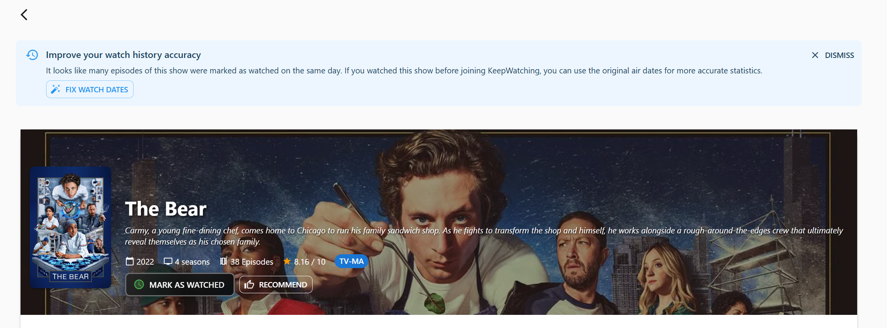

If KeepWatching detects that many episodes from a show were all marked on the same day — a common pattern when manually importing a full watch history — a **banner** appears at the top of the Show Details page. The banner offers two options:

- **Fix dates** — retroactively update the watch dates for all those episodes to use their original air dates
- **Dismiss** — keep the current dates as-is

You can also review and fix bulk-marked shows from the **Manage Account** page. See [Manage Account](manageAccount.md) for details.

## Advanced Features

### Watch Status Hierarchy

The Shows workflow uses a hierarchical watch status system:
1. **Show Level**: Overall completion status
2. **Season Level**: Seasonal completion status
3. **Episode Level**: Individual episode completion

Changes at higher levels automatically update lower levels, but you can also manage individual episodes for precise tracking.

### Smart Filtering by Status

The system automatically sorts shows by logical priority:
1. **Watching**: Shows you're actively following
2. **Not Watched**: Shows waiting to be started
3. **Unaired**: Upcoming shows
4. **Up To Date**: Shows you're current on
5. **Watched**: Completed shows

### Real-Time Updates

Your watch progress updates in real-time across all views:
- Changes on the Show Details page immediately reflect on the Shows list
- WebSocket connections ensure updates appear instantly
- Progress is synchronized across all your devices

## Tips for Effective Show Management

### Organization Strategies
1. **Use Status Filters**: Create bookmarked views for "Currently Watching" and "To Watch" lists
2. **Genre Organization**: Filter by genre when deciding what mood you're in
3. **Platform Planning**: Use streaming service filters to see what's available on your subscriptions

### Progress Tracking
1. **Mark as You Go**: Update episode status immediately after watching
2. **Seasonal Reviews**: Use season-level controls for shows you binge-watch
3. **Future Planning**: Keep unaired shows in your list to track upcoming premieres

### Discovery Workflow
1. **Start with Similar**: Use the Related Content tab to find shows like ones you already enjoy
2. **Cross-Reference**: Check if recommended shows are available on your streaming services
3. **Genre Exploration**: Try filtering by genres you don't usually watch for variety

The Shows workflow is designed to give you complete control over your TV watching experience while making it easy to discover new content and track your progress across multiple shows and seasons.
