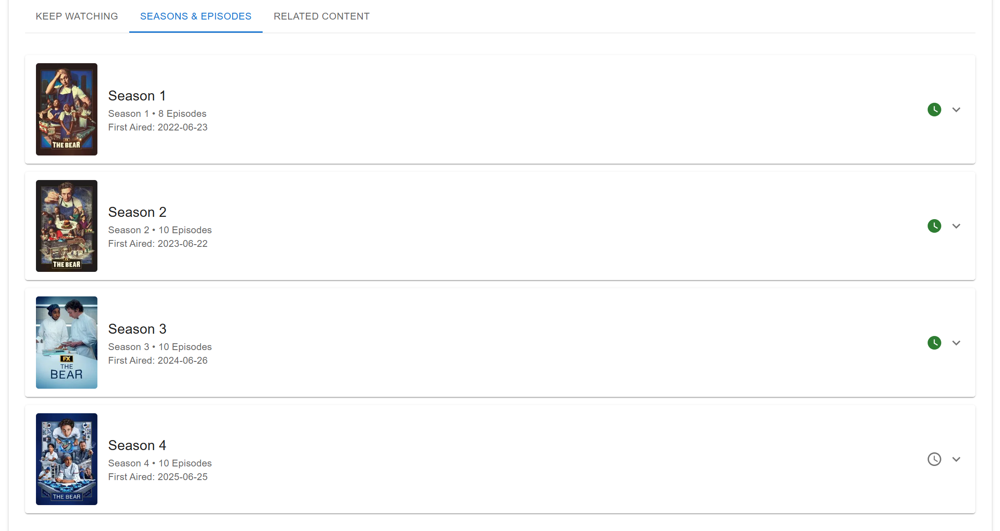
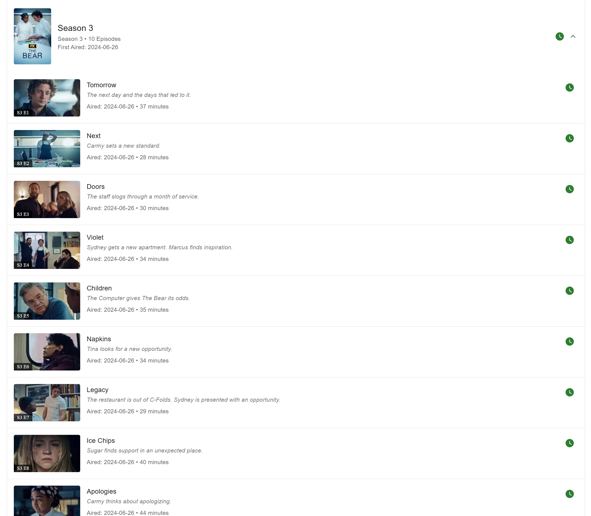

[< Back](../README.md)

# Shows - User Guide

The Shows feature in KeepWatching allows you to manage your favorite TV shows, track your viewing progress, and discover new content. This guide covers how to use the Shows page and Show Details page effectively.

## Shows Page Overview

The Shows page is your central hub for managing all your favorite TV shows. It displays a comprehensive list of all shows you've added to your watchlist, with powerful filtering options to help you find exactly what you're looking for.

### Key Features:
- **Complete Show List**: View all your favorited shows in one place
- **Watch Status Indicators**: Quickly see which shows you're watching, have completed, or haven't started
- **Smart Sorting**: Shows are automatically sorted by watch status and title for easy navigation
- **Quick Actions**: Mark shows as watched/unwatched or remove favorites directly from the list

## Filtering and Sorting

### Filter Options

The Shows page includes powerful filtering capabilities accessible through the **Filters** button in the top toolbar.

#### Available Filters:
1. **Genre Filter**: Filter shows by specific genres (Action, Comedy, Drama, etc.)
2. **Streaming Service Filter**: Find shows available on specific platforms (Netflix, Disney+, HBO Max, etc.)
3. **Watch Status Filter**: Filter by your viewing progress:
   - **Unaired**: Shows that haven't premiered yet
   - **Not Watched**: Shows you've added but haven't started
   - **Watching**: Shows you're currently following
   - **Up To Date**: Shows where you've watched all available episodes
   - **Watched**: Shows you've completed

### Using Filters

1. Click the **Filters** button in the toolbar
2. Select your desired filters from the drawer that opens
3. Use multiple filters simultaneously to narrow your search
4. Click **Clear Filters** to reset all filters
5. Your filter selections persist in the URL, so you can bookmark filtered views

### URL-Based Filtering

Filters are automatically saved in the URL, allowing you to:
- Bookmark specific filtered views
- Navigate back to specific filter combinations

## Managing Shows

### Show List Items

Each show in the list displays comprehensive information:

- **Poster Image**: Visual identification of the show
- **Title and Description**: Basic show information
- **Show Details**: Type (Series/Miniseries), status (Continuing/Ended), genres
- **Network and Streaming**: Where the show airs and streams
- **Season/Episode Count**: Total seasons and episodes
- **Episode Information**: Last and next episode details
- **Quick Actions**: Favorite removal and watch status change buttons

### Quick Actions

#### Removing Shows
- Click the **star icon** next to any show to remove it from your favorites
- The show will be immediately removed from your list

#### Changing Watch Status
- Click the **watch status icon** to change a show's status
- Confirm the action in the dialog that appears
- **Warning**: Marking a show as "Watched" or "Not Watched" affects ALL seasons and episodes

### Show Count
The total number of shows matching your current filters is displayed in the top-right corner of the toolbar.

## Show Details Page

Clicking on any show takes you to the detailed Show Details page, where you can manage individual episodes and seasons.

### Show Information Section

The top section displays:
- **Backdrop Image**: Large promotional image
- **Poster**: Show poster overlaid on the backdrop
- **Title and Description**: Complete show synopsis
- **Key Details**: Release year, seasons, episodes, rating
- **Genres**: Tagged genre categories
- **Network and Streaming**: Broadcasting and streaming information
- **Watch Status Control**: Master control for entire show status

### Navigation

#### Breadcrumb Navigation
- Use the **back arrow** in the top-left to return to your previous page
- The system remembers your filters and returns you to the exact same view

## Episode Management

The Show Details page includes tabbed navigation for different aspects of show management:

### Keep Watching Tab

The Keep Watching tab shows:
- **Next Episodes**: Up to 6 upcoming episodes you haven't watched
- **Episode Cards**: Each card shows episode details and watch status controls
- **Smart Sorting**: Episodes are sorted by season and episode number
- **Quick Actions**: Mark episodes as watched directly from the cards

### Seasons & Episodes Tab

This comprehensive view includes:

#### Season Management
- **Season Accordions**: Each season is displayed in an expandable section
- **Season Overview**: Poster, episode count, air date information
- **Season Watch Status**: Control for marking entire seasons as watched/unwatched
- **Visual Indicators**: Clear watch status icons for quick identification

#### Episode Management
- **Complete Episode List**: All episodes within each season
- **Episode Details**: Title, description, air date, runtime
- **Episode Images**: Still images from each episode when available
- **Individual Controls**: Mark each episode as watched or unwatched
- **Progress Tracking**: Visual indicators show which episodes you've completed

#### Episode Information
Each episode displays:
- **Episode Number**: Season and episode designation (S1 E1)
- **Title**: Episode name
- **Description**: Episode synopsis
- **Air Date**: When the episode aired or will air
- **Runtime**: Episode length
- **Watch Status**: Individual episode completion status

### Cast Tab

The Cast tab displays the actors who appear in the show:
- **Cast List**: All credited actors for the show
- **Character Information**: Character names played by each actor
- **Profile Photos**: Actor headshots when available
- **Clickable Cards**: Click any cast member to view their [Person Details](personDetails.md) page
- **Additional Credits**: Explore what other shows and movies each actor has appeared in

### Related Content Tab

Discover new content with:
- **Recommended Shows**: Shows suggested based on your viewing history
- **Similar Shows**: Shows with similar themes, genres, or characteristics
- **Quick Add**: Add recommended shows directly to your favorites

## Advanced Features

### Watch Status Hierarchy

The Shows workflow uses a hierarchical watch status system:
1. **Show Level**: Overall completion status
2. **Season Level**: Seasonal completion status
3. **Episode Level**: Individual episode completion

Changes at higher levels automatically update lower levels, but you can also manage individual episodes for precise tracking.

### Smart Filtering by Status

The system automatically sorts shows by logical priority:
1. **Watching**: Shows you're actively following
2. **Not Watched**: Shows waiting to be started
3. **Unaired**: Upcoming shows
4. **Up To Date**: Shows you're current on
5. **Watched**: Completed shows

### Real-Time Updates

Your watch progress updates in real-time across all views:
- Changes on the Show Details page immediately reflect on the Shows list
- WebSocket connections ensure updates appear instantly
- Progress is synchronized across all your devices

## Tips for Effective Show Management

### Organization Strategies
1. **Use Status Filters**: Create bookmarked views for "Currently Watching" and "To Watch" lists
2. **Genre Organization**: Filter by genre when deciding what mood you're in
3. **Platform Planning**: Use streaming service filters to see what's available on your subscriptions

### Progress Tracking
1. **Mark as You Go**: Update episode status immediately after watching
2. **Seasonal Reviews**: Use season-level controls for shows you binge-watch
3. **Future Planning**: Keep unaired shows in your list to track upcoming premieres

### Discovery Workflow
1. **Start with Similar**: Use the Related Content tab to find shows like ones you already enjoy
2. **Cross-Reference**: Check if recommended shows are available on your streaming services
3. **Genre Exploration**: Try filtering by genres you don't usually watch for variety

The Shows workflow is designed to give you complete control over your TV watching experience while making it easy to discover new content and track your progress across multiple shows and seasons.
