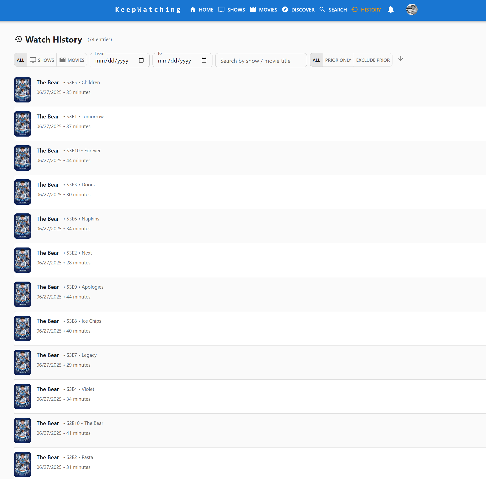
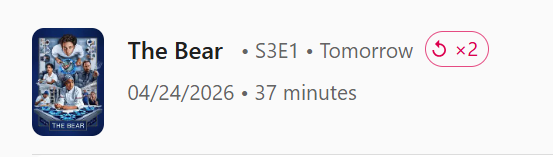
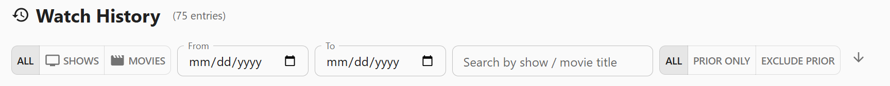

[< Back](../README.md)

# Watch History - User Guide

The Watch History page gives you a complete, searchable record of every episode and movie you have watched, including rewatches and content you recorded as watched before joining KeepWatching (prior watches). You can also start new rewatches of completed shows, seasons, and movies from the Show and Movie detail pages.

## Overview

Navigate to `/history` to open your Watch History. The page displays a paginated list of watch events for the active profile, with the most recently watched items shown first by default.

Each entry in the list shows:

- **Poster** of the show or movie
- **Title** (show name for episodes, movie title for movies)
- **Episode details** (season, episode number, and episode title for TV entries)
- **Watch date** — the date and time the item was recorded as watched
- **Runtime** — duration of the episode or movie
- **Watch count** — total number of times this item has been watched
- **Prior watch badge** — shown when the entry was recorded as a prior watch (watched before joining KeepWatching)

## Filtering

A toolbar at the top of the page provides several ways to narrow your history.

### Content Type

Toggle between:

- **All** — episodes and movies together
- **Episodes** — TV episodes only
- **Movies** — movies only

### Date Range

Use the **From** and **To** date pickers to restrict results to a specific date range. Leave either field blank for an open-ended range.

### Prior Watch Filter

Three options control how prior-watch entries are shown:

- **All** — include all watch events regardless of prior watch status
- **Prior only** — show only prior-watch entries (content watched before joining)
- **Exclude prior** — hide prior-watch entries and show only recent watches

### Title Search

Type a show or movie title into the search field to filter by name. The search is debounced so results update automatically as you type.

### Sort Order

Toggle between **Newest first** and **Oldest first** to change the chronological order of results.

## Pagination

Results are displayed in pages. Use the pagination controls at the bottom of the list to move between pages or change the number of items per page.

## Prior Watch Tracking

Prior watches represent content you finished watching before you joined KeepWatching. When you open a show for the first time that has fully aired seasons you haven't marked at all, a **Prior Watch Prompt** appears asking whether you:

- Are starting fresh (no prior history to record)
- Watched everything (all aired seasons marked as prior watches)
- Watched through a specific season (seasons up to your chosen season marked as prior watches)

Prior watches are stored with the original episode air dates rather than today's date, so your watch history accurately reflects when you actually watched the content.

### Season-Level Prior Watch

When you mark an entire season as watched for the first time, a dialog asks whether you watched it when it originally aired or more recently. If you watched it when it aired, the episodes are recorded using their original air dates.

### Skipped Content Prompts

If you mark an episode or season as watched but earlier content in the same show is still unwatched, a prompt appears asking whether you want to mark the skipped episodes or seasons as prior watches. This helps keep your history accurate without manual backfilling.

### Bulk Mark Detection

If KeepWatching detects that many episodes from a show were all marked on the same day (a common pattern when importing history all at once), a banner appears on the Show Details page offering to retroactively fix the watch dates using the original air dates. You can also review and fix bulk-marked shows from the **Manage Account** page.

## Rewatch Tracking

Once you have watched a show or movie, you can record a rewatch:

- **Show rewatch**: On the Show Details page, a **Start Rewatch** button appears when the show is fully watched or up to date. Starting a rewatch resets the watch status so you can track your progress through the show again from the beginning.
- **Season rewatch**: Each fully-watched season has a rewatch button to track rewatching a specific season.
- **Episode rewatch**: Individual episodes can be recorded as rewatched directly from the episode list.
- **Movie rewatch**: On the Movie Details page, a **Watch Again** button appears when the movie is marked watched.

Rewatch entries appear in your Watch History with a watch count greater than 1, showing how many times you have watched that item.

## Tips

- Use the **Prior only** filter to review all the history you recorded from before joining KeepWatching
- Use the **Date range** filter to look back at what you were watching during a specific period
- The **Watch count** column helps you identify your most rewatched favorites
- Combine the Title search with Content Type filters to quickly find all instances of a specific show
