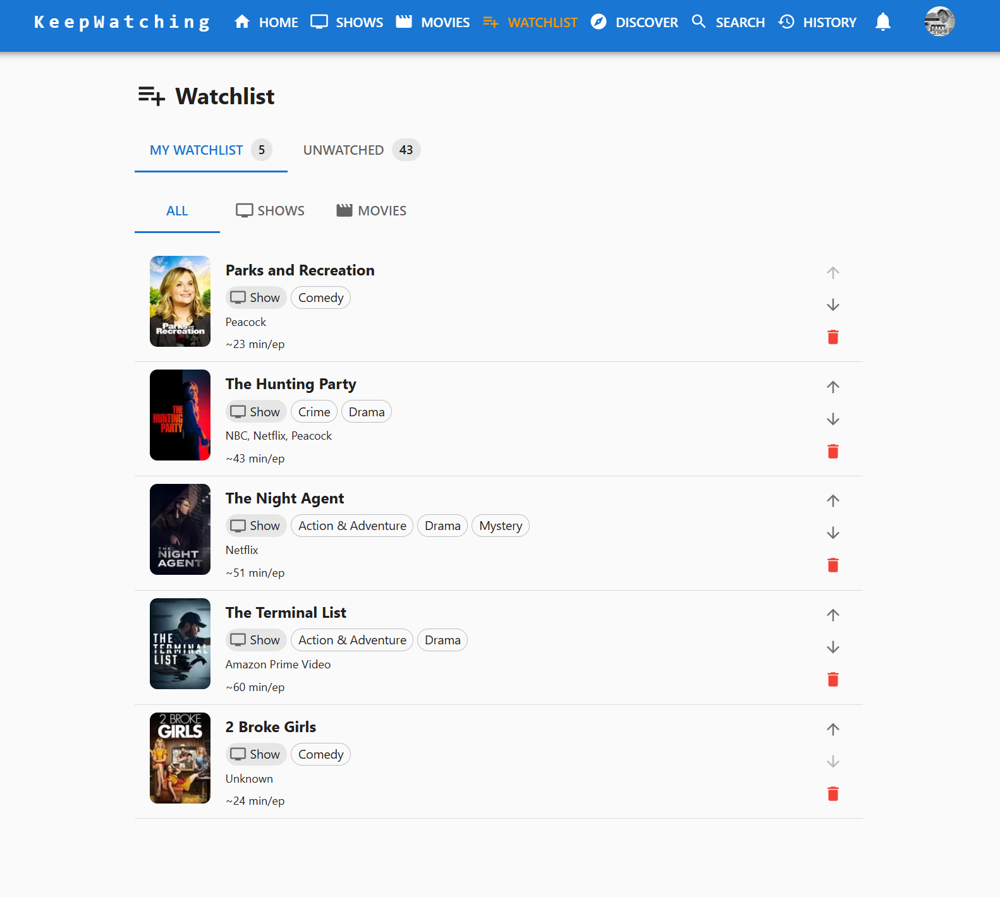
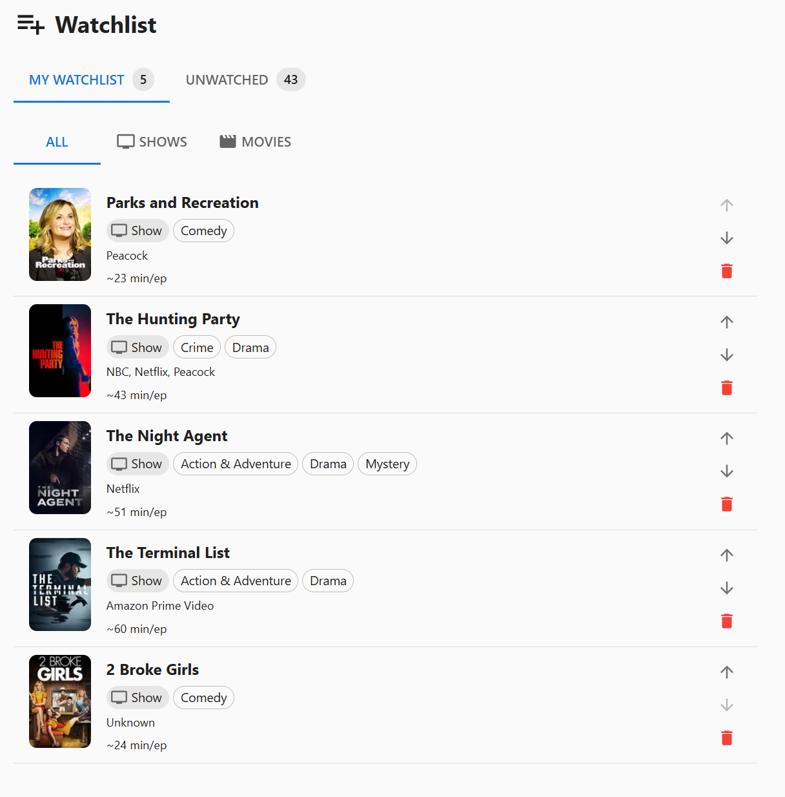
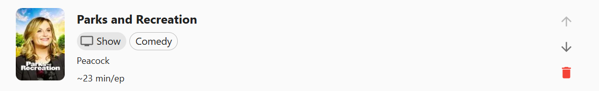
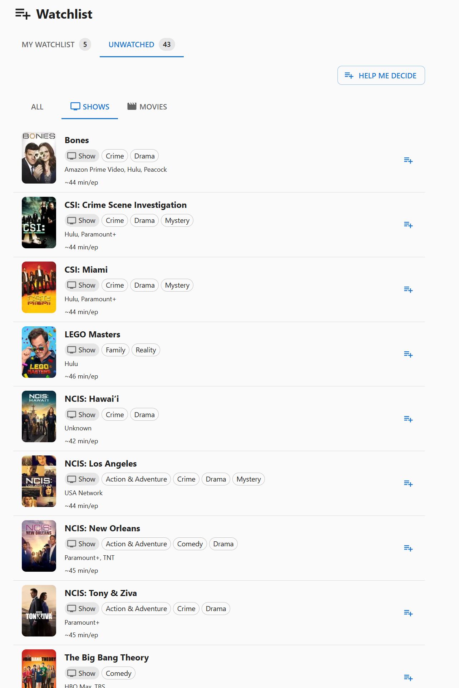
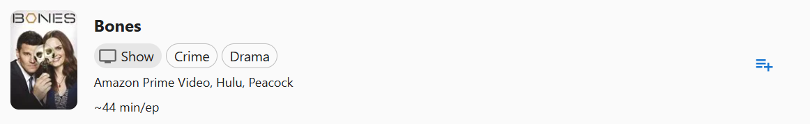
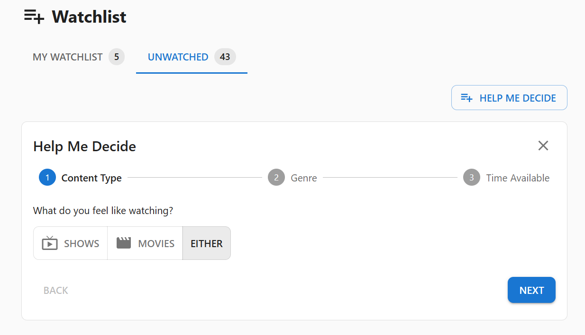
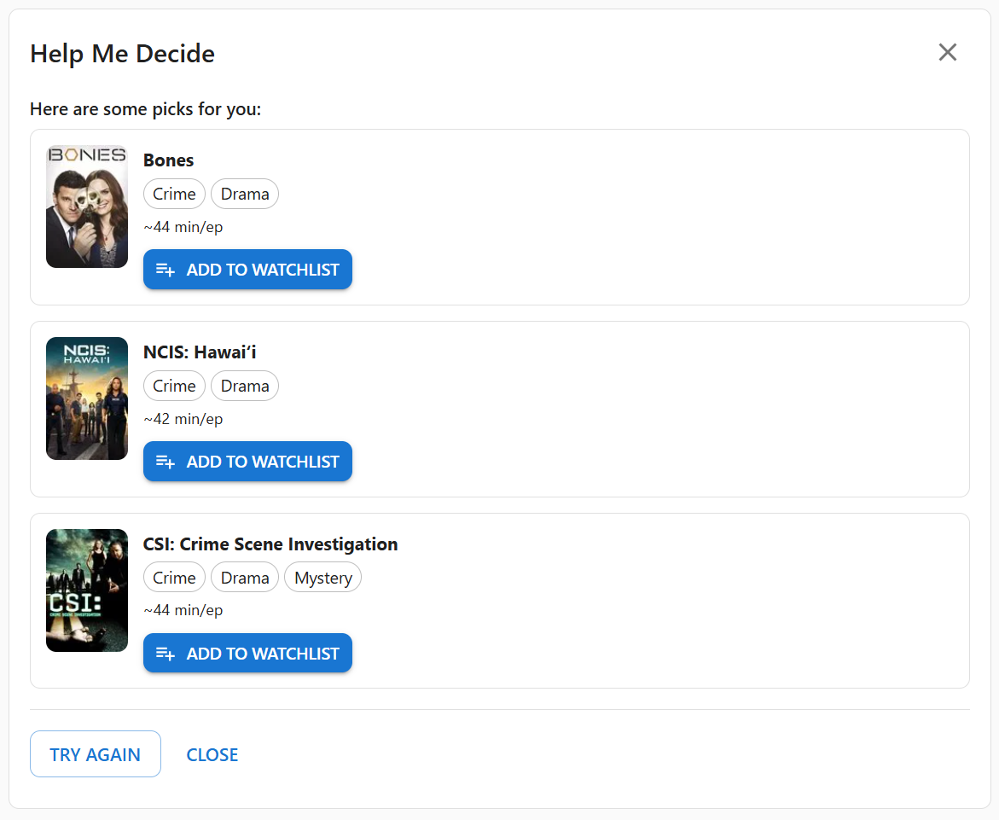
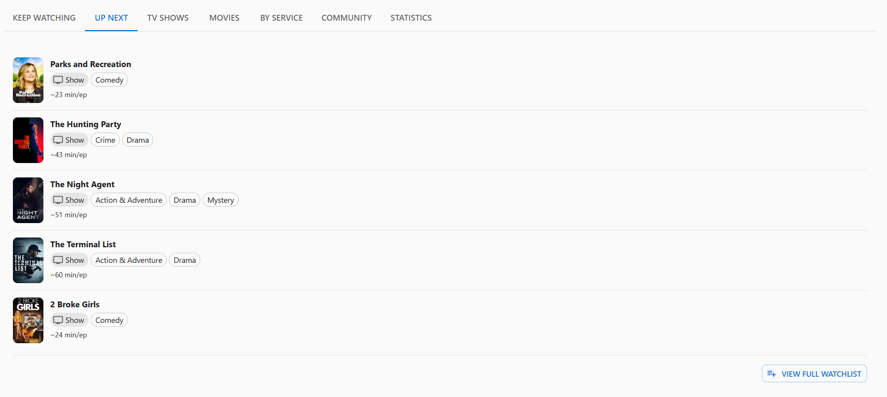

[< Back](../README.md)

# Watchlist - User Guide

The Watchlist page is your personal queue of shows and movies you intend to watch next. It has two distinct areas: **My Watchlist**, a manually ordered queue you control, and **Unwatched**, a searchable pool of everything in your favorites that you haven't started yet. A quick preview of your queue also appears on the [Home](home.md) page under the **Up Next** tab.

## Table of Contents

- [Overview](#overview)
- [Main Tabs](#main-tabs)
- [My Watchlist Tab](#my-watchlist-tab)
- [Unwatched Tab](#unwatched-tab)
- [Adding Items to Your Queue](#adding-items-to-your-queue)
- [Help Me Decide Wizard](#help-me-decide-wizard)
- [Up Next on the Home Page](#up-next-on-the-home-page)
- [Tips](#tips)
- [Troubleshooting](#troubleshooting)

## Overview

## Main Tabs

The page is divided into two top-level tabs:

| Tab                           | Contents                                                                                    |
| ----------------------------- | ------------------------------------------------------------------------------------------- |
| **My Watchlist** (with count) | Your personal, prioritized queue of items you have explicitly added                         |
| **Unwatched** (with count)    | Everything in your favorites that is not yet started — minus anything already in your queue |

---

## My Watchlist Tab

This tab is your ordered queue. Items appear in priority order and you control what goes in and how it is sorted.

### Empty State

If you have not added anything yet, the tab shows:

> _"Your watchlist is empty. Switch to the Unwatched tab to add items."_

### When Items Are Present

Three content sub-tabs filter the queue:

| Sub-tab    | Contents             |
| ---------- | -------------------- |
| **All**    | Every item (default) |
| **Shows**  | TV shows only        |
| **Movies** | Movies only          |

### Queue Item Layout

Each row displays:

- **Poster thumbnail** — 64×96 image
- **Title** — links directly to the show or movie detail page
- **Watch status chip** — shown when the item's current watch status is not Not Watched (e.g. "Watching", "Watched")
- **Genre chips** — up to four genre tags
- **Streaming service(s)** — where the content is available
- **Runtime** — total runtime for movies (e.g., "1h 42m"); average episode runtime for shows (e.g., "~45 min/ep")

### Reordering Items

Each item has up and down arrow buttons on the right:

- **Up arrow** — moves the item one position higher (disabled on the first item)
- **Down arrow** — moves the item one position lower (disabled on the last item)

Priority is saved immediately after each move.

### Removing Items

Click the red **trash icon** on any item to remove it from your queue. Removing an item does not affect the show or movie's watch status — it simply moves it back to the Unwatched pool.

---

## Unwatched Tab

This tab shows all of your favorited content that you have not started yet, filtered to exclude anything already in your personal queue. It is the primary place to browse and decide what to add to your queue.

### What Appears Here

The pool includes:

- Shows with a watch status of **Not Watched**
- Movies with a watch status of **Not Watched**

Items already in **My Watchlist** are excluded. The pool is sorted alphabetically by title.

### Content Sub-Tabs

| Sub-tab    | Contents        |
| ---------- | --------------- |
| **All**    | Every pool item |
| **Shows**  | TV shows only   |
| **Movies** | Movies only     |

### Pool Item Layout

Each row displays:

- **Poster thumbnail** — 64×96 image
- **Title** — links directly to the content detail page
- **Content type chip** — Show or Movie
- **Genre chips** — up to four genre tags
- **Streaming service(s)**
- **Runtime**
- **Add button** ("+") — on the right side; click to move this item into your **My Watchlist** queue

### Empty State

If you have no eligible favorites, the tab shows a prompt with two navigation buttons:

- **Browse Shows** — navigates to the Shows page
- **Browse Movies** — navigates to the Movies page

### Help Me Decide

When the pool is non-empty, a **Help Me Decide** button appears at the top right of the Unwatched tab. It opens the decision wizard (described below) which filters the pool and suggests up to three picks.

---

## Adding Items to Your Queue

There are two ways to add an item to **My Watchlist**:

1. **From the Unwatched tab** — click the "+" button on any pool item
2. **From a show or movie detail page** — click the **Add to Watchlist** button in the hero card actions

On detail pages the button toggles: it shows **Add to Watchlist** when the item is not yet queued and **Remove from Watchlist** when it is. The button only appears while the show or movie's watch status is **Not Watched** (or once it's already queued) — it disappears once you start watching.

---

## Help Me Decide Wizard

Click **Help Me Decide** on the Unwatched tab to open the decision wizard. It walks through three steps to filter the Unwatched pool and suggest up to three picks at random.

### Step 1 — Content Type

Choose what you feel like watching:

- **Shows** — TV shows only
- **Movies** — Movies only
- **Either** — Both types (default)

### Step 2 — Genre

Select a genre from chips derived from your actual pool content, or choose **No preference** to skip genre filtering.

### Step 3 — Time Available

Filter by how much time you have. The options shown depend on your Step 1 selection.

**Movie lengths:**

| Option   | Runtime             |
| -------- | ------------------- |
| Quick    | Under 90 minutes    |
| Standard | Up to 120 minutes   |
| Long     | Up to 150 minutes   |
| Epic     | 150 minutes or more |

**Episode lengths (per episode):**

| Option     | Runtime          |
| ---------- | ---------------- |
| Quick      | Under 30 minutes |
| Standard   | Up to 50 minutes |
| Long       | Up to 70 minutes |
| Any length | No filter        |

### Results

After clicking **Find Something!**, the wizard shows up to three randomly selected suggestions matching your filters.

Each suggestion card shows:

- Poster thumbnail
- Title
- Genre chips (up to three)
- Runtime
- **Let's Watch!** button — navigates directly to the content detail page

If no content matches, you are offered:

- **Broaden Search** — clears genre and runtime filters and tries again
- **Start Over** — resets the wizard to Step 1

From the results screen you can also use **Try Again** to restart or **Close** to dismiss the wizard.

---

## Up Next on the Home Page

The **Home** page includes an **Up Next** tab (between Keep Watching and TV Shows) that shows a quick preview of your personal queue without leaving the dashboard.

### What It Shows

- The top **5 items** from your **My Watchlist** queue, in priority order
- Each entry displays:
  - Poster thumbnail
  - Title (links to the detail page; navigating back returns you to the Watchlist)
  - Content type chip (Show or Movie)
  - Genre chips (up to three)
  - Runtime

### Footer

- If your queue has more than 5 items, a caption shows how many are not displayed (e.g., "Showing 5 of 12 items")
- A **View full watchlist** link button always appears at the bottom right

### Empty State

If your queue is empty, the tab shows:

> _"Your watchlist is empty."_

with a **Go to Watchlist** button.

---

## Tips

- **Use the Unwatched tab to discover and queue**: browse your full pool of not-started content and add the most interesting items to your queue in one session.
- **Keep your queue focused**: a shorter, intentional queue makes the Up Next tab on the Home page more useful.
- **Use the wizard when undecided**: it works on the full Unwatched pool, not just your queue, so it is useful even before you have built a queue.
- **Reorder by priority**: put your most anticipated content at the top so it appears first in Up Next.

---

## Troubleshooting

**My Watchlist is empty even though I just added something from a detail page:**

- Verify you are on the **My Watchlist** tab, not Unwatched.
- Try refreshing; the add action updates Redux state immediately but confirm the item appears.

**The Unwatched pool is empty:**

- Content must have a watch status of Not Watched to appear.
- Watching, Up to Date, and Watched content is not included.
- Browse the Shows or Movies pages to add more favorites.

**An item I added to My Watchlist is still showing in Unwatched:**

- It should not — items are filtered out of the pool once queued. Try refreshing the page.

**Priority changes are not saving:**

- Reordering requires a network connection. Check your connection and try again.

---

_The Watchlist is designed to help you make the most of your viewing time — whether you know exactly what you want to watch or need a little help deciding._
